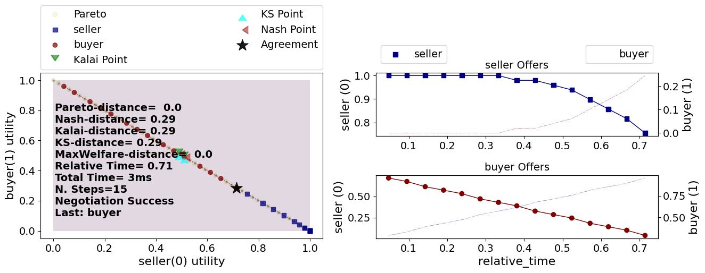

.. code:: ipython3

    from negmas import (
        make_issue,
        SAOMechanism,
       TimeBasedConcedingNegotiator,
    )
    from negmas.sao.negotiators import BoulwareTBNegotiator as Boulware
    from negmas.sao.negotiators import LinearTBNegotiator as Linear
    from negmas.preferences import LinearAdditiveUtilityFunction as UFun
    from negmas.preferences.value_fun import IdentityFun, AffineFun
    import matplotlib.pyplot as plt

    # create negotiation agenda (issues)
    issues = [
        make_issue(name="price", values=50),
    ]

    # create the mechanism
    mechanism = SAOMechanism(issues=issues, n_steps=20)

The negotiation protocol in NegMAS is handled by a ``Mechanism`` object.
Here we instantiate a\ ``SAOMechanism`` which implements the `Stacked
Alternating Offers
Protocol <https://ii.tudelft.nl/~catholijn/publications/sites/default/files/Aydogan2017_Chapter_AlternatingOffersProtocolsForM.pdf>`__.
In this protocol, negotiators exchange offers until an offer is accepted
by all negotiators (in this case 2), a negotiators leaves the table
ending the negotiation or a time-out condition is met. In the example
above, we use a limit on the number of rounds of ``20`` (a step of a
mechanism is an executed round).

Next, we define the utilities of the seller and the buyer. The utility
function of the seller is defined by the ``IdentityFun`` which means
that the higher the price, the higher the utility function. The buyer’s
utility function is reversed. The last two lines make sure that utility
is scaled between 0 and 1.

.. code:: ipython3

    seller_utility = UFun(
        values=[IdentityFun()],
        outcome_space=mechanism.outcome_space,
    )

    buyer_utility = UFun(
        values=[AffineFun(slope=-1)],
        outcome_space=mechanism.outcome_space,
    )

    seller_utility = seller_utility.normalize()
    buyer_utility = buyer_utility.normalize()

Then we add two agents with a boulware strategy. The negotiation ends
with status overview. For example, you can see if the negotiation
timed-out, what agreement was found, and how long the negotiation took.
Moreover, we output the full negotiation history. For a more visual
representation, we can plot the session. This shows the bidding curve,
but also the proximity to e.g. the Nash point.

.. code:: ipython3

    # create and add agent A and B
    mechanism.add(Boulware(name="seller"), ufun=seller_utility)
    mechanism.add(Linear(name="buyer"), ufun=buyer_utility)

    # run the negotiation and show the results
    print(mechanism.run())

.. raw:: html

    <pre style="white-space:pre;overflow-x:auto;line-height:normal;font-family:Menlo,'DejaVu Sans Mono',consolas,'Courier New',monospace">SAOState(
        running=False,
        waiting=False,
        started=True,
        step=16,
        time=0.003750874995603226,
        relative_time=0.8095238095238095,
        broken=False,
        timedout=False,
        agreement=(35,),
        results=None,
        n_negotiators=2,
        has_error=False,
        error_details='',
        erred_negotiator='',
        erred_agent='',
        threads={},
        last_thread='',
        current_offer=(35,),
        current_proposer='buyer-953acaf8-4227-4d51-a652-8626f799fa76',
        current_proposer_agent=None,
        n_acceptances=2,
        new_offers=[],
        new_offerer_agents=[None, None],
        last_negotiator='buyer',
        current_data=None,
        new_data=[]
    )
    </pre>

In this case, the negotiation ended with an agreement which is indicated
by the ``agreement`` field of the
`SAOState <https://negmas.readthedocs.io/en/latest/api/negmas.sao.SAOState.html#saostate>`__.

We can see a trace of the negotiation giving the step number, agent-id
and its offer using the ``extended_trace`` property of the mechanism
(session):

.. code:: ipython3

    # negotiation history
    print(mechanism.extended_trace)

.. raw:: html

    <pre style="white-space:pre;overflow-x:auto;line-height:normal;font-family:Menlo,'DejaVu Sans Mono',consolas,'Courier New',monospace">[
        (0, 'seller-e3614ef9-6d24-442a-9332-b15342ffa1e4', (49,)),
        (0, 'buyer-953acaf8-4227-4d51-a652-8626f799fa76', (2,)),
        (1, 'seller-e3614ef9-6d24-442a-9332-b15342ffa1e4', (49,)),
        (1, 'buyer-953acaf8-4227-4d51-a652-8626f799fa76', (4,)),
        (2, 'seller-e3614ef9-6d24-442a-9332-b15342ffa1e4', (49,)),
        (2, 'buyer-953acaf8-4227-4d51-a652-8626f799fa76', (7,)),
        (3, 'seller-e3614ef9-6d24-442a-9332-b15342ffa1e4', (49,)),
        (3, 'buyer-953acaf8-4227-4d51-a652-8626f799fa76', (9,)),
        (4, 'seller-e3614ef9-6d24-442a-9332-b15342ffa1e4', (49,)),
        (4, 'buyer-953acaf8-4227-4d51-a652-8626f799fa76', (11,)),
        (5, 'seller-e3614ef9-6d24-442a-9332-b15342ffa1e4', (49,)),
        (5, 'buyer-953acaf8-4227-4d51-a652-8626f799fa76', (14,)),
        (6, 'seller-e3614ef9-6d24-442a-9332-b15342ffa1e4', (49,)),
        (6, 'buyer-953acaf8-4227-4d51-a652-8626f799fa76', (16,)),
        (7, 'seller-e3614ef9-6d24-442a-9332-b15342ffa1e4', (48,)),
        (7, 'buyer-953acaf8-4227-4d51-a652-8626f799fa76', (18,)),
        (8, 'seller-e3614ef9-6d24-442a-9332-b15342ffa1e4', (48,)),
        (8, 'buyer-953acaf8-4227-4d51-a652-8626f799fa76', (21,)),
        (9, 'seller-e3614ef9-6d24-442a-9332-b15342ffa1e4', (47,)),
        (9, 'buyer-953acaf8-4227-4d51-a652-8626f799fa76', (23,)),
        (10, 'seller-e3614ef9-6d24-442a-9332-b15342ffa1e4', (46,)),
        (10, 'buyer-953acaf8-4227-4d51-a652-8626f799fa76', (25,)),
        (11, 'seller-e3614ef9-6d24-442a-9332-b15342ffa1e4', (44,)),
        (11, 'buyer-953acaf8-4227-4d51-a652-8626f799fa76', (28,)),
        (12, 'seller-e3614ef9-6d24-442a-9332-b15342ffa1e4', (42,)),
        (12, 'buyer-953acaf8-4227-4d51-a652-8626f799fa76', (30,)),
        (13, 'seller-e3614ef9-6d24-442a-9332-b15342ffa1e4', (40,)),
        (13, 'buyer-953acaf8-4227-4d51-a652-8626f799fa76', (32,)),
        (14, 'seller-e3614ef9-6d24-442a-9332-b15342ffa1e4', (37,)),
        (14, 'buyer-953acaf8-4227-4d51-a652-8626f799fa76', (35,))
    ]
    </pre>

We can also plot the negotiation.

.. code:: ipython3

    mechanism.plot(mark_max_welfare_points=False)
    plt.show()

