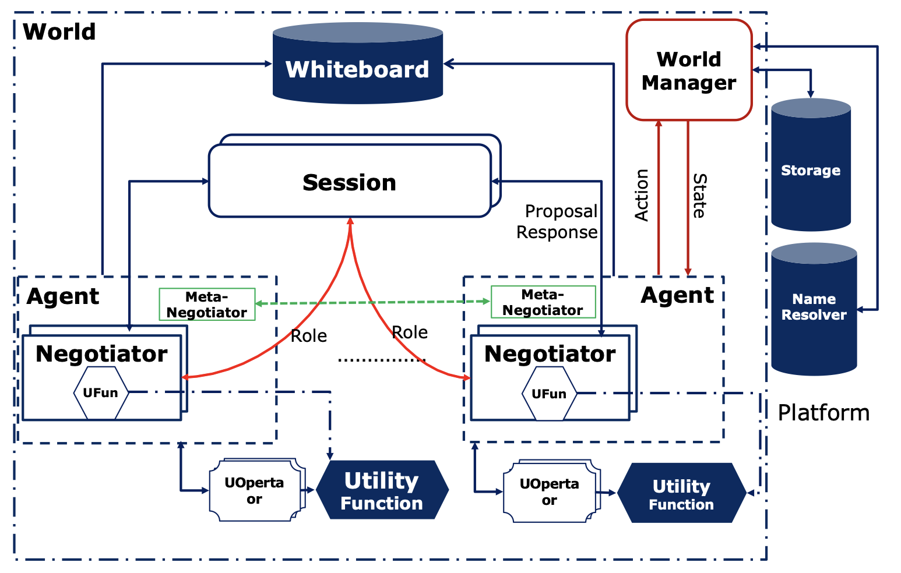

Overview
========

negmas was designed mainly as a research and educational tool with
special emphasis on supporting multi-strand multilateral multi-issue
negotiations with complex utility functions. This section gives an
introduction to the main concepts of the public interface.

In order to use the library you will need to import it as follows
(assuming that you followed the instructions in the installation section
of this document):

.. code:: ipython3

    import negmas

To simplify the use of this platform, all classes and functions from all
base modules are aliased in the root package (except generics and
helpers). This is an example of importing just ``Outcome`` which is
defined in the ``outcomes`` package

.. code:: ipython3

    from negmas import Outcome

It is possible *but not recommended* to just import everything in the
package using:

.. code:: ipython3

    from negmas import *

Organization
------------

The package is organized into a set of modules/packages that combine
together related functionality. There are base modules, protocol
specific modules, advanced and helper modules.

-  **Base Modules** Implements basic automated negotiation
   functionality:

   1. **outcomes** This module represents issues, outcome and responses
      and provides basic functions and methods to operator with and on
      them.
   2. **preferences** This modules represents the base type of all
      preferences and different widely used utility function types
      including linear and nonlinear utilities and constraint-based
      utilities. This module also implements basic analysis tools like
      finding the pareto-frontier, sampling outcomes with given
      utilities from the outcome space, etc.
   3. **negotiators** This module represents basic negotiation agent
      implementation and provides basic interfaces to be overriden
      (implemented) by higher specialized modules
   4. **mechanisms** This module represents the most basic conceptual
      view of a negotiation protocol supporting both mediate and
      unmediated mechanisms. The term ``mechanism`` was used instead of
      the more common ``protocol`` to stress the fact that this
      mechanism need not be a standard negotiation protocol. For example
      auction mechanisms (like second-price auctions) can easily be
      implemented as a ``Mechanism`` in negmas.
   5. **common** Provides data structures that are used by all modules
      including mechanism-state, and the agent-mechanism-interface.
   6. **genius** Implements a specific type negotiator for the stacked
      alternating offers protocol called ``GeniusNegotiator`` which can
      run ``NegotiationParty`` based agents from the Java
      `Genius <http://ii.tudelft.nl/genius/>`__ platform.

-  **Mechanism Specific Modules** These modules implement the base
   mechanism, negotiator type(s), state, and related computational
   resources specific to a single (or a set of related)
   negotiation/auction protocols

   1. **sao** Implements that stacked alternating offers protocol for
      unmediated multiparty multi-issue negotiations. Other than
      providing the ``SAOMechanism`` class representing the protocol,
      this package provides a set of simple negotiators including the
      time-based ``AspirationNegotiator``, a
      ``SimpleTitForTatNegotiator``, among others.
   2. **st** Implements two basic single-text mediated negotiation
      protocols (veto and hill-climbing) and the basic negotiator types
      to support them.
   3. **mt** Implements and extension of single text mediated protocols
      to handle multiple *proposed agreements* in parallel.
   4. **ga** Implements a Genetic Algorithm based single text mediated
      negotiation protocol

-  **Advanced Negotiation Modules** These modules model advanced
   negotiation problems and techniques

   1. **situated** Implements world simulations within which agents with
      intrinsic utility functions can engage in simultaneous
      interconnected situated negotiations. It is the most important
      module for the goals of this library. The ``Agent`` and ``World``
      classes described in details later belong to this module
   2. **modeling** This is a set of submodules implementing modeling of
      opponent utility, opponent strategy, opponent’s future offers and
      opponent’s probability of accepting offers.
   3. **elicitation** Implements several preference elicitation during
      negotiation methods.
   4. **concurrent** Implements mechanism types, and other computational
      resources to support concurrent negotiation.

-  **Helper Modules** These modules provide basic activities that is not
   directly related to the negotiation but that are relied upon by
   different base modules. The end user is not expected to interact
   directly with these modules.

   -  **common** Provides common interfaces that are used by all other
      modules.
   -  **helpers** Various helper functions and classes used throughout
      the library including mixins for logging.
   -  **inout** Provides functions to load and store XML Genius domains
      and utility functions.
   -  **java** [Depricated] Provides an interface to JNegMAS allowing
      agents and negotiators to be developed in Java.
   -  **tournaments** Supports creating and running tournaments to
      compare agents and negotiators.
   -  **checkpoints** Supports saving and reloading world simulations
      to/from secondary storage.
   -  **visualizers** [Under development] Supports visualization of
      world simulation, negotiation sessions, negotiators, and agents.
   -  **generics** Provides a set of types and interfaces to increase
      the representation flexibility of different base modules.

A (not very) brief introduction to NegMAS
-----------------------------------------

This figure shows the main active components of a simulation in a NegMAS
world: |NegMAS world|

The simulation is run using a **World** object which defines what
happens in every simulation **step**, provides a **BulletinBoard**
object containing all public information about the game, calls various
callbacks defined in the **Agent** object representing each agent in the
environment, takes care of running negotiations and keeps track of
agreement signing and the resulting **Contract**\ s. The **World**
object also controls logging, event management, serialization,
visualization, etc. Refer to the
`World <http://www.yasserm.com/negmas/api/negmas.situated.World.html>`__
documentation for more details (*you need to do that only if you are
implementing new world simulations*).

The designer of the game implements a **World** class by overriding few
abstract methods in the base **World** class.

The logic of an agent is NegMAS is implemented in an **Agent** object.
The designer of the simulation, should provide a base class for its
specific world inherited from NegMAS’s **Agent** class. Refer to the
`Agent <http://www.yasserm.com/negmas/api/negmas.situated.Agent.html>`__
documentation for more details about general NegMAS agents.

So now we have the **World** and the **Agent** objects, and we already
said that the agent does not directly interact with the world. How does
these two types of entities interact then?

-  When the **World** wants to interact with the **Agent**, it calls
   some method in it. For example, to instruct the agent to *initialize*
   itself, the world calls the **init()** method defined by the
   **Agent**. To inform the agent that a negotiation it is involved in
   is concluded with success, the **World** calls the method
   **on_negotiation_success()** defined by the agent.
-  When the **Agent** wants to interact with the **World**, it accesses
   an interface object called an **AgentWorldInterface** or **AWI** for
   short which provides all the services available to the **Agent**. For
   example, to request a negotiation with another agent, the **Agent**
   object needs to call **request_negotiation()** defined in the
   **AWI**.

The world designer usually defines an AWI for its world that inherits
NegMAS’s **AgentWorldInterface** class and provides any special services
for agents interacting in this world. You can find all the services
available to your agent through the AgentWorldInterface
`here <http://www.yasserm.com/negmas/api/negmas.situated.AgentWorldInterface.html>`__.
These methods and properties are still available for your agent in SCML.
Nevertheless, in many cases, more convenient ways to access some of the
information (e.g. the bulletin board) is provided in the specific AWIs
implemented in the SCML package to be described now.

Now that we know how worlds and agents work and interact, we can look at
how negotiation is managed in NegMAS. **Note that you can create
negotiations that do not belong to any world**

A negotiation is controlled by a **Mechanism** object which implements
the negotiation protocol (e.g. the alternating offers protocol). NegMAS
provides several mediated and unmediated negotiation protocols (as well
as auction mechanisms). The specific **Mechanism** that is used in SCML
is the **SAOMechanism** which implements the bargaining protocol.

Negotiation strategies are implemented in a **Negotiator** object which
usually inherits some base negotiator-class corresponding to the
mechanism(s) it supports.

The interaction between **Mechanism** and **Negotiator** objects mirrors
the interaction between **World** and **Agent** objects. **Mechanism**
objects call methods in **Negotiator** objects directly but
**Negotiator** objects can only access services provided by the
**Mechanism** object through a **NegotiatorMechanismInterface** (AMI).
You can find more details about the general NegMAS NMI
`here <http://www.yasserm.com/negmas/api/negmas.common.NegotiatorMechanismInterface.html>`__.

Each specific **Mechanism** defines a corresponding specific
**AgentMechanismInterface** class (in the same way that **World**
classes define their own AWI).

To negotiate effectively, negotiators employ a **UtilityFunction** (or
any other form of **Preferences** objects) to represent their
preferences over different possible **Outcome**\ s of the negotiation
(where an outcome is a full assignment of values to all negotiated
**Issue**\ s). NegMAS provides an extensive set of preferences types,
utility functions, and issue types. Please refer to this
`overview <http://www.yasserm.com/negmas/overview.html>`__ and
`tutorials <http://www.yasserm.com/negmas/tutorials.html>`__ for more
details. NegMAS also provides some basic **SAONegotiator**\ s for the
**SAOMechanism** (Check the class diagram
`here <http://www.yasserm.com/negmas/modules/sao.html>`__). Moreover,
you can access almost all `Genius <http://ii.tudelft.nl/genius/>`__
agents using NegMAS’s
`GeniusNegotiator <http://www.yasserm.com/negmas/api/negmas.genius.GeniusNegotiator.html>`__
including all finalists and winners of all past ANAC competitions.

Now we understand how agents interact with worlds through AWIs and
negotiators interact with mechanisms through AMIs. We know that the
general simulation is controlled by the world while each negotiation is
controlled by a mechanism within that world. **We need now to connect
these two triplets of objects**

As the figure above shows: **Negotiator** objects can be created and
controlled by **Agent** objects for the purpose of negotiating with
other **Agent** objects. The standard flow of operations is something
like this:

1. **Agent** A uses its AWI to *request_negotiation()* with Agent B
   passing a **Negotiator** to be used in this negotiation. Usually
   Agent A will also create a **UtilityFunction** and attach it to the
   **Negotiator** it just created (by setting its *ufun* attribute).
2. The **World** calls Agent B’s *respond_to_negotiation_request()*
   asking it to provide its own **Negotiator** to negotiate with Agent
   A’s Negotiator. It can also just reject the negotiation request by
   returning no negotiators.
3. The **World** will then create a **Mechanism** and ask both
   **Negotiator**\ s to *join* it. If all goes well, the negotiation
   starts (at a time defined by the simulation rules) and runs until
   either an agreement or disagreement is reached.
4. The **World** class will then inform **Agent**\ s A and B about the
   results of the negotiation using their *on_negotiation_success* and
   *on_negotiation_failure* callbacks.
5. Successful negotiations lead to **Agreement**\ s but are still not
   binding in general until signed by all agents involved (A and B in
   this case). **Agent**\ ’s ’\ *sign_all_contracts* is used for this.
6. Signed agreements become *Contract*\ s and are executed (as specified
   in the simulation rules) by the **World**.

When negotiations are independent, these are all the objects needed.
Nevertheless, in many cases, negotiations are inter-dependent. This
means that what is *good* in one negotiation depends on other
concurrently running negotiations (or on expectations of future
negotiations). NegMAS provides two ways to support this case shown in
the following figure:

.. figure:: figs/controllers.jpg
   :alt: controllers

   controllers

1. Let **Negotiator**\ s use **UtilityFunction**\ s that depend on some
   common state. That is what is happening in the left two negotiations.
2. Have multiple **Negotiator**\ s be controlled by a single
   **Controller** object with its own utility function that depends on
   what is happening on all the negotiations controlled.

The **Negotiator**\ s connected to a controller lost their autonomy and
just pass control to their *owning* **Controller**.

This concludes our introduction to NegMAS and different objects you need
to know about to develop your agent.

Outcomes, Issues and Outcome Spaces
-----------------------------------

Negotiations are conducted between multiple agents with the goal of
achieving an *agreement* (usually called a contract) on one of several
possible outcomes. Each *outcome* is in general an assignment of some
value to a set of issues. Each *issue* is a variable that can take one
of a – probably infinite – set of values from some predefined *domain*.

The classes and functions supporting management of issues,
outcome-spaces and outcomes are implemented in the ``outcomes`` module.

Issues are represented in ``negmas`` using the ``Issue`` class. An issue
is defined by a set of ``values`` and a ``name``.

NegMAS supports a variety of ``Issue`` types.

-  Using a set of strings:

.. code:: ipython3

    # an issue with randomly assigned name
    issue1 = make_issue(values=['to be', 'not to be'])
    print(issue1)
    # an issue with given name:
    issue2 = make_issue(values=['to be', 'not to be'], name='The Problem')
    print(issue2)

.. parsed-literal::

    TVxoHhOQTAWzrEZU: ['to be', 'not to be']
    The Problem: ['to be', 'not to be']

-  Using a single integer to give an issue which takes any value from
   ``0`` to the given integer minus 1:

.. code:: ipython3

    issue3 = make_issue(values=10, name='number of items')
    print(issue3)

.. parsed-literal::

    number of items: (0, 9)

-  Using a ``tuple`` with a lower and upper real-valued boundaries to
   give an issue with an infinite number of possibilities (all real
   numbers in between)

.. code:: ipython3

    issue4 = make_issue(values=(0.0, 1.0), name='cost')
    print(issue4)

.. parsed-literal::

    cost: (0.0, 1.0)

The ``Issue`` class provides some useful functions. For example you can
find the ``cardinality`` of any issue using:

.. code:: ipython3

    [issue2.cardinality, issue3.cardinality, issue4.cardinality]

.. parsed-literal::

    [2, 10, inf]

It is also possible to check the ``type`` of the issue and whether it is
discrete or continuous:

.. code:: ipython3

    [issue2.type, issue2.is_discrete(), issue2.is_continuous()]

.. parsed-literal::

    ['categorical', True, False]

It is possible to check the total cardinality for a set of issues:

.. code:: ipython3

    [num_outcomes([issue1, issue2, issue3, issue4]), # expected inf
     num_outcomes([issue1, issue2, issue3])] # expected 40 = 2 * 2 * 10

.. parsed-literal::

    [inf, 40]

You can pick random valid or invalid values for the issue:

.. code:: ipython3

    [
        [issue1.rand_valid(), issue1.rand_invalid()],
        [issue3.rand_valid(), issue3.rand_invalid()],
        [issue4.rand_valid(), issue4.rand_invalid()],
    ]

.. parsed-literal::

    [['to be', '20220219H112412903289W1q6gdElto be20220219H1124129033533sAHogUt'],
     [9, 12],
     [0.6976970707821888, 1.303414685774959]]

You can also list all valid values for an issue using ``all`` or sample
from them using ``value_generator``. Notice that ``all`` and
``value_generator`` return generators so both are memory efficient.

.. code:: ipython3

    print(tuple(issue1.all))
    print(tuple(issue2.all))
    print(tuple(issue3.all))
    try:
        print(tuple(issue4.all))
    except ValueError as e:
        print(e)

.. parsed-literal::

    ('to be', 'not to be')
    ('to be', 'not to be')
    (0, 1, 2, 3, 4, 5, 6, 7, 8, 9)
    Cannot enumerate all values of a continuous issue

Outcomes
~~~~~~~~

Now that we know how to define issues, defining outcomes from a
negotiation is even simpler. An outcome can be any python ``mapping`` or
``iterable`` with a known length. That includes dictionaries, lists,
tuples among many other.

Here is how to define an outcome for the last three issues mentioned
above:

.. code:: ipython3

    valid_outcome = {'The Problem': 'to be', 'number of items': 5, 'cost': 0.15}
    invalid_outcome = {'The Problem': 'to be', 'number of items': 10, 'cost': 0.15}

Notice that the ``invalid_outcome`` is assigning a value of ``10`` to
the ``number of items`` issue which is not an acceptable value (``cost``
ranges between ``0`` and ``9``).

Because ``outcomes`` can be represented with many built-in collection
classes, the only common ancestor of all outcome objects is the
``object`` class. Nevertheless, the ``outcomes`` module provide a
type-alias ``Outcome`` that can be used for static type checking if
needed. The ``outcomes`` module also provides some functions for dealing
with ``outcome`` objects in relation to ``Issue``\ s. These are some
examples:

.. code:: ipython3

    [
        outcome_is_valid(valid_outcome, [issue2, issue3, issue4]),      # valid giving True
        outcome_is_valid(invalid_outcome, [issue2, issue3, issue4])     # invalid giving False
    ]

.. parsed-literal::

    [True, False]

It is not necessary for an outcome to assign a value for *all* issues to
be considered *valid*. For example the following outcomes are all valid
for the last three issues given above:

.. code:: ipython3

    [
        outcome_is_valid({'The Problem': 'to be'}, [issue2, issue3, issue4]),
        outcome_is_valid({'The Problem': 'to be', 'number of items': 5}, [issue2, issue3, issue4])
    ]

.. parsed-literal::

    [True, True]

You can check the validity of outcomes defined as tuples or lists the
same way.

.. code:: ipython3

    [
        outcome_is_valid(['to be', 4, 0.5], [issue2, issue3, issue4]),
        outcome_is_valid(('to be', 4, 1.5), [issue2, issue3, issue4])
    ]

.. parsed-literal::

    [True, False]

It is also important for some applications to check if an outcome is
``complete`` in the sense that it assigns a *valid* value to every issue
in the given set of issues. This can be done using the
``outcome_is_complete`` function:

.. code:: ipython3

    [
        outcome_is_complete(valid_outcome, [issue2, issue3, issue4]),            # complete -> True
        outcome_is_complete(invalid_outcome, [issue2, issue3, issue4]),          # invalid -> incomplete -> False
        outcome_is_complete({'The Problem': 'to be'}, [issue2, issue3, issue4])  # incomplete -> False
    ]

.. parsed-literal::

    [True, False, False]

Outcome Ranges and constraints
^^^^^^^^^^^^^^^^^^^^^^^^^^^^^^

Sometimes, it is important to represent not only a single outcome but a
range of outcomes. This can be represented using an ``OutcomeRange``.
Again, an outcome range can be almost any ``mapping`` or ``iterable`` in
python including dictionaries, lists, tuples, etc with the only
exception that the values stored in it can be not only be ``int``,
``str``, ``float`` but also ``tuple``\ s of two of any of them
representing a range or a ``list`` of values. This is easier shown:

.. code:: ipython3

    range1 = {'The Problem': ['to be', 'not to be'], 'number of items': 5, 'cost': (0.1, 0.2)}

``range1`` represents the following range of outcomes:

-  **The Problem**: accepts both ``to be`` and ``not to be``

-  **number of items**: accepts only the value ``5``

-  **cost**: accepts any real number between ``0.1`` and ``0.2`` up to
   representation error

It is easy to check whether a specific outcome is within a given range:

.. code:: ipython3

    outcome1 = {'The Problem': 'to be', 'number of items': 5, 'cost': 0.15}
    outcome2 = {'The Problem': 'to be', 'number of items': 10, 'cost': 0.15}
    [
        outcome_in_range(outcome1, range1),       # True
        outcome_in_range(outcome2, range1)        # False
    ]

.. parsed-literal::

    [True, False]

In general outcome ranges constraint outcomes depending on the type of
the constraint:

-  **tuple** The outcome must fall within the range specified by the
   first and second elements. Only valid for values that can be compared
   using ``__lt__`` (e.g. int, float, str).
-  **single value** The outcome must equal this given value.
-  **list of values** The outcome must be within the list.
-  **list of tuples** The outcome must fall within one of the ranges
   specified by the tuples.

Outcome Spaces
~~~~~~~~~~~~~~

An outcome-space is a *set of outcomes* which can be enumerated,
sampled, etc.

NegMAS supports a special kind of outcome-spaces called
``CartesianOutcomeSpace`` which represents the Cartesian product of a
set of issues and can be created using ``make_os`` function:

.. code:: ipython3

    myos = make_os([issue1, issue2, issue3, issue4])
    print(type(myos))

.. parsed-literal::

    <class 'negmas.outcomes.outcome_space.CartesianOutcomeSpace'>

A special case of ``CartesianOutcomeSpace`` is a
``DiscreteCartesianOutcomeSpace`` (see the examle above) which represent
a Cartesian outcome-space with discrete issues (i.e. no issues are
continuous).

``OutcomeSpace`` provide convenient methods for gettin information about
the outcome-space or manipulating it. Some of the most important
examples are:

-  **is_numeric, is_integer, is_float** Checks if all components of all
   outcomes are numeric, integer or float.
-  **is_discrete, is_finite, is_continuous** Check if the outcome space
   itself is discrete, finite or continuous.
-  **cardinality** returns the number of outcomes in the outcome-space.
-  **cardinality_if_discretized** returns the number of outcomes in the
   outcome-space if we discretize it.
-  **to_discrete, to_largest_discrete** create an discrete outcome-space
   that ranges over the input outcome-space.
-  **sample** returns outcomes from the outcome-space.
-  **enumerate_or_sample** sample from continuous outcome-spaces and
   enumerate all outcomes of discrete outcome-spaces.

``DiscreteOutcomeSpace`` is a special case of ``OutcomeSpace``
representing a finite outcome space and adds some operations including:

-  **to_single_issue** generates a single-issue outcome-space with the
   same number of outcomes as the given outcome-space
-  **limit_cardinality** generates a discrete outcome-space that
   *approximates* the input outcome-space using at most some predefined
   number of outcomes.

Utilities and Preferences
-------------------------

Agents engage in negotiations to maximize their utility. That is the
central dogma in negotiation research. ``negmas`` allows the user to
define their own utility functions based on a set of predefined base
classes that can be found in the ``utilities`` module.

Utility Values
~~~~~~~~~~~~~~

In most applications, utility values can be represented by real numbers.
Nevertheless, some applications need a more complicated representation.
For example, during utility elicitation (the process of learning about
the utility function of the human being represented by the agent) or
opponent modeling (the process of learning about the utility function of
an opponent), the need may arise to represent a probability distribution
over utilities.

``negmas`` allows all functions that receive a utility value to receive
a utility distribution. This is achieved through the use of two basic
type definitions:

-  ``Distribution`` That is a probability distribution class capable of
   representing probabilistic variables having both continuous and
   discrete distributions and applying basic operations on them
   (addition, subtraction and multiplication). Currently we use
   ``scipy.stats`` for modeling these distributions but this is an
   implementation detail that should not be relied upon as it is likely
   that the probabilistic framework will be changed in the future to
   enhance the flexibility of the package and its integration with other
   probabilistic modeling packages (e.g. PyMC3). A concrete
   implementation of ``Distribution`` provided by NegMAS is
   ``ScipyDistribution``. A special case if the ``Real`` distribution
   which represents a delta distribution :math:`\delta(v)` at a given
   real value :math:`v` (i.e. :math:`p(x)=1` for :math:`x=v` and
   :math:`0` otherwise) which acts both as a ``Distribution`` and a
   ``float``.

-  ``Value`` This is the input and output type used whenever a utility
   value is to be represented in the whole package. It is defined as a
   union of a real value and a ``Distribution``
   (``float | Distribution``). This way, it is possible to pass utility
   distributions to most functions expecting (or returning) a utility
   value including utility functions.

This means that both of the following are valid utility values

.. code:: ipython3

    u1 = Real(1.0)
    u2 = UniformDistribution()   # standard normal distribution
    print(u1)
    print(u2)

.. parsed-literal::

    1.0
    U(0.0, 1.0)

Preferences
~~~~~~~~~~~

``Rational`` entities in NegMAS (including ``Agent``\ s,
``Negotiator``\ s, and ``Controller``\ s) can have ``Preferences`` which
define how much they prefer an ``Outcome`` over another. Several types
of preferences are supported in NegMAS and they all must implement the
``BasePref`` protocol.

Ordinal and Cardinal Preferences
~~~~~~~~~~~~~~~~~~~~~~~~~~~~~~~~

The most general ``Preferences`` type in NegMAS is ``Ordinal``
``Preferences`` which can only represent partial ordering of outcomes in
the outcome-space throgh the ``is_not_worse()`` method. An entity with
this kind of preferences can compare two outcomes but it gets one bit of
information out of this comparison (which is better for the entity) and
has no way to know *how much* is the difference

``CarindalProb`` ``Preferences``, on the other hand, implement
``difference_prob()`` which return a ``Distribution`` indicating *how
much* is the difference between two outcomes. A crisp version
(``CardinalCrisp``) moreover implements ``difference()`` which returns a
``float`` indicating *exactly* the difference in value for the entity
between two outcomes.

Every ``CadrinalCrisp`` object is a ``CardinalProb`` which is also an
``Ordinal`` object.

Crisp and Prob Preferences
~~~~~~~~~~~~~~~~~~~~~~~~~~

NegMAS usually implements two versions of each ``Preferences`` type
(other than ``Ordinal``) that represent a probabilistic version (ending
with ``Prob``) returing ``Distribution``\ s when queried, and a crisp
version (ending with ``Crisp``) returning a ``float``. This simplifies
the development of agents and negotiators working with probability
distributions.

Stationary and Non-Stationary Preferences
~~~~~~~~~~~~~~~~~~~~~~~~~~~~~~~~~~~~~~~~~

Stationary ``Preferences`` are those that *do not change during the
lifetime of their owner*, while non-stationary ``Preferences`` are
allowed to change. The entity having non-stationary preferences usually
faces a harder problem achieving its goals as it needs to take into
account this possible change. Entities interacting with other entities
with non-stationary ``Preferences`` are also in reatively harder
situation comapred with those dealing with entities with stationary
``Preferences``.

Stationary Preference type names start with ``Stationary``
(e.g. ``StationaryCardinalProb``) while non-stationary types start with
``NonStationary`` (e.g. ``NonStationaryCardinalProb``).

Utility Functions
~~~~~~~~~~~~~~~~~

Utility functions are entities that take an ``Outcome`` and return its
``Value``. There are many types of utility functions defined in the
literature. In this package, the base of all utiliy functions is the
``BaseUtilityFunction`` class which is defined in the
``preferences.ufun`` module. It behaves like a standard python
``Callable`` which can be called with a single ``Outcome`` object
(i.e. a dictionary, list, tuple etc representing an outcome) and returns
a ``Value``. This allows utility functions to return a distribution
instead of a single utility value. Special cases are ``UtilityFunction``
which is the base class of all crisp ufuns (returning a ``float`` when
called) and ``ProbUtilityFunction`` which is the base class of all
probabilistic ufuns (returning a ``Distribution`` when called).

Utility functions in ``negmas`` have a helper ``property`` called
``type`` which returns the type of the utility function and a helper
function ``eu`` for returning the expected utility of a given outcome
which is guaranteed to return a real number (``float``) even if the
utiliy function itself is returning a utility distribution.

To implement a specific utility function, you need to override the
single ``eval`` function provided in the
``UtilityFunction``/``ProbUtilityFunction`` abstract base class. This is
a simple example:

.. code:: ipython3

    COST = 0
    class ConstUtilityFunction(UtilityFunction):
       def eval(self, offer):
            try:
                return 3.0 * offer[COST]
            except KeyError:  # No value was given to the cost
                return None

       def xml(self):
            return '<ufun const=True value=3.0></ufun>'

    f = ConstUtilityFunction()
    f((10,))

.. parsed-literal::

    30.0

Note that we used ``StationaryUtilityFunction`` as the base class to
inform users of the ``ConstUtilityFunction`` class that it represents a
stationary ufun which means that it is OK to cache results of calls to
the ufun for example.

General Utility functions can store internal state and use it to return
different values for the same outcome over time allowing for dynamic
change or evolution of them during negotiations. For example this
*silly* utility function responds to the mood of the user:

.. code:: ipython3

    class MoodyUtilityFunction(UtilityFunction):
        def __init__(self, mood='good'):
            super().__init__()
            self.mood = mood

        def eval(self, offer):
            if self.mood not in ('good', 'bad'):
                raise ValueError(f"Cannot calculate utility for {offer}")
            return float(offer[COST]) if self.mood == 'good' else 0.1 * offer[COST]
        def set_mood(self, mood):
            self.mood = mood

        def xml(self):
            pass

    offer = (10,)

    f = MoodyUtilityFunction()
    # I am in a good mode now
    print(f'Utility in good mood of {offer} is {f(offer)}')
    f.set_mood('bad')
    print(f'Utility in bad mood of {offer} is {f(offer)}')
    f.set_mood('undecided')
    try:
        y = f(offer)
    except ValueError as e:
        print(f'Utility in good mood of {offer} is undecidable: {e}')

.. parsed-literal::

    Utility in good mood of (10,) is 10.0
    Utility in bad mood of (10,) is 1.0
    Utility in good mood of (10,) is undecidable: Cannot calculate utility for (10,)

Notice that (as the last example shows) utility functions can return
``None`` to indicate that the utility value cannot be inferred for this
outcome/offer.

Preferences Protcols
~~~~~~~~~~~~~~~~~~~~

The ``preferences`` module provide a set of other python protocols that
guarantee that a given ``Preferences`` object has some predefined
properties. This can be used by developers to adjust the behavior of any
entity based on the specific features of its preferences or to limit the
applicability of some strategy to a given ``Preferences`` type.

Here are some examples of these protocols all applying to utility
functions (see next section) (note that *protocol* here is used in the
Pythonic sense of a duck-typed interface):

+-----------------------------------+-----------------------------------+
| Protoocol                         | Meaning                           |
+===================================+===================================+
| Scalable                          | The utility function can be       |
|                                   | scaled by some factor             |
+-----------------------------------+-----------------------------------+
| PartiallyScalable                 | The utility function can be       |
|                                   | scaled in some part of the        |
|                                   | outcome-space                     |
+-----------------------------------+-----------------------------------+
| Shiftable                         | The utility function can be       |
|                                   | shifted by some constant value    |
+-----------------------------------+-----------------------------------+
| PartiallyShiftable                | The utility function can be by    |
|                                   | some constant value in some part  |
|                                   | of the outcome-space              |
+-----------------------------------+-----------------------------------+
| Normalizable                      | The utility function can be       |
|                                   | normalized to fall in some given  |
|                                   | range                             |
+-----------------------------------+-----------------------------------+
| PartiallyNormalizable             | The utility function can be       |
|                                   | normalized to fall in some given  |
|                                   | range for some part of the        |
|                                   | outcome-space                     |
+-----------------------------------+-----------------------------------+
| HasReservedOutcome                | The utility function defines some |
|                                   | outcome as the default outcome in |
|                                   | case of disagreement              |
+-----------------------------------+-----------------------------------+
| HasReservedDistribution           | The utility function defines some |
|                                   | distribution as the distribution  |
|                                   | from which a value is chosen in   |
|                                   | case of disagreement              |
+-----------------------------------+-----------------------------------+
| HasReservedValue                  | The utility function defines some |
|                                   | value as the default value for    |
|                                   | the agent in case of agreement in |
|                                   | case of disagreement              |
+-----------------------------------+-----------------------------------+
| HasRange                          | The utility function defines some |
|                                   | value as the default value for    |
|                                   | the agent in case of agreement in |
|                                   | case of disagreement              |
+-----------------------------------+-----------------------------------+
| IndIssues                         | The utility function is a         |
|                                   | mathematical function (linear or  |
|                                   | otherwise) of a set of            |
|                                   | single-issue functions.           |
+-----------------------------------+-----------------------------------+

The package provides a set of predefined utility functions representing
most widely used types. The following subsections describe them briefly.

Linear Additive Utility Functions
~~~~~~~~~~~~~~~~~~~~~~~~~~~~~~~~~

The ``LinearAdditiveUtilityFunction`` class represents a function that
linearly aggregate utilities assigned to issues in the given outcome
which can be defined mathematically as follows:

.. math:: U(o) = \sum_{i=0}^{\left|o\right|}{w_i\times g_i(o_i)}

where :math:`o` is an outcome, :math:`w` is a real-valued weight vector,
:math:`\left|o\right|` is the number of issues, :math:`o_i` if the value
assigned in outcome :math:`o` to issue :math:`i`, and :math:`g` is a
vector of functions each mapping one issue of the outcome to some
real-valued number (utility of this issue).

Notice that despite the name, this type of utiliy functions can
represent nonlinear relation between issue values and utility values.
The linearity is in how these possibly nonlinear mappings are being
combind to generate a utility value for the outcome.

Note that a utility function needs to know the outcome-space over which
is it defined. There are three ways to pass this to the
``UtilityFunction`` constructor:

1. **issues=…** pass a list of issues (usually made using
   ``make_issue``)
2. **outcome_space=…** pass an ``OutcomeSpace`` type (usualy made using
   ``make_os``)
3. **outcomes=…** pass a list of outcomes.

The following three ufuns are exactly equivalent:

.. code:: ipython3

    issues = [make_issue(2, "i1"), make_issue(2, "i2")]
    u1 = LinearAdditiveUtilityFunction(issues=issues, values=[lambda x: x, lambda x: x, lambda x: x])

.. code:: ipython3

    u2 = LinearAdditiveUtilityFunction(outcome_space=make_os(issues=issues), values=[lambda x: x, lambda x: x, lambda x: x])

.. code:: ipython3

    u3 = LinearAdditiveUtilityFunction(outcomes=[(0, 0), (0, 1), (1, 0), (1, 1)],
                                       values=[lambda x: x, lambda x: x, lambda x: x])

For example, the following utility function represents the utility of
``buyer`` who wants low cost, many items, and prefers delivery:

.. code:: ipython3

    issues = [
        make_issue((0, 10), "price"),
        make_issue((1, 10), "number of items"),
        make_issue(["delivered", "not delivered"], "delivery")
    ]
    buyer_utility = LinearAdditiveUtilityFunction({
        'price': lambda x: - x , 'number of items': lambda x: 0.5 * x,
        'delivery': {'delivered': 1.0, 'not delivered': 0.0}},
        issues=issues)

Given this definition of utility, we can easily calculate the utility of
different options:

.. code:: ipython3

    print(buyer_utility((1.0, 3, 'not delivered')))

.. parsed-literal::

    0.5

Now what happens if we offer to deliver the items:

.. code:: ipython3

    print(buyer_utility((1.0, 3, 'delivered')))

.. parsed-literal::

    1.5

And if delivery was accompanied with an increase in price

.. code:: ipython3

    print(buyer_utility((1.8, 3, 'delivered')))

.. parsed-literal::

    0.7

It is clear that this buyer will still accept that increase of price
from ``'1.0'`` to ``'1.8``\ ’ if it is accompanied with the delivery
option.

As explained before, you can use ``dict2outcome`` to make ufun calls
more readable:

.. code:: ipython3

    buyer_utility(
        dict2outcome({"price": 1.8, "number of items": 3, "delivery": "delivered"},
                     issues=buyer_utility.issues
                    )
    )

.. parsed-literal::

    0.7

Nonlinear Aggregation Utility Functions
~~~~~~~~~~~~~~~~~~~~~~~~~~~~~~~~~~~~~~~

A direct generalization of the linear agggregation utility functions is
provided by the ``NonLinearAggregationUtilityFunction`` which represents
the following function:

.. math:: U(o) = f\left(\left\{{g_i(o_i)}\right\}\right)

where :math:`g` is a vector of functions defined as before and :math:`f`
is a mapping from a vector of real-values to a single real value.

For example, a seller’s utility can be defined as:

.. code:: ipython3

    seller_utility =NonLinearAggregationUtilityFunction((
                                 lambda x: x
                               , lambda x: 0.5 * x
                               , {'delivered': 1.0, 'not delivered': 0.0})
                       , f=lambda x: x[0]/x[1] - 0.5 * x[2])

This utility will go up with the ``price`` and down with the
``number of items`` as expected but not linearly.

We can now evaluate different options similar to the case for the buyer:

.. code:: ipython3

    print(seller_utility((1.0, 3, 'not delivered')))

.. parsed-literal::

    0.6666666666666666

.. code:: ipython3

    print(seller_utility((1.0, 3, 'delivered')))

.. parsed-literal::

    0.16666666666666663

.. code:: ipython3

    print(seller_utility((1.8, 3, 'delivered')))

.. parsed-literal::

    0.7

Hyper Rectangle Utility Functions
~~~~~~~~~~~~~~~~~~~~~~~~~~~~~~~~~

In many cases, it is not possible to define a utility mapping for every
issue independently. We provide the utility function
``HyperVolumeUtilityFunction`` to handle this situation by allowing for
representation of a set of nonlinear functions defined on arbitrary
hyper-volumes of the space of outcomes.

The simplest example is a nonlinear-function that is defined over the
whole space but that nonlinearly combines several issues to calculate
the utility.

For example the previous ``NonLinearUtilityFunction`` for the ``seller``
can be represented as follows:

.. code:: ipython3

    seller_utility = HyperRectangleUtilityFunction(
        outcome_ranges= [None],
        utilities= [
            lambda x: 2.0*x['price']/x['number of items']
            - 0.5 * int(x['delivery'] == 'delivered')
        ]
    )
    print(seller_utility({'price': 1.0, 'number of items': 3, 'delivery': 'not delivered'}))
    print(seller_utility({'price': 1.0, 'number of items': 3, 'delivery': 'delivered'}))
    print(seller_utility({'price': 1.8, 'number of items': 3, 'delivery': 'delivered'}))

.. parsed-literal::

    0.6666666666666666
    0.16666666666666663
    0.7

This function recovered exactly the same values as the
``NonlinearUtilityFuction`` defined earlier by defining a single
hyper-volume with the special value of ``None`` which applies the
function to the whole space and then defining a single nonlinear
function over the whole space to implement the required utiltiy mapping.

``HyperVolumeUtilityFunction`` was designed to a more complex situation
in which you can have multiple nonlinear functions defined over
different parts of the space of possible outcomes.

Here is an example in which we combine one global utility function and
two different local ones:

.. code:: ipython3

    f = HyperRectangleUtilityFunction(
        outcome_ranges=[
            None,
            {0: (1.0, 2.0), 1: (1.0, 2.0)},
            {0: (1.4, 2.0), 2: (2.0, 3.0)}
        ],
        utilities=[
            5.0, 2.0, lambda x: 2 * x[2] + x[0]
        ],
        weights=[1,0.5,2.5]
    )

There are three nonlinear functions in this example:

-  A global function which gives a utility of ``5.0`` everywhere
-  A local function which gives a utility of ``2.0`` to any outcome for
   which the first issue (issue ``0``) has a value between
   ``1.0 and``\ 2.0\ ``and the second issue (issue``\ 1\ ``) has a value between``\ 1.0\ ``and``\ 2.0\ ``which is represented as:``\ {0:
   (1.0, 2.0), 1: (1.0, 2.0)}`\`
-  A second local function which gives a utility that depends on both
   the third and first issues ``(lambda x: 2 * x[2] + x[0]``) on the
   range ``{0: (1.4, 2.0), 2: (2.0, 3.0)}``.

You can also have weights for combining these functions linearly. The
default is just to sum all values from these functions to calculate the
final utility.

Here are some examples: \* An outcome that falls in the range of all
constraints:

.. code:: ipython3

    f([1.5, 1.5, 2.5])

.. parsed-literal::

    22.25

-  An outcome that falls in the range of the global and first local
   constraints only:

.. code:: ipython3

    f([1.5, 1.5, 1.0])

.. parsed-literal::

    6.0

-  An outcome that misses a value for some of the issues:

.. code:: ipython3

    print(f([1.5, 1.5]))

.. parsed-literal::

    None

Notice that in this case, no utility is calculated because we do not
know if the outcome falls within the range of the second local function
or not. To allow such cases, the initializer of
``HyperVolumeUtilityFunction`` allows you to ignore such cases:

.. code:: ipython3

    g = HyperRectangleUtilityFunction(
        outcome_ranges=[
            None,
            {0: (1.0, 2.0), 1: (1.0, 2.0)},
            {0: (1.4, 2.0), 2: (2.0, 3.0)}
        ],
        utilities=[5.0, 2.0, lambda x: 2 * x[2] + x[0]],
        ignore_failing_range_utilities=True,
        ignore_issues_not_in_input=True
    )
    print(g([1.5, 1.5]))

.. parsed-literal::

    7.0

Nonlinear Hyper Rectangle Utility Functions
~~~~~~~~~~~~~~~~~~~~~~~~~~~~~~~~~~~~~~~~~~~

``HyperVolumeUtilityFunction`` should be able to handle most complex
multi-issue utility evaluations but we provide a more general class
called ``NoneLinearHyperVolumeUtilityFunction`` which replaces the
simple weighted summation of local/global functions implemented in
``HyperVolumeUtilityFunction`` with a more general nonlinar mapping.

The relation between ``NoneLinearHyperVolumeUtilityFunction`` and
``HyperVolumeUtilityFunction`` is exactly the same as that between
``NonLinearAdditiveUtilityFunction`` and
``LinearAdditiveUtilityFunction``

Other utility function types
----------------------------

There are several other built-in utility function types in the utilities
module. Operations for utility function serialization to and from xml as
sell as normalization, finding pareto-frontier, generation of ufuns, etc
are also available. Please check the documentation of the utilities
module for more details

.. code:: ipython3

    from pprint import pprint
    pprint(list(_ for _ in negmas.preferences.__all__ if _.endswith("Function")))

.. parsed-literal::

    ['BaseUtilityFunction',
     'UtilityFunction',
     'ProbUtilityFunction',
     'PresortingInverseUtilityFunction',
     'SamplingInverseUtilityFunction',
     'DiscountedUtilityFunction',
     'ConstUtilityFunction',
     'LinearUtilityAggregationFunction',
     'LinearAdditiveUtilityFunction',
     'LinearUtilityFunction',
     'AffineUtilityFunction',
     'MappingUtilityFunction',
     'NonLinearAggregationUtilityFunction',
     'HyperRectangleUtilityFunction',
     'NonlinearHyperRectangleUtilityFunction',
     'RandomUtilityFunction',
     'RankOnlyUtilityFunction',
     'ProbMappingUtilityFunction',
     'IPUtilityFunction',
     'ILSUtilityFunction',
     'UniformUtilityFunction',
     'ProbRandomUtilityFunction',
     'WeightedUtilityFunction',
     'ComplexNonlinearUtilityFunction']

Utility Helpers and Analysis Tools
----------------------------------

NegMAS provides a set of functions that help with common tasks required
while developing negotiation agents. These are some examples:

-  **pareto_frontier** Finds the pareto-frontier of a set of utility
   functions.
-  **make_discounted_ufun** Takes a utility function and returns one
   that is discounted (linearly and/or exponentially).
-  **normalize** Normalizes a utility function within a given range.
-  **outcome_with_utility** Finds an outcome with a utility within some
   range.
-  **minmax** Finds the range of values of a utility function and
   outcomes with highest and lowest utilities.

Responses
---------

When negotiations are run, agents are allowed to respond to given offers
for the final contract. An offer is simply an outcome (either complete
or incomplete depending on the protocol but it is always valid).
Negotiators can then respond with one of the values defined by the
``Response`` enumeration in the ``outcomes`` module. Currently these
are:

-  **ACCEPT_OFFER** Accepts the offer.
-  **REJECT_OFFER** Rejects the offer.
-  **END_NEGOTIATION** This implies rejection of the offer and further
   more indicates that the agent is not willing to continue with the
   negotiation. The protocol is free to handle this situation. It may
   just end the negotiation with no agreement, may just remove the agent
   from the negotiation and keep it running with the remaining agents
   (if that makes sense) or just gives the agent a second chance by
   treating it as just a ``REJECT_OFFER`` case. In most case the first
   response (just end the negotiation) is expected.
-  **NO_RESPONSE** Making no response at all. This is usually not
   allowed by negotiation protocols and will be considered a protocol
   violation in most cases. Nevertheless, negotiation protocols are free
   to handle this response when it arise in any way.
-  **WAIT** Used to make the negotiation wait for a slow running process
   in one of the negotiators. This should never be returned from user
   code. It is used by some builtin controllers in the system to
   synchronize responses (e.g. ``SAOSyncController`` )

Rational Entities
-----------------

A ``Rational`` entity in NegMAS is an object that has an associated
``UtilityFunction``. There are three types of ``Rational`` entities
defined in the library:

-  **Negotiator** represents a negotiation agent that can interact with
   ``Mechanism`` objects (representing negotiation protocols) using a
   dedicated ``AgentMechanismInterface`` the defines public information
   of the mechanism. A negotiator is tied to a single negotiation.
-  **Agent** represents a more complex entity than a negotiation agent.
   It does not interact directly with negotiation protocols (i.e. it
   does not have an ``AgentMechanismInterface``) and is needed when
   there is a need to adjust behavior in multiple negotiations and/or
   when there is a need to interact with a simulation or the real world
   (represented in negmas by a ``World`` object) through an
   ``AgentWorldInterface``.
-  **Controller** A mid-level entity between ``Negotiator`` and
   ``Agent``. It can *control* multiple negotiator objects at the same
   time but it cannot interact with mechanisms or worlds directly.
   Usually controllers are created by agents to manage a set of
   interrelated negotiations through dedicated negotiators in each of
   them.

Negotiators
~~~~~~~~~~~

Negotiations are conducted by negotiators. We reserve the term ``Agent``
to more complex entities that can interact with a simulation or the real
world and spawn ``Negotiator`` objects as needed (see the situated
module documentation). The base ``Negotiator`` is implemented in the
``negotiators`` module. The design of this module tried to achieve
maximum flexibility by relying mostly on Mixins instead of inheritance
for adding functionality as will be described later.

To build your negotiator, you need to inherit from a ``Negotiator``
suitable for the negotiation mechanism your negotiator is compatible
with, implement its abstract functions.

Negotiators related to a specific negotiation mechanism are implemented
in that mechanism’s module. For example, negotiators designed for the
Stacked Alternating Offers Mechanism are found in the ``sao`` module.

The Base Negotiator
^^^^^^^^^^^^^^^^^^^

The base class of all negotiators is ``Negotiator``. Negotiators define
callbacks that are called by ``Mechanism``\ s to implement the
*negotiation protocol*.

The base ``Negotiator`` class defines basic functionality including the
ability to access the ``Mechanism`` settings in the form of an
``AgentMechanismInterface`` accessible through the ``ami`` attribute of
the ``Negotiator``.

Genius Negotiator
^^^^^^^^^^^^^^^^^

There is a special type of negotiators called ``GeniusNegotiator``
implemented in the ``genius`` module that is capable of interacting with
negotiation sessions running in the genius platform (JVM). Please refer
to the documentation of ``genius`` module for more information.

Controller
~~~~~~~~~~

A ``Controller`` is an object that can control multiple negotiators
either by taking full or partial control from the ``Negotiator``\ s. By
default, controllers will just resend all requests received to the
corresponding negotiator. This means that if you do not override any
methods in the controller, all negotiation related actions will still be
handled by the ``Negotiator``. To allow controllers to actually manage
negotiations, a subclass of ``Controller`` needs to implement these
actions without calling the base class’s implementation.

A special kind of negotiator called ``ControlledNegotiator`` is designed
to work with controllers that take full responsibility of the
negotiation. These negotiators act just as a relay station passing all
requests from the mechanism object to the controller and all responses
back.

Agents
~~~~~~

Self interested entities in NegMAS can be represented by either
``Negotiator``\ s or ``Agent``\ s. Use negotiators when a single
negotiation session is involved, otherwise use an agent. Agents can own
both negotiators and controllers (that manage negotiators) and can act
in the ``World`` (simulated or real).

Putting Everything together
---------------------------

Other than ``Rational`` objects, NegMAS defines two types of entities
that orchestrate the interactions between ``Rational`` objects:

-  **Mechanisms** represent interaction protocols which can be
   negotiation protocols or auctions. A ``Mechanism`` object connects a
   set of ``Negotiator``\ s and implements the interaction protocol.
-  **Worlds** represent either the real world or (usually) a simulation
   that connects ``Agent``\ s together. ``Agent``\ s can find each other
   using the world’s ``BulletinBoard`` (or other mechanisms defined by
   the world simulation), they can act in the world, receive state from
   it and – most importantly for our current purposes – request/run
   negotiations involving other agents (through dedicated ``Controller``
   and/or ``Negotiator`` objects).

A picture is worth a thousand words. The following figure shows how all
the classes we mentioned so far fit together

The most important points to notice about this figure are the following:

-  Almost all entities are ``NamedObject``\ s which means they have a
   *user assigned* name used for debugging, printing, and logging, and a
   *system assigned* id used when programatically accessing the object.
   For example, agents request negotiations with other agents from the
   world using the partner’s *id* not *name*.
-  ``Controller`` objects can access neither worlds nor mechanisms
   directly and they depend on agents to create them and on negotiators
   to negotiate for them.
-  A ``UtilityFunction`` in negmas is an active entity, it is not just a
   mathematical function but it can have state, access the mechanism
   state or settings (through its own ``AgentMechanismInterface``) and
   can change its returned value for the same output during the
   negotiation. Ufuns need not be dyanmic in this sense but they can be.

Mechanisms (Negotiations)
-------------------------

The base ``Mechanism`` class is implemented in the ``mechanisms``
module.

All protocols in the package inherit from the ``Protocol`` class and
provide the following basic functionalities:

-  checking ``capabilities`` of agents against ``requirements`` of the
   protocol
-  allowing agents to be join and leave the negotiation under the
   control of the underlying protocol. For example the protocol may
   allow or disallow agents from entering the negotiation once it
   started, it may allow or disallow modifying the issues being
   negotiated, may allow only a predefined maximum and minimum number of
   agents to engage in the negotiation. All of this is controlled
   through parameters to the protocol initializer.
-  provide the basic flow of protocols so that new protocols can be
   implemented by just overriding a single ``round()`` function.
-  provide basic callbacks that can be extended by new protocols.

   .. container:: alert alert-block alert-warning

      Protocols must extend any callback (i.e. call the ``super()``
      version) instead of overriding them as they may do some actions to
      ensure correct processing.

The simplest way to use a protocol is to just run one of the already
provided protocols. This is an example of a full negotiation session:

.. code:: ipython3

    p = SAOMechanism(outcomes = 6, n_steps = 10)
    p.add(LimitedOutcomesNegotiator(name='seller', acceptable_outcomes=[(2,), (3,), (5,)]))
    p.add(LimitedOutcomesNegotiator(name='buyer', acceptable_outcomes=[(1,), (4,), (3,)]))
    state = p.run()
    p.state.agreement

.. parsed-literal::

    (3,)

You can create a new protocol by overriding a single function in the
``Protocol`` class.

The built-in ``SAOMechanism`` calls negotiators sequentially. Let’s
implement a simplified similar protocol that asks *all* negotiators to
respond to every offer in parallel.

.. code:: ipython3

    from concurrent.futures import ThreadPoolExecutor
    class ParallelResponseMechanism(Mechanism):
        def __init__(self, *args, **kwargs):
            super().__init__(*args, **kwargs)
            self.current_offer = None
            self.current_offerer = -1

        def round(self):
            n_agents = len(self.negotiators)
            current = self.negotiators[(self.current_offerer + 1) % n_agents]
            self.current_offer = current.propose(self.state)

            def get_response(negotiator, offer=self.current_offer,
                             state=self.state):
                return negotiator.respond(state, offer)

            with ThreadPoolExecutor(4) as executor:
                responses = executor.map(get_response, self.negotiators)
            self.current_offerer = (self.current_offerer + 1) % n_agents
            if all(_== ResponseType.ACCEPT_OFFER for _ in responses):
                return MechanismRoundResult(agreement=self.current_offer)
            if any(_== ResponseType.END_NEGOTIATION for _ in responses):
                return MechanismRoundResult(broken=True)
            return MechanismRoundResult()

We needed only to override the ``round`` method which defines one round
of the negotiation. The protocol goes as follows:

1. Ask the next negotiator to propose.
2. Get the response of all negotiators (using the thread-pool)
3. If all negotiators accept the current offer, return it as the
   agreement
4. Otherwise, if any negotiators responded with END_NEGOTIATION, break
   the negotiation
5. Otherwise, change the next negotiator and return.

Note that we did not need to take care of timeouts because they are
handled by the base ``Mechanism`` class. Nor did we need to handle
adding agents to the negotiation, removing them (for dynamic protocols),
checking for errors, etc.

Agents can now engage in interactions with this protocol as easily as
any built-in protocol:

.. code:: ipython3

    p = ParallelResponseMechanism(outcomes = 6, n_steps = 10)
    p.add(LimitedOutcomesNegotiator(name='seller', acceptable_outcomes=[(2,), (3,), (5,)]))
    p.add(LimitedOutcomesNegotiator(name='buyer', acceptable_outcomes=[(1,), (4,), (3,)]))
    state = p.run()
    p.state.agreement

.. parsed-literal::

    (3,)

The negotiation ran with the expected results

Our mechanism keeps a history in the form of a list of
``MechanismState`` objects (on per round). Let’s check it:

.. code:: ipython3

    import pandas as pd
    pd.DataFrame([vars(_) for _ in p.history])

.. raw:: html

    

    
    <table border="1" class="dataframe">
      <thead>
        <tr style="text-align: right;">
          <th></th>
          <th>running</th>
          <th>waiting</th>
          <th>started</th>
          <th>step</th>
          <th>time</th>
          <th>relative_time</th>
          <th>broken</th>
          <th>timedout</th>
          <th>agreement</th>
          <th>results</th>
          <th>n_negotiators</th>
          <th>has_error</th>
          <th>error_details</th>
        </tr>
      </thead>
      <tbody>
        <tr>
          <th>0</th>
          <td>True</td>
          <td>False</td>
          <td>True</td>
          <td>0</td>
          <td>0.000742</td>
          <td>0.090909</td>
          <td>False</td>
          <td>False</td>
          <td>None</td>
          <td>None</td>
          <td>2</td>
          <td>False</td>
          <td></td>
        </tr>
        <tr>
          <th>1</th>
          <td>True</td>
          <td>False</td>
          <td>True</td>
          <td>1</td>
          <td>0.001438</td>
          <td>0.181818</td>
          <td>False</td>
          <td>False</td>
          <td>None</td>
          <td>None</td>
          <td>2</td>
          <td>False</td>
          <td></td>
        </tr>
        <tr>
          <th>2</th>
          <td>False</td>
          <td>False</td>
          <td>True</td>
          <td>2</td>
          <td>0.001966</td>
          <td>0.272727</td>
          <td>False</td>
          <td>False</td>
          <td>(3,)</td>
          <td>None</td>
          <td>2</td>
          <td>False</td>
          <td></td>
        </tr>
      </tbody>
    </table>
    

We can see that the negotiation did not time-out, and that the final
agreement was ``(3,)`` but that is hardly useful. It will be much better
if we can also see the offers exchanged and who offered them.

To do that we need to *augment* the mechanism state. NegMAS defines an
easy way to do that by defining a new ``MechanismState`` type and
filling it in the mechanism:

.. code:: ipython3

    from dataclasses import dataclass

    @dataclass
    class MyState(MechanismState):
        current_offer: Outcome = None
        current_offerer: str = "none"

    class NewParallelResponseMechanism(ParallelResponseMechanism):

        def __init__(self, *args, **kwargs):
            kwargs['state_factory'] = MyState
            super().__init__(*args, **kwargs)

        def extra_state(self):
            if self.current_offerer >= 0:
                current = self.negotiators[self.current_offerer].name
            else:
                current = "none"
            return dict(
                current_offer = self.current_offer,
                current_offerer = current
            )

That is all. We just needed to define our new state type, set the
state_factory of the mechanism to it and define how to fill it in the
``extra_state`` method. Now it is possible to use this mechanism as we
did previously

.. code:: ipython3

    p = NewParallelResponseMechanism(outcomes = 6, n_steps = 10)
    p.add(LimitedOutcomesNegotiator(name='seller', acceptable_outcomes=[(2,), (3,), (5,)]))
    p.add(LimitedOutcomesNegotiator(name='buyer', acceptable_outcomes=[(1,), (4,), (3,)]))
    p.run()
    print(f"Agreement: {p.state.agreement}")

.. parsed-literal::

    Agreement: (3,)

We can now check the history again (showing few of the attributes only)
to confirm that the current offer and its source are stored.

.. code:: ipython3

    def show_history(p):
        """Returns a Pandas Dataframe with the negotiation history"""
        return pd.DataFrame([
            dict(
                step=_.step,
                agreement=_.agreement,
                relative_time=_.relative_time,
                timedout=_.timedout,
                broken=_.broken,
                current_offer=_.current_offer,
                current_offerer=_.current_offerer
            )
            for _ in p.history])
    show_history(p)

.. raw:: html

    

    
    <table border="1" class="dataframe">
      <thead>
        <tr style="text-align: right;">
          <th></th>
          <th>step</th>
          <th>agreement</th>
          <th>relative_time</th>
          <th>timedout</th>
          <th>broken</th>
          <th>current_offer</th>
          <th>current_offerer</th>
        </tr>
      </thead>
      <tbody>
        <tr>
          <th>0</th>
          <td>0</td>
          <td>None</td>
          <td>0.090909</td>
          <td>False</td>
          <td>False</td>
          <td>(2,)</td>
          <td>seller</td>
        </tr>
        <tr>
          <th>1</th>
          <td>1</td>
          <td>(3,)</td>
          <td>0.181818</td>
          <td>False</td>
          <td>False</td>
          <td>(3,)</td>
          <td>buyer</td>
        </tr>
      </tbody>
    </table>
    

Let’s see what happens if agreement is impossible (no intersection of
acceptable outcomes in our case):

.. code:: ipython3

    p = NewParallelResponseMechanism(outcomes = 6, n_steps = 6)
    p.add(LimitedOutcomesNegotiator(name='seller', acceptable_outcomes=[(2,), (0,), (5,)]))
    p.add(LimitedOutcomesNegotiator(name='buyer', acceptable_outcomes=[(1,), (4,), (3,)]))
    p.run()
    print(f"Agreement: {p.state.agreement}")
    show_history(p)

.. parsed-literal::

    Agreement: None

.. raw:: html

    

    
    <table border="1" class="dataframe">
      <thead>
        <tr style="text-align: right;">
          <th></th>
          <th>step</th>
          <th>agreement</th>
          <th>relative_time</th>
          <th>timedout</th>
          <th>broken</th>
          <th>current_offer</th>
          <th>current_offerer</th>
        </tr>
      </thead>
      <tbody>
        <tr>
          <th>0</th>
          <td>0</td>
          <td>None</td>
          <td>0.142857</td>
          <td>False</td>
          <td>False</td>
          <td>(5,)</td>
          <td>seller</td>
        </tr>
        <tr>
          <th>1</th>
          <td>1</td>
          <td>None</td>
          <td>0.285714</td>
          <td>False</td>
          <td>False</td>
          <td>(1,)</td>
          <td>buyer</td>
        </tr>
        <tr>
          <th>2</th>
          <td>2</td>
          <td>None</td>
          <td>0.428571</td>
          <td>False</td>
          <td>False</td>
          <td>(5,)</td>
          <td>seller</td>
        </tr>
        <tr>
          <th>3</th>
          <td>3</td>
          <td>None</td>
          <td>0.571429</td>
          <td>False</td>
          <td>False</td>
          <td>(3,)</td>
          <td>buyer</td>
        </tr>
        <tr>
          <th>4</th>
          <td>4</td>
          <td>None</td>
          <td>0.714286</td>
          <td>False</td>
          <td>False</td>
          <td>(2,)</td>
          <td>seller</td>
        </tr>
        <tr>
          <th>5</th>
          <td>5</td>
          <td>None</td>
          <td>0.857143</td>
          <td>False</td>
          <td>False</td>
          <td>(3,)</td>
          <td>buyer</td>
        </tr>
      </tbody>
    </table>
    

As expected, the negotiation timed out. Let’s try to make it possible
for the agents to agree by providing a common outcome that they may
agree upon:

.. code:: ipython3

    p = NewParallelResponseMechanism(outcomes = 6, n_steps = 6)
    p.add(LimitedOutcomesNegotiator(name='seller', acceptable_outcomes=[(3,), (0,), (5,)]))
    p.add(LimitedOutcomesNegotiator(name='buyer', acceptable_outcomes=[(1,), (4,), (3,)]))
    p.run()
    print(f"Agreement: {p.state.agreement}")
    show_history(p)

.. parsed-literal::

    Agreement: (3,)

.. raw:: html

    

    
    <table border="1" class="dataframe">
      <thead>
        <tr style="text-align: right;">
          <th></th>
          <th>step</th>
          <th>agreement</th>
          <th>relative_time</th>
          <th>timedout</th>
          <th>broken</th>
          <th>current_offer</th>
          <th>current_offerer</th>
        </tr>
      </thead>
      <tbody>
        <tr>
          <th>0</th>
          <td>0</td>
          <td>(3,)</td>
          <td>0.142857</td>
          <td>False</td>
          <td>False</td>
          <td>(3,)</td>
          <td>seller</td>
        </tr>
      </tbody>
    </table>
    

We got an agreement again as expected.

Worlds (Simulations)
--------------------

A world in NegMAS is what connects all agents together. It has a
``simulation_step`` that is used to run a simulation (or update the
state from the real world) and manages creation and destruction of
``AgentWorldInterface``\ s (AWI) and connecting them to ``Agent``\ s.

``Agent``\ s can join and leave worlds using the ``join`` and ``leave``
methods and can interact with it through their AWI.

To create a new world type, you need to override a single method
(``simulation_step``) in the base ``World`` class to define your
simulation. Most likely you will also need to define a base ``Agent``
inherited class that is capable of interacting with this world and a
corresponding ``AgentWorldInterface``.

You can see an example of a world simulation in the tutorials.
