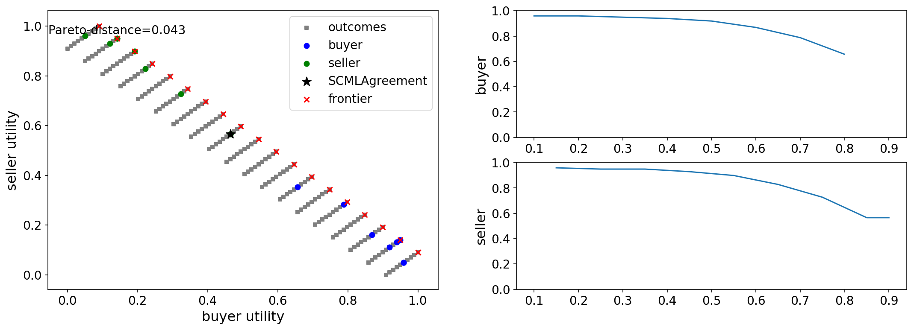
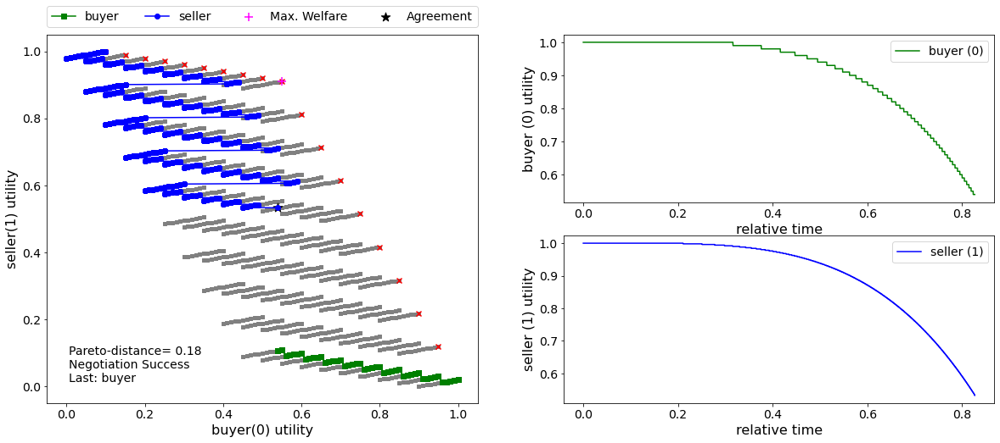
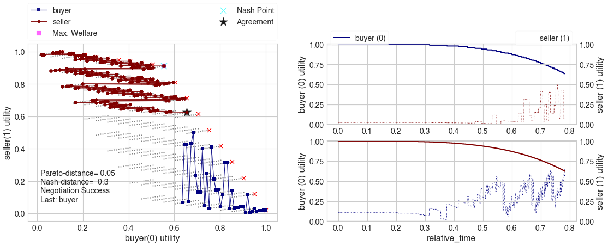

.. code:: ipython3

    # setup disply parameters
    import pandas as pd
    import numpy as np
    from matplotlib import pylab as plt
    from matplotlib.ticker import StrMethodFormatter
    float_formatter = StrMethodFormatter('{x:0.03f}')
    %pylab inline
    from IPython.core.display import display, HTML
    display(HTML(""))
    %config InlineBackend.figure_formats = 'pdf'
    
    SMALL_SIZE = 14
    MEDIUM_SIZE = 16
    BIGGER_SIZE = 20
    
    plt.rc('font', size=SMALL_SIZE)          # controls default text sizes
    plt.rc('axes', titlesize=SMALL_SIZE)     # fontsize of the axes title
    plt.rc('axes', labelsize=MEDIUM_SIZE)    # fontsize of the x and y labels
    plt.rc('xtick', labelsize=SMALL_SIZE)    # fontsize of the tick labels
    plt.rc('ytick', labelsize=SMALL_SIZE)    # fontsize of the tick labels
    plt.rc('legend', fontsize=SMALL_SIZE)    # legend fontsize
    plt.rc('figure', titlesize=BIGGER_SIZE)  # fontsize of the figure title
    pylab.rcParams['figure.figsize'] = (18, 6)

.. parsed-literal::

    Populating the interactive namespace from numpy and matplotlib

.. parsed-literal::

    /Users/yasser/.local/share/virtualenvs/negmas-bNSbQ2CL/lib/python3.6/site-packages/IPython/core/magics/pylab.py:160: UserWarning: pylab import has clobbered these variables: ['plt', 'random']
    `%matplotlib` prevents importing * from pylab and numpy
      "\n`%matplotlib` prevents importing * from pylab and numpy"

.. raw:: html

    

.. parsed-literal::

    ERROR:root:The 'figure_formats' trait of an InlineBackend instance must be a set, but a value of class 'str' (i.e. 'pdf') was specified.

Running a Negotiation
---------------------

NegMAS has several built-in negotiation ``Mechanism`` s (``Protocol``
s), negotiation agents (``Negotiator`` s), and ``UtilityFunction`` s.
You can use these to run negotiations as follows:

.. code:: ipython3

    import random # for generating random ufuns
    random.seed(0) # for reproducibility
    from pprint import pprint # for printing
    from negmas import SAOMechanism, AspirationNegotiator, MappingUtilityFunction
    
    session = SAOMechanism(outcomes=10, n_steps=100)
    negotiators = [AspirationNegotiator(name=f'a{_}') for _ in range(5)]
    for negotiator in negotiators:
        session.add(negotiator, ufun=MappingUtilityFunction(lambda x: random.random() * x[0]))
    
    pprint(session.run().__dict__)

.. parsed-literal::

    {'agreement': (4,),
     'broken': False,
     'current_offer': (4,),
     'current_offerer': 'a0-35a80813-5769-43f4-b0f5-b747623147e3',
     'error_details': '',
     'has_error': False,
     'n_acceptances': 5,
     'n_negotiators': 5,
     'relative_time': 0.06,
     'running': False,
     'started': True,
     'step': 5,
     'time': 0.0012421809951774776,
     'timedout': False}

Negotations end with a status that shows you what happens. In the above
example, we can see that the negotiation was not broken and did not
time-out. The agreement was on outcome ``(4,)`` of the *10* possible
outcomes of this negotiation. That offer was offered by negotiator
``a0`` (the rest of the agent *ID* is always a random value to ensure no
name repetitions) which was accepted by all of the other *4*
negotiators.

It is possible to run the same negotiation using a ``Protocol`` object
instead of a ``Mechanism`` object

.. code:: ipython3

    random.seed(0) # for reproducibility
    from negmas import SAOProtocol
    
    session = SAOProtocol(outcomes=10, n_steps=100)
    negotiators = [AspirationNegotiator(name=f'a{_}') for _ in range(5)]
    for negotiator in negotiators:
        session.add(negotiator, ufun=MappingUtilityFunction(lambda x: random.random() * x[0]))
    
    pprint(session.run().__dict__)

.. parsed-literal::

    {'agreement': (4,),
     'broken': False,
     'current_offer': (4,),
     'current_offerer': 'a0-dd83f431-c3b2-4cf3-be69-e1372ac08575',
     'error_details': '',
     'has_error': False,
     'n_acceptances': 5,
     'n_negotiators': 5,
     'relative_time': 0.06,
     'running': False,
     'started': True,
     'step': 5,
     'time': 0.0016102890003821813,
     'timedout': False}

As you can see, we got the same output.\ ``Protocol`` is an alias of
``Mechanism`` in NegMAS.

Let's try a more meaningful situation: Assume we have a buyer and a
seller who are negotiating about a business transaction in which the
buyer wants to maximize his profit while the seller wants to minimize
her cost. They both would like to transact on as much as possible of the
product and each has some preferred delivery time.

This can be modeled in the following negotiation:

.. code:: ipython3

    from negmas import Issue, SAOMechanism, AspirationNegotiator, normalize
    from negmas.utilities import LinearUtilityAggregationFunction as LUFun
    issues = [Issue(name='price', values=10), Issue(name='quantity', values=10)
              , Issue(name='delivery_time', values=10)]
    session = SAOMechanism(issues=issues, n_steps=20)
    
    buyer_utility = normalize(ufun=LUFun(issue_utilities={'price': lambda x: 9.0 - x
                                           , 'quantity': lambda x: 0.2 * x
                                           , 'delivery_time': lambda x: x})
                             , outcomes=session.outcomes)
    
    seller_utility = normalize(ufun=LUFun(issue_utilities={'price': lambda x: x
                                           , 'quantity': lambda x: 0.2 * x
                                           , 'delivery_time': lambda x: 9.0 - x})
                               , outcomes=session.outcomes)
    
    
    session.add(AspirationNegotiator(name='buyer'), ufun=buyer_utility)
    session.add(AspirationNegotiator(name='seller'), ufun=seller_utility)
    pprint(session.run().__dict__)

.. parsed-literal::

    {'agreement': {'delivery_time': 8, 'price': 9, 'quantity': 6},
     'broken': False,
     'current_offer': {'delivery_time': 8, 'price': 9, 'quantity': 6},
     'current_offerer': 'seller-5f97f609-4619-4947-8d01-7c04b3af071c',
     'error_details': '',
     'has_error': False,
     'n_acceptances': 2,
     'n_negotiators': 2,
     'relative_time': 0.9,
     'running': False,
     'started': True,
     'step': 17,
     'time': 0.041303394005808514,
     'timedout': False}

In this run, we can see that the agreement was on a high price (*9*)
which is preferred by the seller but with a delivery time of *8* which
is preferred by the buyer. Negotiation took *17* steps out of the
allowed *20* (*90%* of the available time)

We can check the negotiation history as well

.. code:: ipython3

    for i, _ in enumerate(session.history):
        print(f'{i:03}: {_.current_offerer} offered {_.current_offer}')

.. parsed-literal::

    000: buyer-663b5a0c-9efa-4530-9d81-95caa2348718 offered {'price': 0, 'quantity': 5, 'delivery_time': 9}
    001: seller-5f97f609-4619-4947-8d01-7c04b3af071c offered {'price': 9, 'quantity': 5, 'delivery_time': 0}
    002: buyer-663b5a0c-9efa-4530-9d81-95caa2348718 offered {'price': 0, 'quantity': 5, 'delivery_time': 9}
    003: seller-5f97f609-4619-4947-8d01-7c04b3af071c offered {'price': 9, 'quantity': 9, 'delivery_time': 1}
    004: buyer-663b5a0c-9efa-4530-9d81-95caa2348718 offered {'price': 1, 'quantity': 9, 'delivery_time': 9}
    005: seller-5f97f609-4619-4947-8d01-7c04b3af071c offered {'price': 9, 'quantity': 9, 'delivery_time': 1}
    006: buyer-663b5a0c-9efa-4530-9d81-95caa2348718 offered {'price': 1, 'quantity': 8, 'delivery_time': 9}
    007: seller-5f97f609-4619-4947-8d01-7c04b3af071c offered {'price': 9, 'quantity': 7, 'delivery_time': 1}
    008: buyer-663b5a0c-9efa-4530-9d81-95caa2348718 offered {'price': 1, 'quantity': 6, 'delivery_time': 9}
    009: seller-5f97f609-4619-4947-8d01-7c04b3af071c offered {'price': 9, 'quantity': 9, 'delivery_time': 2}
    010: buyer-663b5a0c-9efa-4530-9d81-95caa2348718 offered {'price': 2, 'quantity': 6, 'delivery_time': 9}
    011: seller-5f97f609-4619-4947-8d01-7c04b3af071c offered {'price': 9, 'quantity': 7, 'delivery_time': 3}
    012: buyer-663b5a0c-9efa-4530-9d81-95caa2348718 offered {'price': 4, 'quantity': 8, 'delivery_time': 9}
    013: seller-5f97f609-4619-4947-8d01-7c04b3af071c offered {'price': 9, 'quantity': 7, 'delivery_time': 5}
    014: buyer-663b5a0c-9efa-4530-9d81-95caa2348718 offered {'price': 6, 'quantity': 5, 'delivery_time': 9}
    015: seller-5f97f609-4619-4947-8d01-7c04b3af071c offered {'price': 9, 'quantity': 6, 'delivery_time': 8}
    016: seller-5f97f609-4619-4947-8d01-7c04b3af071c offered {'price': 9, 'quantity': 6, 'delivery_time': 8}

We can even plot the complete negotiation history and visually see how
far were the result from the pareto frontier (it was 0.043 utility units
far from it). We can see that it was possible to increase the utility of
the seller without decreasing the utility of the buyer at the agreement
point (i.e. going vertically up from the agreement). That means that
there is some *money left on the table* yet the results are not very far
from the pareto front.

.. code:: ipython3

    session.plot(plot_outcomes=False)

What happens if the seller was much more interested in delivery time.

Firstly, what do you expect?

Given that delivery time becomes a more important issue now, the buyer
will get more utility points by allowing the price to go up given that
the delivery time can be made earlier. This means that we should expect
the delivery time to go down in the agreement and the price to go up if
it can. Let's see what happens:

.. code:: ipython3

    session = SAOMechanism(issues=issues, n_steps=50)
    
    buyer_utility = normalize(ufun=LUFun(issue_utilities={'price': lambda x: x
                                           , 'quantity': lambda x: 0.2 * x
                                           , 'delivery_time': lambda x: 9.0 - x}
                                         , weights = {'price': 1.0, 'quantity': 1.0, 'delivery_time': 10.0})
                             , outcomes=session.outcomes)
    
    session.add(AspirationNegotiator(name='buyer'), ufun=buyer_utility)
    session.add(AspirationNegotiator(name='seller'), ufun=seller_utility)
    pprint(session.run().__dict__)

.. parsed-literal::

    {'agreement': {'delivery_time': 0, 'price': 9, 'quantity': 5},
     'broken': False,
     'current_offer': {'delivery_time': 0, 'price': 9, 'quantity': 5},
     'current_offerer': 'seller-0c569ef5-994c-492a-8dd5-6ca29e20bc02',
     'error_details': '',
     'has_error': False,
     'n_acceptances': 2,
     'n_negotiators': 2,
     'relative_time': 0.08,
     'running': False,
     'started': True,
     'step': 3,
     'time': 0.04780532199947629,
     'timedout': False}

We can check it visually as well:

.. code:: ipython3

    session.plot(plot_outcomes=False)

It is clear that the new ufuns transformed the problem. Now we have a
single outcome at the pareto front. The agreement again is near to it
(*0.041* utility points) and as expected the agreement was to make the
delivery time *0* which is much earlier than before. Moreover, the
negotation eas much faster finighing in 3 steps (*8%* of the available
time).

What happens if we repeat the earlier neotiation but with a much longer
negotiation time:

.. code:: ipython3

    session = SAOMechanism(issues=issues, n_steps=2000)
    
    buyer_utility = normalize(ufun=LUFun(issue_utilities={'price': lambda x: 9.0 - x
                                           , 'quantity': lambda x: 0.2 * x
                                           , 'delivery_time': lambda x: x})
                             , outcomes=session.outcomes)
    
    seller_utility = normalize(ufun=LUFun(issue_utilities={'price': lambda x: x
                                           , 'quantity': lambda x: 0.2 * x
                                           , 'delivery_time': lambda x: 9.0 - x})
                               , outcomes=session.outcomes)
    
    
    session.add(AspirationNegotiator(name='buyer'), ufun=buyer_utility)
    session.add(AspirationNegotiator(name='seller'), ufun=seller_utility)
    
    pprint(session.run().__dict__)
    session.plot(plot_outcomes=False)

.. parsed-literal::

    {'agreement': {'delivery_time': 9, 'price': 9, 'quantity': 9},
     'broken': False,
     'current_offer': {'delivery_time': 9, 'price': 9, 'quantity': 9},
     'current_offerer': 'seller-351793b0-c5d9-41d3-ab81-fc8dd4a993fb',
     'error_details': '',
     'has_error': False,
     'n_acceptances': 2,
     'n_negotiators': 2,
     'relative_time': 0.809,
     'running': False,
     'started': True,
     'step': 1617,
     'time': 0.5112965289954445,
     'timedout': False}

Given the longer negotiation time, the buyer and the seller can both
take a tougher stance conceding as slowly as possible and as a result
the actually acheive a point exatly on the pareto-front. Moreover, this
point happens to maximze the *welfare* defined as the sum of the utility
received by both partners.

.. only:: builder_html

    Download :download:`Notebook<notebooks/01.running_simple_negotiation.ipynb>`.

