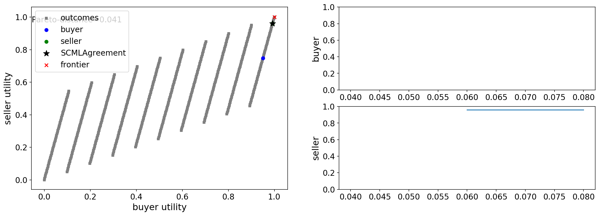
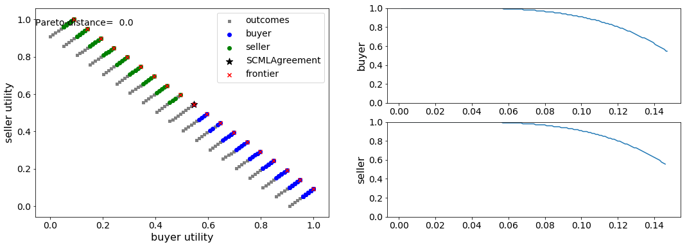

Running a Negotiation
---------------------

NegMAS has several built-in negotiation ``Mechanism`` s (``Protocol``
s), negotiation agents (``Negotiator`` s), and ``UtilityFunction`` s.
You can use these to run negotiations as follows:

.. code:: ipython3

    import random # for generating random ufuns
    random.seed(0) # for reproducibility
    from pprint import pprint # for printing
    from negmas import SAOMechanism, AspirationNegotiator, MappingUtilityFunction
    
    session = SAOMechanism(outcomes=10, n_steps=100)
    negotiators = [AspirationNegotiator(name=f'a{_}') for _ in range(5)]
    for negotiator in negotiators:
        session.add(negotiator, ufun=MappingUtilityFunction(lambda x: random.random() * x[0]))
    
    pprint(session.run().__dict__)

.. parsed-literal::

    {'agreement': (4,),
     'broken': False,
     'current_offer': (4,),
     'current_proposer': 'a4-3c56bcb2-0278-45ee-b95b-c696d6a11a54',
     'error_details': '',
     'has_error': False,
     'n_acceptances': 0,
     'n_negotiators': 5,
     'relative_time': 0.96,
     'running': False,
     'started': True,
     'step': 95,
     'time': 0.012729342999989512,
     'timedout': False}

Negotations end with a status that shows you what happens. In the above
example, we can see that the negotiation was not broken and did not
time-out. The agreement was on outcome ``(4,)`` of the *10* possible
outcomes of this negotiation. That offer was offered by negotiator
``a0`` (the rest of the agent *ID* is always a random value to ensure no
name repetitions) which was accepted by all of the other *4*
negotiators.

It is possible to run the same negotiation using a ``Protocol`` object
instead of a ``Mechanism`` object

.. code:: ipython3

    random.seed(0) # for reproducibility
    from negmas import SAOProtocol
    
    session = SAOProtocol(outcomes=10, n_steps=100)
    negotiators = [AspirationNegotiator(name=f'a{_}') for _ in range(5)]
    for negotiator in negotiators:
        session.add(negotiator, ufun=MappingUtilityFunction(lambda x: random.random() * x[0]))
    
    pprint(session.run().__dict__)

.. parsed-literal::

    {'agreement': (4,),
     'broken': False,
     'current_offer': (4,),
     'current_proposer': 'a4-a80ace99-7c18-4f0d-b9b7-9ab32f4b91f9',
     'error_details': '',
     'has_error': False,
     'n_acceptances': 0,
     'n_negotiators': 5,
     'relative_time': 0.96,
     'running': False,
     'started': True,
     'step': 95,
     'time': 0.012701435999986188,
     'timedout': False}

As you can see, we got the same output.\ ``Protocol`` is an alias of
``Mechanism`` in NegMAS.

Let's try a more meaningful situation: Assume we have a buyer and a
seller who are negotiating about a business transaction in which the
buyer wants to maximize his profit while the seller wants to minimize
her cost. They both would like to transact on as much as possible of the
product and each has some preferred delivery time.

This can be modeled in the following negotiation:

.. code:: ipython3

    from negmas import Issue, SAOMechanism, AspirationNegotiator, normalize
    from negmas.utilities import LinearUtilityAggregationFunction as LUFun
    issues = [Issue(name='price', values=10), Issue(name='quantity', values=10)
              , Issue(name='delivery_time', values=10)]
    session = SAOMechanism(issues=issues, n_steps=5)
    
    buyer_utility = normalize(ufun=LUFun(issue_utilities={'price': lambda x: 9.0 - x
                                           , 'quantity': lambda x: 0.2 * x
                                           , 'delivery_time': lambda x: x})
                             , outcomes=session.outcomes)
    
    seller_utility = normalize(ufun=LUFun(issue_utilities={'price': lambda x: x
                                           , 'quantity': lambda x: 0.2 * x
                                           , 'delivery_time': lambda x: 9.0 - x})
                               , outcomes=session.outcomes)
    
    
    session.add(AspirationNegotiator(name='buyer'), ufun=buyer_utility)
    session.add(AspirationNegotiator(name='seller'), ufun=seller_utility)
    pprint(session.run().__dict__)

.. parsed-literal::

    {'agreement': {'delivery_time': 8, 'price': 9, 'quantity': 9},
     'broken': False,
     'current_offer': {'delivery_time': 8, 'price': 9, 'quantity': 9},
     'current_proposer': 'seller-bb1ebd4e-b6ea-44ed-a819-2e9d174d0f85',
     'error_details': '',
     'has_error': False,
     'n_acceptances': 0,
     'n_negotiators': 2,
     'relative_time': 1.2,
     'running': False,
     'started': True,
     'step': 5,
     'time': 0.0006966750000287902,
     'timedout': False}

In this run, we can see that the agreement was on a high price (9) which
is preferred by the seller but with a delivery time of (8) which is
preferred by the buyer. Negotiation took all of the allowed *5* steps.

We can check the negotiation history as well

.. code:: ipython3

    for i, _ in enumerate(session.history):
        print(f'{i:03}: {_.current_proposer} offered {_.current_offer}')

.. parsed-literal::

    000: buyer-a7cd6341-d966-42d2-a206-2104750f56c5 offered {'price': 0, 'quantity': 9, 'delivery_time': 9}
    001: seller-bb1ebd4e-b6ea-44ed-a819-2e9d174d0f85 offered {'price': 9, 'quantity': 7, 'delivery_time': 0}
    002: buyer-a7cd6341-d966-42d2-a206-2104750f56c5 offered {'price': 2, 'quantity': 7, 'delivery_time': 9}
    003: seller-bb1ebd4e-b6ea-44ed-a819-2e9d174d0f85 offered {'price': 9, 'quantity': 9, 'delivery_time': 8}
    004: seller-bb1ebd4e-b6ea-44ed-a819-2e9d174d0f85 offered {'price': 9, 'quantity': 9, 'delivery_time': 8}

We can even plot the complete negotiation history and visually see how
far were the result from the pareto frontier (it was 0.0 utility units
far from it).

.. code:: ipython3

    session.plot(plot_outcomes=False)

.. image:: 01.running_simple_negotiation_files/01.running_simple_negotiation_10_0.png

What happens if the seller was much more interested in delivery time.

Firstly, what do you expect?

Given that delivery time becomes a more important issue now, the buyer
will get more utility points by allowing the price to go up given that
the delivery time can be made earlier. This means that we should expect
the delivery time to go down in the agreement and the price to go up if
it can. Let's see what happens:

.. code:: ipython3

    session = SAOMechanism(issues=issues, n_steps=5)
    
    buyer_utility = normalize(ufun=LUFun(issue_utilities={'price': lambda x: x
                                           , 'quantity': lambda x: 0.2 * x
                                           , 'delivery_time': lambda x: 9.0 - x}
                                         , weights = {'price': 1.0, 'quantity': 1.0, 'delivery_time': 10.0})
                             , outcomes=session.outcomes)
    
    session.add(AspirationNegotiator(name='buyer'), ufun=buyer_utility)
    session.add(AspirationNegotiator(name='seller'), ufun=seller_utility)
    pprint(session.run().__dict__)

.. parsed-literal::

    {'agreement': {'delivery_time': 0, 'price': 9, 'quantity': 9},
     'broken': False,
     'current_offer': {'delivery_time': 0, 'price': 9, 'quantity': 9},
     'current_proposer': 'buyer-89277840-c43d-4bc3-b7aa-9910efca2130',
     'error_details': '',
     'has_error': False,
     'n_acceptances': 0,
     'n_negotiators': 2,
     'relative_time': 0.6,
     'running': False,
     'started': True,
     'step': 2,
     'time': 0.0003362379999884979,
     'timedout': False}

We can check it visually as well:

.. code:: ipython3

    session.plot(plot_outcomes=False)

It is clear that the new ufuns transformed the problem. Now we have a
single outcome at the pareto front. The agreement is on it (*0.0*
utility points).

What happens if we repeat the earlier neotiation but with a much longer
negotiation time:

.. code:: ipython3

    session = SAOMechanism(issues=issues, n_steps=2000)
    
    buyer_utility = normalize(ufun=LUFun(issue_utilities={'price': lambda x: 9.0 - x
                                           , 'quantity': lambda x: 0.2 * x
                                           , 'delivery_time': lambda x: x})
                             , outcomes=session.outcomes)
    
    seller_utility = normalize(ufun=LUFun(issue_utilities={'price': lambda x: x
                                           , 'quantity': lambda x: 0.2 * x
                                           , 'delivery_time': lambda x: 9.0 - x})
                               , outcomes=session.outcomes)
    
    
    session.add(AspirationNegotiator(name='buyer'), ufun=buyer_utility)
    session.add(AspirationNegotiator(name='seller'), ufun=seller_utility)
    
    pprint(session.run().__dict__)
    session.plot(plot_outcomes=False)

.. parsed-literal::

    {'agreement': {'delivery_time': 9, 'price': 9, 'quantity': 9},
     'broken': False,
     'current_offer': {'delivery_time': 9, 'price': 9, 'quantity': 9},
     'current_proposer': 'seller-6f8c4e96-6e66-43aa-9045-431bd587534b',
     'error_details': '',
     'has_error': False,
     'n_acceptances': 0,
     'n_negotiators': 2,
     'relative_time': 0.8225,
     'running': False,
     'started': True,
     'step': 1644,
     'time': 0.2121083879999901,
     'timedout': False}

Given the longer negotiation time, the buyer and the seller can both
take a tougher stance conceding as slowly as possible (taking *1644*
steps out of the available *2000* instead of just 5 as before). As a
result they again achieve a point exactly on the pareto-front. Moreover,
this point happens to maximize the *welfare* defined as the sum of the
utility received by both partners.

Download :download:`Notebook<notebooks/01.running_simple_negotiation.ipynb>`.

