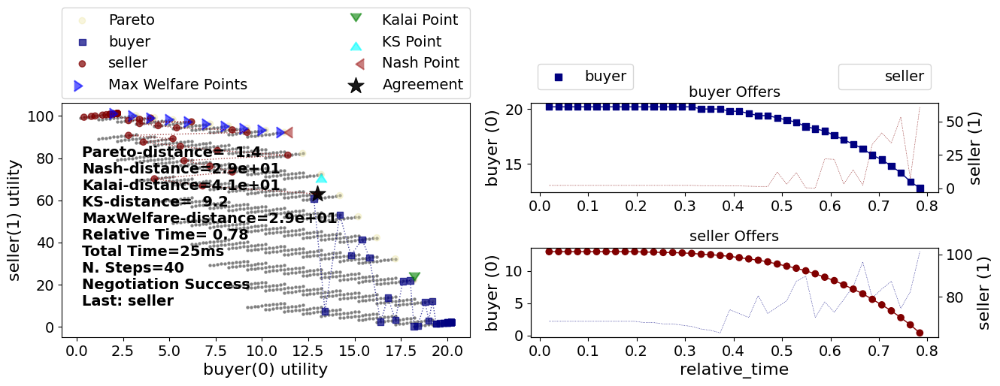
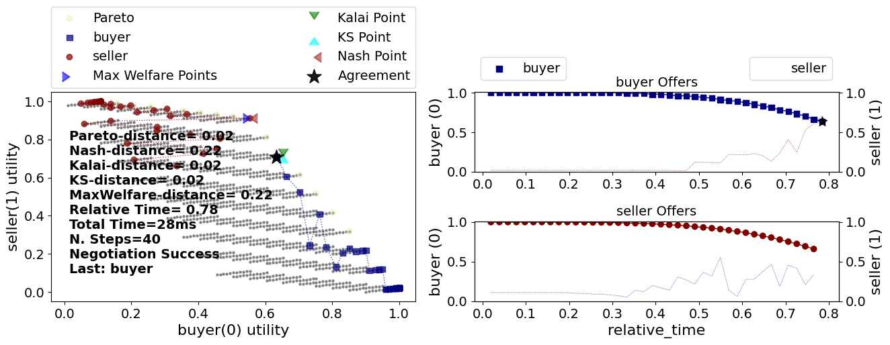
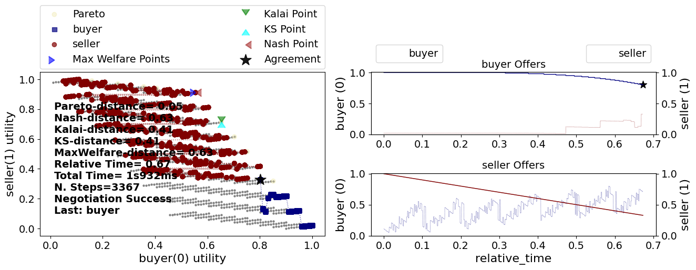

Running a Negotiation
---------------------

NegMAS has several built-in negotiation ``Mechanism`` s, negotiation
agents (``Negotiator`` s), and ``UtilityFunction`` s. You can use these
to run negotiations as follows:

.. code:: ipython3

    from negmas import SAOMechanism, TimeBasedConcedingNegotiator, MappingUtilityFunction
    import random  # for generating random ufuns

    random.seed(0)  # for reproducibility

    session = SAOMechanism(outcomes=10, n_steps=100)
    negotiators = [TimeBasedConcedingNegotiator(name=f"a{_}") for _ in range(5)]
    for negotiator in negotiators:
        session.add(
            negotiator,
            preferences=MappingUtilityFunction(
                lambda x: random.random() * x[0], outcome_space=session.outcome_space
            ),
        )

    print(session.run())

.. raw:: html

    <pre style="white-space:pre;overflow-x:auto;line-height:normal;font-family:Menlo,'DejaVu Sans Mono',consolas,'Courier New',monospace">SAOState(
        running=False,
        waiting=False,
        started=True,
        step=1,
        time=0.0010083329980261624,
        relative_time=0.019801980198019802,
        broken=True,
        timedout=False,
        agreement=None,
        results=None,
        n_negotiators=5,
        has_error=False,
        error_details='',
        threads={},
        last_thread='',
        current_offer=None,
        current_proposer=None,
        current_proposer_agent=None,
        n_acceptances=0,
        new_offers=[],
        new_offerer_agents=&lt;class 'list'&gt;,
        last_negotiator=None
    )
    </pre>

Negotations end with a status that shows you what happens. In the above
example, we can see that the negotiation was not broken and did not
time-out. The agreement was on outcome ``(9,)`` of the *10* possible
outcomes of this negotiation. That offer was offered by negotiator
``a3`` (the rest of the agent *ID* is always a random value to ensure no
name repetitions) in the ``9``\ th round of the negotiation
(rounds/steps start at ``0``) and was accepted by all of the other *4*
negotiators. The whole negotiation took ``4.66`` ms.

Let’s look at this code example line-by-line:

.. code:: python

   session = SAOMechanism(outcomes=10, n_steps=100)

The negotiation protocol in NegMAS is handled by a ``Mechanism`` object.
Here we instantiate an ``SAOMechanism`` which implements the `Stacked
Alternating Offers
Protocol <https://ii.tudelft.nl/~catholijn/publications/sites/default/files/Aydogan2017_Chapter_AlternatingOffersProtocolsForM.pdf>`__.
In this protocol, negotiators exchange offers until an offer is accepted
by all negotiators, a negotiators leaves the table ending the
negotiation or a time-out condition is met. In the example above, we use
a limit on the number of rounds (defined by a number of offers equal to
the number of negotiators) of ``100`` (a step of a mechanism is an
executed round). Another possibility here is to pass a wall-time
constraint using something like ``time_limit=10`` which limits the
negotiation to ``10`` seconds.

The negotiation agenda can be specified in two ways:

1. You can pass ``outcomes=x`` to create a negotiation agenda with a
   single issue of ``x`` values. In this example we use this approach to
   create a single issue negotiation with ``10`` outcomes. These
   outcomes will be tuples of one item each ranging from ``(0,)`` to
   ``(9,)``.
2. You can pass ``issues=x`` to create a multi-issue negotiation as we
   will see later in this tutorial. We can use this approach to achieve
   the same result as above by replacing ``outcomes=10`` with
   ``issues=[make_issue(10)]`` in the sample code above.

.. code:: python

   negotiators = [AspirationNegotiator(name=f"a{_}") for _ in range(5)]

This line creates ``5`` negotiators of the type ``AspirationNegotiator``
which implements a simple time-based negotiation strategy. It starts by
offering the outcome with maximum utility for itself and then concedes
(i.e. offers outcomes with lower utility) based on the relative time of
the negotiation.

.. code:: python

   for negotiator in negotiators:
       session.add(
           negotiator, preferences=MappingUtilityFunction(lambda x: random.random() * x[0])
       )

This loop *adds* the negotiators to the negotiation session (the
``SAOMechanism`` we created earlier). Most negotiators need access to a
utility function that defines its preferences over different outcomes.
Here we use a ``MappintUtilityFunction`` which is passed any python
callable (i.e. a function, lambda expression, a class implementing
``__call__``, …) and uses it to calculate the utility of a given
outcome.

The lambda expression used here (``lambda x: random.random() * x[0]``)
extracts the first value of the outcome (which will be an integer from
``0`` to ``9``) and multiplies it with a random number *each time it is
called*. This means that calling this utility function twice with the
same outcome results in two different values. This may not be
particularly useful but it shows that the utility function can *change*
during the negotiation and NegMAS provides some support for this which
we will discuss in later tutorials.

Now the last line runs the negotiation using the ``run()`` method of the
``SAOMechanism`` object, converts the result to a dictionary using
``var`` and prints it.

A simple bilateral negotiation
~~~~~~~~~~~~~~~~~~~~~~~~~~~~~~

Let’s try a more meaningful situation: Assume we have a buyer and a
seller who are negotiating about a business transaction in which the
buyer wants to maximize his profit while the seller wants to minimize
her cost. They both would like to transact on as much as possible of the
product and each has some preferred delivery time.

This can be modeled in the following negotiation:

.. code:: ipython3

    from negmas import (
        make_issue,
        SAOMechanism,
        NaiveTitForTatNegotiator,
        TimeBasedConcedingNegotiator,
    )
    from negmas.preferences import LinearAdditiveUtilityFunction as LUFun
    from negmas.preferences.value_fun import LinearFun, IdentityFun, AffineFun

    # create negotiation agenda (issues)
    issues = [
        make_issue(name="price", values=10),
        make_issue(name="quantity", values=(1, 11)),
        make_issue(name="delivery_time", values=10),
    ]

    # create the mechanism
    session = SAOMechanism(issues=issues, n_steps=20)

    # define buyer and seller utilities
    seller_utility = LUFun(
        values=[IdentityFun(), LinearFun(0.2), AffineFun(-1, bias=9.0)],
        outcome_space=session.outcome_space,
    )

    buyer_utility = LUFun(
        values={
            "price": AffineFun(-1, bias=9.0),
            "quantity": LinearFun(0.2),
            "delivery_time": IdentityFun(),
        },
        outcome_space=session.outcome_space,
    )

    # create and add buyer and seller negotiators
    session.add(TimeBasedConcedingNegotiator(name="buyer"), preferences=buyer_utility)
    session.add(TimeBasedConcedingNegotiator(name="seller"), ufun=seller_utility)

    # run the negotiation and show the results
    print(session.run())

.. raw:: html

    <pre style="white-space:pre;overflow-x:auto;line-height:normal;font-family:Menlo,'DejaVu Sans Mono',consolas,'Courier New',monospace">SAOState(
        running=False,
        waiting=False,
        started=True,
        step=18,
        time=0.011125040997285396,
        relative_time=0.9047619047619048,
        broken=False,
        timedout=False,
        agreement=(1, 9, 0),
        results=None,
        n_negotiators=2,
        has_error=False,
        error_details='',
        threads={},
        last_thread='',
        current_offer=(1, 9, 0),
        current_proposer='seller-ac4d21c3-78ef-4352-908c-0362efa27d9c',
        current_proposer_agent=None,
        n_acceptances=2,
        new_offers=[],
        new_offerer_agents=[None, None],
        last_negotiator='seller'
    )
    </pre>

In this run, we can see that the agreement was on a high price (*9*)
which is preferred by the seller but with a delivery time of *8* which
is preferred by the buyer. Negotiation took *17* steps out of the
allowed *20* (*90%* of the available time)

We can check the negotiation history as well by printing the
``extended_trace`` which shows the step, negotiator, and offer for every
s tep of the negotiation:

.. code:: ipython3

    session.extended_trace

.. parsed-literal::

    [(0, 'buyer-3a4c7047-d5bb-4ae7-9684-eadf7c9c68d2', (0, 11, 9)),
     (0, 'seller-ac4d21c3-78ef-4352-908c-0362efa27d9c', (9, 11, 0)),
     (1, 'buyer-3a4c7047-d5bb-4ae7-9684-eadf7c9c68d2', (0, 11, 9)),
     (1, 'seller-ac4d21c3-78ef-4352-908c-0362efa27d9c', (9, 11, 0)),
     (2, 'buyer-3a4c7047-d5bb-4ae7-9684-eadf7c9c68d2', (0, 11, 9)),
     (2, 'seller-ac4d21c3-78ef-4352-908c-0362efa27d9c', (9, 11, 0)),
     (3, 'buyer-3a4c7047-d5bb-4ae7-9684-eadf7c9c68d2', (0, 11, 9)),
     (3, 'seller-ac4d21c3-78ef-4352-908c-0362efa27d9c', (9, 11, 0)),
     (4, 'buyer-3a4c7047-d5bb-4ae7-9684-eadf7c9c68d2', (0, 11, 9)),
     (4, 'seller-ac4d21c3-78ef-4352-908c-0362efa27d9c', (9, 11, 0)),
     (5, 'buyer-3a4c7047-d5bb-4ae7-9684-eadf7c9c68d2', (0, 11, 9)),
     (5, 'seller-ac4d21c3-78ef-4352-908c-0362efa27d9c', (9, 11, 0)),
     (6, 'buyer-3a4c7047-d5bb-4ae7-9684-eadf7c9c68d2', (0, 10, 9)),
     (6, 'seller-ac4d21c3-78ef-4352-908c-0362efa27d9c', (9, 10, 0)),
     (7, 'buyer-3a4c7047-d5bb-4ae7-9684-eadf7c9c68d2', (0, 9, 9)),
     (7, 'seller-ac4d21c3-78ef-4352-908c-0362efa27d9c', (9, 9, 0)),
     (8, 'buyer-3a4c7047-d5bb-4ae7-9684-eadf7c9c68d2', (0, 8, 9)),
     (8, 'seller-ac4d21c3-78ef-4352-908c-0362efa27d9c', (9, 8, 0)),
     (9, 'buyer-3a4c7047-d5bb-4ae7-9684-eadf7c9c68d2', (0, 11, 8)),
     (9, 'seller-ac4d21c3-78ef-4352-908c-0362efa27d9c', (9, 11, 1)),
     (10, 'buyer-3a4c7047-d5bb-4ae7-9684-eadf7c9c68d2', (0, 9, 8)),
     (10, 'seller-ac4d21c3-78ef-4352-908c-0362efa27d9c', (9, 4, 0)),
     (11, 'buyer-3a4c7047-d5bb-4ae7-9684-eadf7c9c68d2', (0, 1, 9)),
     (11, 'seller-ac4d21c3-78ef-4352-908c-0362efa27d9c', (8, 6, 0)),
     (12, 'buyer-3a4c7047-d5bb-4ae7-9684-eadf7c9c68d2', (0, 2, 8)),
     (12, 'seller-ac4d21c3-78ef-4352-908c-0362efa27d9c', (9, 7, 2)),
     (13, 'buyer-3a4c7047-d5bb-4ae7-9684-eadf7c9c68d2', (2, 2, 9)),
     (13, 'seller-ac4d21c3-78ef-4352-908c-0362efa27d9c', (9, 7, 3)),
     (14, 'buyer-3a4c7047-d5bb-4ae7-9684-eadf7c9c68d2', (0, 10, 4)),
     (14, 'seller-ac4d21c3-78ef-4352-908c-0362efa27d9c', (4, 10, 0)),
     (15, 'buyer-3a4c7047-d5bb-4ae7-9684-eadf7c9c68d2', (1, 8, 4)),
     (15, 'seller-ac4d21c3-78ef-4352-908c-0362efa27d9c', (8, 3, 4)),
     (16, 'buyer-3a4c7047-d5bb-4ae7-9684-eadf7c9c68d2', (6, 9, 7)),
     (16, 'seller-ac4d21c3-78ef-4352-908c-0362efa27d9c', (1, 9, 0))]

We can even plot the complete negotiation history and visually see how
far were the result from the pareto frontier (it was 0.0 utility units
far from it).

.. code:: ipython3

    session.plot(show_reserved=False)
    plt.show()

.. image:: 01.running_simple_negotiation_files/01.running_simple_negotiation_9_0.png

What happens if the seller was much more interested in delivery time.

Firstly, what do you expect?

Given that delivery time becomes a more important issue now, the seller
will get more utility points by allowing the price to go down given that
the delivery time can be made earlier. This means that we should expect
the delivery time and price to go down. Let’s see what happens:

.. code:: ipython3

    seller_utility = LUFun(
        values={
            "price": IdentityFun(),
            "quantity": LinearFun(0.2),
            "delivery_time": AffineFun(-1, bias=9),
        },
        weights={"price": 1.0, "quantity": 1.0, "delivery_time": 10.0},
        outcome_space=session.outcome_space,
    )

    session = SAOMechanism(issues=issues, n_steps=50)
    session.add(TimeBasedConcedingNegotiator(name="buyer"), ufun=buyer_utility)
    session.add(TimeBasedConcedingNegotiator(name="seller"), ufun=seller_utility)
    print(session.run())

.. raw:: html

    <pre style="white-space:pre;overflow-x:auto;line-height:normal;font-family:Menlo,'DejaVu Sans Mono',consolas,'Courier New',monospace">SAOState(
        running=False,
        waiting=False,
        started=True,
        step=41,
        time=0.008240791998105124,
        relative_time=0.8235294117647058,
        broken=False,
        timedout=False,
        agreement=(1, 10, 3),
        results=None,
        n_negotiators=2,
        has_error=False,
        error_details='',
        threads={},
        last_thread='',
        current_offer=(1, 10, 3),
        current_proposer='seller-44e25dcc-a967-49a1-b29d-6b77c44a4a08',
        current_proposer_agent=None,
        n_acceptances=2,
        new_offers=[],
        new_offerer_agents=[None, None],
        last_negotiator='seller'
    )
    </pre>

We can check it visually as well:

.. code:: ipython3

    session.plot(show_reserved=False)
    plt.show()

It is clear that the new ufuns transformed the problem. Now we have many
outcomes that are far from the pareto-front in this case. Nevertheless,
there is money on the table as the negotiators did not agree on an
outcome on the pareto front.

Inspecting the utility ranges of the seller and buyer we can see that
the seller can get much higher utility than the buyer (100 comapred with
20). This is a side effect of the ufun definitions and we can remove
this difference by normalizing both ufuns and trying again:

.. code:: ipython3

    seller_utility = seller_utility.scale_max(1.0)
    buyer_utility = buyer_utility.scale_max(1.0)
    session = SAOMechanism(issues=issues, n_steps=50)
    session.add(TimeBasedConcedingNegotiator(name="buyer"), ufun=buyer_utility)
    session.add(TimeBasedConcedingNegotiator(name="seller"), ufun=seller_utility)
    session.run()
    session.plot(ylimits=(0.0, 1.01), show_reserved=False)
    plt.show()

What happens if we give them more time to negotiate:

.. code:: ipython3

    session = SAOMechanism(issues=issues, n_steps=5000)

    session.add(TimeBasedConcedingNegotiator(name="buyer"), ufun=buyer_utility)
    session.add(TimeBasedConcedingNegotiator(name="seller"), ufun=seller_utility)
    session.run()
    session.plot(ylimits=(0.0, 1.01), show_reserved=False)
    plt.show()

It did not help much! The two agents adjusted their concession to match
the new time and they did not get to the Pareto-front.

Let’s allow them to concede faster by setting their ``aspiration_type``
to *linear* instead of the default *boulware*:

.. code:: ipython3

    session = SAOMechanism(issues=issues, n_steps=5000)
    session.add(
        TimeBasedConcedingNegotiator(name="buyer", offering_curve="linear"),
        ufun=buyer_utility,
    )
    session.add(
        TimeBasedConcedingNegotiator(name="seller", offering_curve="linear"),
        ufun=seller_utility,
    )
    session.run()
    session.plot(ylimits=(0.0, 1.01), show_reserved=False)
    plt.show()

.. image:: 01.running_simple_negotiation_files/01.running_simple_negotiation_19_0.png

It is clear that longer negotiation time, and faster concession did not
help the negotiators get to a point on the pareto-front.

What happens if one of the negotiators (say the buyer) was tougher than
the other?

.. code:: ipython3

    session = SAOMechanism(issues=issues, n_steps=5000)
    session.add(
        TimeBasedConcedingNegotiator(name="buyer", offering_curve="boulware"),
        ufun=buyer_utility,
    )
    session.add(
        TimeBasedConcedingNegotiator(name="seller", offering_curve="linear"),
        ufun=seller_utility,
    )
    session.run()
    session.plot(ylimits=(0.0, 1.01), show_reserved=False)
    plt.show()

Try to give an intuition for what happened:

-  Why did the negotiation take shorter than the previous one?
-  Why is the final agreement nearer to the pareto front?
-  Why is the buyer getting higher utility than in the case before the
   previous (in which it was also using a Boulware strategy)?
-  Why is the seller getting lower utility than in the case before the
   previous (in which it was also using a linear concession strategy)?
-  If the seller knew that the buyer will be using this strategy, what
   is its best response?
