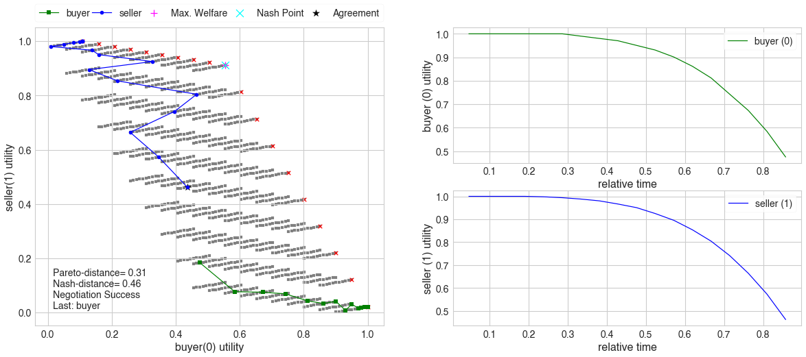
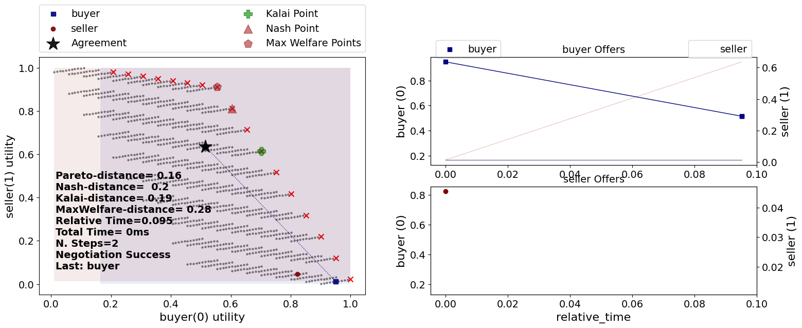
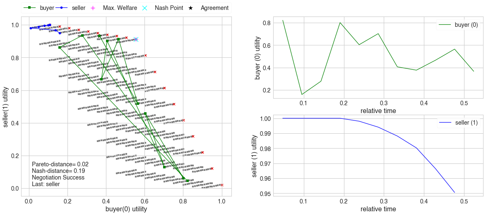
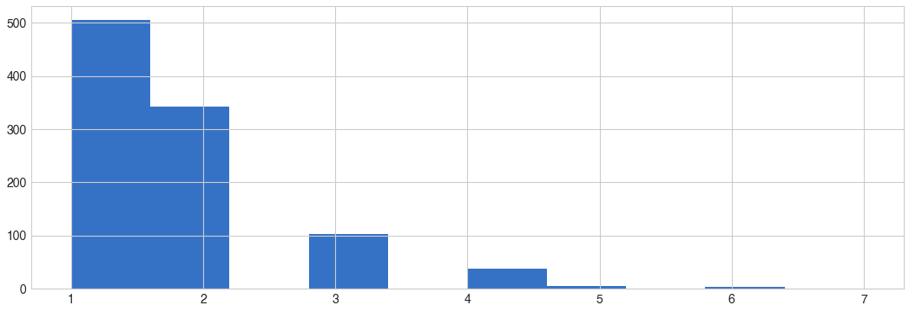
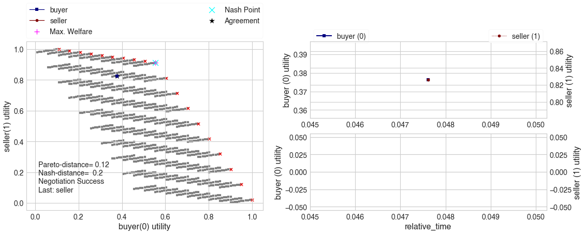
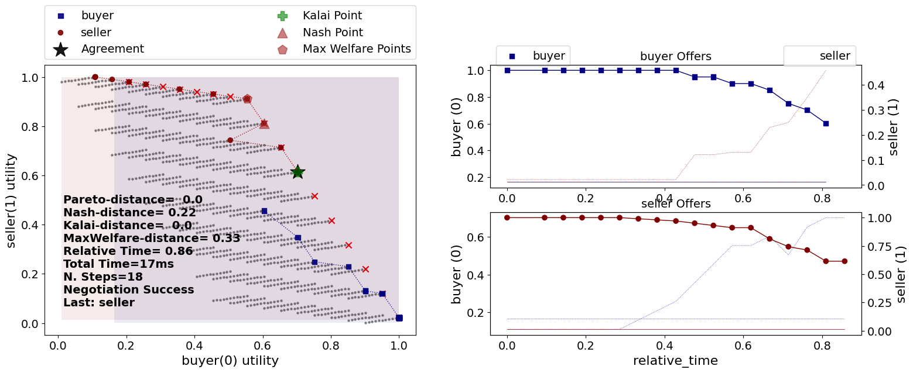

Develop a new negotiator
------------------------

In this section, we go through the process of developing a new agent for
the Stacked Alternating offers Protocols. Firstly, let’s look at an
example from the previous tutorial in which we simulate a buyer and a
seller negotiating over a deal using time-based negotiators.

.. code:: ipython3

    # create negotiation agenda (issues)
    issues = [
        make_issue(name='price', values=10),
        make_issue(name='quantity', values=(1, 11)),
        make_issue(name='delivery_time', values=10)
    ]

    # create the mechanism
    session = SAOMechanism(issues=issues, n_steps=20)

    #define ufuns
    seller_utility = LUFun(values={'price': IdentityFun() , 'quantity': LinearFun(0.2) , 'delivery_time': AffineFun(-1, bias=9)},
                           weights = {'price': 1.0, 'quantity': 1.0, 'delivery_time': 10.0},
                           outcome_space=session.outcome_space, reserved_value=0.0).scale_max(1.0)
    buyer_utility = LUFun(
            values={
                'price': AffineFun(-1, bias=9.0),
                'quantity': LinearFun(0.2),
                'delivery_time': IdentityFun()
            },
            outcome_space=session.outcome_space,
        reserved_value=0.0
        ).scale_max(1.0)

    session.add(AspirationNegotiator(name='buyer'), ufun=buyer_utility)
    session.add(AspirationNegotiator(name='seller'), ufun=seller_utility)
    session.run()
    session.plot()





The negotiation ended with an agreement far from the pareto-front
(pareto-distance = :math:`0.31`) which does not seem like a good result.
What is the problem?

Looking carefully at the 2D representation of the negotiation above, we
can immediately see the issue: uninformed concession. Consider the buyer
agent. It started with offering the best outcome for itself (The green
offers above) and repeated it for a while (as expected) then started
conceding (i.e. offering outcomes with lower utility for itself.
Nevertheless, when it did conceed, it did not consider its partner at
all. The figure below shows the same figure focusing on one specific
choice the buyer did: |Uninformed Concession|

The problem is highlighted in orange. Even though the buyer had several
offers that are *of the same utility for itself*, they are not of the
same utility *to its partner*. In the figure, it is clear that the
buyer, chose the offer that was in fact the *worst* for its opponent.
Choosing any other offer in the orange rectangle could have been better
as it is nearer to the pareto-front. By offering this way, the partners
are *leaving money on the table*.

Could the buyer have done better? Yes. By the time it gave this offer,
it already have received several offers from the seller which could have
been used to *estimate* the utility of different outcomes the buyer is
cosidering offering for the seller (highlighted in red).

| The ideas we want to implement is pretty simple:
| **Use a time-based consession strategy but always offer the outcome
  nearest to the first offer of the partner**

The intuition behind this simple strategy relies on two assumptions:

1. The partner’s first offer is most likely its best outcome. Most
   negotiators will start with the best outcome for themselves.
2. Nearer outcomes in the outcome-space, are likely to have similar
   utilities (i.e. the utility function of the partner is smooth).

Both of these assumptions are sometimes violated but our goal here is to
develop a *simple* yet useful negotiator not to end once and for all the
hunt for the most effective negotiation strategy. With that said, let’s
dive in.

Building a random negotiator
~~~~~~~~~~~~~~~~~~~~~~~~~~~~

As a first step, we will build a negotiator that acts randomly.

Let’s assume that we are too lazy to even read the documentation and
want to learn how to develop a negotiator for the stacked alternating
offers protocol. The first thing is to create a negotiator class and see
what are the methods we need to override. All negotiators for the SAO
mechanism should inherit from the ``SAONegotiator`` base class. Let’s
try to do that

.. |Uninformed Concession| image:: uninformed.png

.. code:: ipython3

    class RandomNegotiator(SAONegotiator):
        ...

    try:
        RandomNegotiator()
    except Exception as e:
        print(e)


.. raw:: html

    <pre style="white-space:pre;overflow-x:auto;line-height:normal;font-family:Menlo,'DejaVu Sans Mono',consolas,'Courier New',monospace">Can't instantiate abstract class RandomNegotiator with abstract method propose
    </pre>


This is telling us that there is one (and only one) required abstract
method that we need to override called ``propose()``. This is the
signature of this method:

.. code:: python

   def proposed(self, state: SAOState) -> Outcome:
       ...

It receives the negotiation ``state`` which has all information
available to the negotiator about the current state of the negotiation
and generates an outcome to *offer* to the opponent. That is it.
Moreover, we should know that the negotiator always have access to a
``NegotiatorMechanismInterface`` object that gives it unchanging
information about the negotiation (for example the number of allowed
rounds, any real-time limits on the negotiation, the number of partners,
etc). This interface is accessible through the ``nmi`` member of the
negotiator. With this knowledge, we can build our first negotiator which
will simply offer randomly.

.. code:: ipython3

    class RandomNegotiator(SAONegotiator):
        def propose(self, state):
            return self.nmi.random_outcomes(1)[0]

Let’s define a helper function for testing our negotiator that replaces
the buyer and/or seller negotiators in the code sample we used above:

.. code:: ipython3

    def try_negotiator(cls, replace_buyer=True, replace_seller=True, plot=True, n_steps=20):
        buyer_cls = cls if replace_buyer else AspirationNegotiator
        seller_cls = cls if replace_seller else AspirationNegotiator

        # create negotiation agenda (issues)
        issues = [
            make_issue(name='price', values=10),
            make_issue(name='quantity', values=(1, 11)),
            make_issue(name='delivery_time', values=10)
        ]

        # create the mechanism
        session = SAOMechanism(issues=issues, n_steps=n_steps)

        #define ufuns
        seller_utility = LUFun(values={'price': IdentityFun() , 'quantity': LinearFun(0.2) , 'delivery_time': AffineFun(-1, bias=9)},
                               weights = {'price': 1.0, 'quantity': 1.0, 'delivery_time': 10.0},
                               outcome_space=session.outcome_space, reserved_value=0.0).scale_max(1.0)
        buyer_utility = LUFun(
                values={
                    'price': AffineFun(-1, bias=9.0),
                    'quantity': LinearFun(0.2),
                    'delivery_time': IdentityFun()
                },
                outcome_space=session.outcome_space,
                reserved_value=0.0
            ).scale_max(1.0)

        session.add(buyer_cls(name='buyer'), ufun=buyer_utility)
        session.add(seller_cls(name='seller'), ufun=seller_utility)
        session.run()
        if plot:
            session.plot()
        return session

… and try our first attempt:

.. code:: ipython3

    s = try_negotiator(RandomNegotiator)





What just happened? It seems that the buyer offered a single offer which
was **immediately** accepted by the seller. We can check that explicitly
by looking at the negotiation *trace* which stores all the offers
exchanged (along with the agent that offered it):

.. code:: ipython3

    s.trace


.. parsed-literal::

    [('buyer-e47cae3d-787f-4557-92a0-7757dbcd6e85', (4, 8, 8)),
     ('seller-2613bf25-8850-4012-9324-4c7bf78b557c', (3, 7, 9))]


Why did this happen? To answer this question, let’s try to run another
negotiation but replacing only the buyer

.. code:: ipython3

    s2 = try_negotiator(RandomNegotiator, replace_seller=False)





The seller behaves as the time-based aspiration negotiator is expected
to behave. It starts at its best outcome then it conceeds slowly. Our
random buyer agent also seems to behave as expected, it offers outcomes
all over the place. What happened in this case, is that the buyer
accepted some offer from the seller. How did it decide to do so? We did
not implement a way for our negotiator to make this decision.

The default acceptance strategy in NegMAS is to accept an outcome **if
and only if it has a utility for the negotiator better or equal to
whatever offer it would hace proposed at this negotiation state**.

So this is what happened, the buyer agent received some offer from the
aspriation negotiator, it called our ``propose`` method to see what
outcome would it have offered. Because our ``propose`` behaved randomly,
it returned some outcome that has a utility less than or equal to the
utility for the buyer of the seller’s offer and that is why it accepted.

It is clear that the default acceptance strategy in NegMAS does not make
sense for our random negotiator (not that random offering makes sense in
the first place :-) ).

**Can you see why the first negotiation we attempted between our two
random agents ended up at the first offer?**

Let’s test your answer by checking if it explains what happens when we
repeat the process and plot a histogram of the step (round) at which the
negotiation ended.

.. code:: ipython3

    ended_at = [try_negotiator(RandomNegotiator, plot=False).state.step for _ in range(100)]
    plt.hist(ended_at)
    plt.show()





Better acceptance strategy
~~~~~~~~~~~~~~~~~~~~~~~~~~

So how can we slightly improve our random negotiator. We can make it
accept offers only if they are above some threshold. To do that we need
to override the ``respond`` method which is used by the ``SAOMechanism``
to check if an outcome is acceptable for the negotiator. It has the
following signature:

.. code:: python

   def respond(self, state: SAOState, offer: Outcome) -> ResponseType:
       ...

The ``ResponseType`` returned is an enum with different possible
options. We are only interested in three of them:

-  ACCEPT_OFFER: Accept
-  REJECT_OFFER: Reject
-  END_NEGOTIATION: End the negotiation immediately

Here is how we can add our acceptance strategy:

.. code:: ipython3

    class BetterRandomNegotiator(RandomNegotiator):

        def respond(self, state, offer):
            if self.ufun(offer) > 0.8:
                return ResponseType.ACCEPT_OFFER
            return ResponseType.REJECT_OFFER

The only new thing for us here is that the negotiator can access it
*own* utility function using ``self.ufun``. Let’s try to replace both
agents with our slightly better random negotiator

.. code:: ipython3

    s3 = try_negotiator(BetterRandomNegotiator)





Now *both* agents are proposing randomly. How can we check that our
*complicated* acceptance strategy is implemented correctly?

We can check that the agent that accepted the final offer (the seller in
this case) had a utility above *0.8*. To do that we need to know a
little bit about the ``state`` object which we receive in both
``propose`` and ``respond`` and can access at any time on the mechanism
object using the ``state`` property. Here is the final state of the
negotiation:

.. code:: ipython3

    print(s3.state)


.. raw:: html

    <pre style="white-space:pre;overflow-x:auto;line-height:normal;font-family:Menlo,'DejaVu Sans Mono',consolas,'Courier New',monospace"><span style="color: #800080; text-decoration-color: #800080; font-weight: bold">SAOState</span><span style="font-weight: bold">(</span>
        <span style="color: #808000; text-decoration-color: #808000">running</span>=<span style="color: #ff0000; text-decoration-color: #ff0000; font-style: italic">False</span>,
        <span style="color: #808000; text-decoration-color: #808000">waiting</span>=<span style="color: #ff0000; text-decoration-color: #ff0000; font-style: italic">False</span>,
        <span style="color: #808000; text-decoration-color: #808000">started</span>=<span style="color: #00ff00; text-decoration-color: #00ff00; font-style: italic">True</span>,
        <span style="color: #808000; text-decoration-color: #808000">step</span>=<span style="color: #008080; text-decoration-color: #008080; font-weight: bold">9</span>,
        <span style="color: #808000; text-decoration-color: #808000">time</span>=<span style="color: #008080; text-decoration-color: #008080; font-weight: bold">2.0652347949999985</span>,
        <span style="color: #808000; text-decoration-color: #808000">relative_time</span>=<span style="color: #008080; text-decoration-color: #008080; font-weight: bold">0.47619047619047616</span>,
        <span style="color: #808000; text-decoration-color: #808000">broken</span>=<span style="color: #ff0000; text-decoration-color: #ff0000; font-style: italic">False</span>,
        <span style="color: #808000; text-decoration-color: #808000">timedout</span>=<span style="color: #ff0000; text-decoration-color: #ff0000; font-style: italic">False</span>,
        <span style="color: #808000; text-decoration-color: #808000">agreement</span>=<span style="font-weight: bold">(</span><span style="color: #008080; text-decoration-color: #008080; font-weight: bold">9</span>, <span style="color: #008080; text-decoration-color: #008080; font-weight: bold">9</span>, <span style="color: #008080; text-decoration-color: #008080; font-weight: bold">0</span><span style="font-weight: bold">)</span>,
        <span style="color: #808000; text-decoration-color: #808000">results</span>=<span style="color: #800080; text-decoration-color: #800080; font-style: italic">None</span>,
        <span style="color: #808000; text-decoration-color: #808000">n_negotiators</span>=<span style="color: #008080; text-decoration-color: #008080; font-weight: bold">2</span>,
        <span style="color: #808000; text-decoration-color: #808000">has_error</span>=<span style="color: #ff0000; text-decoration-color: #ff0000; font-style: italic">False</span>,
        <span style="color: #808000; text-decoration-color: #808000">error_details</span>=<span style="color: #008000; text-decoration-color: #008000">''</span>,
        <span style="color: #808000; text-decoration-color: #808000">current_offer</span>=<span style="font-weight: bold">(</span><span style="color: #008080; text-decoration-color: #008080; font-weight: bold">9</span>, <span style="color: #008080; text-decoration-color: #008080; font-weight: bold">9</span>, <span style="color: #008080; text-decoration-color: #008080; font-weight: bold">0</span><span style="font-weight: bold">)</span>,
        <span style="color: #808000; text-decoration-color: #808000">current_proposer</span>=<span style="color: #008000; text-decoration-color: #008000">'buyer-bfabfffe-5017-4299-bb5e-a3e4db5a6726'</span>,
        <span style="color: #808000; text-decoration-color: #808000">current_proposer_agent</span>=<span style="color: #800080; text-decoration-color: #800080; font-style: italic">None</span>,
        <span style="color: #808000; text-decoration-color: #808000">n_acceptances</span>=<span style="color: #008080; text-decoration-color: #008080; font-weight: bold">0</span>,
        <span style="color: #808000; text-decoration-color: #808000">new_offers</span>=<span style="font-weight: bold">[(</span><span style="color: #008000; text-decoration-color: #008000">'buyer-bfabfffe-5017-4299-bb5e-a3e4db5a6726'</span>, <span style="font-weight: bold">(</span><span style="color: #008080; text-decoration-color: #008080; font-weight: bold">9</span>, <span style="color: #008080; text-decoration-color: #008080; font-weight: bold">9</span>, <span style="color: #008080; text-decoration-color: #008080; font-weight: bold">0</span><span style="font-weight: bold">))]</span>,
        <span style="color: #808000; text-decoration-color: #808000">new_offerer_agents</span>=<span style="font-weight: bold">[</span><span style="color: #800080; text-decoration-color: #800080; font-style: italic">None</span><span style="font-weight: bold">]</span>,
        <span style="color: #808000; text-decoration-color: #808000">last_negotiator</span>=<span style="color: #008000; text-decoration-color: #008000">'seller'</span>
    <span style="font-weight: bold">)</span>
    </pre>


Some of these state variables are specific to the ``SAOMechanism`` but
others are common to all mechanisms (i.e. available in the
``MechainsmState`` class which is the parent of ``SAOState``). Let’s
check some of these first:

Negotiation execution state:

-  **started** Did the negotiation start?
-  **running** Is the negotiation still running?
-  **waiting** Is the negotiation waiting for some response from one of
   the negtiators?
-  **has_errors** Does the negotiation have any exceptions?

Negotiation end state:

-  **bronken** Did a negotiator end the negotiation (by returning
   ``ResponseType.END_NEGOTIATION`` from its ``respond()`` method).
-  **timedout** The negotiation timed out without agreement.
-  **agreement** The final agreement (or ``None`` if broken or
   timedout).

Timing state:

-  **step** The current negotiation step (here it is *9* out of the *20*
   steps allowed)
-  **time** The real time that passed since the negotiation stareted
-  **relative_time** The fraction of teh negotiation that passed (here
   it is :math:`(9+1)/(20+1=0.476...`).

There are also SAO specific state variables:

The most important for us are:

-  **current_offer** which will be the same as the agreement as the
   negotiation has already ended.
-  **current_proposer** The ID of the negotiator that proposed the
   ``current_offer``.

Using this information, we can confirm the utility value of the
agreement for the agent that accepted it as follows:

.. code:: ipython3

    negotiator_ids = [_.id for _ in s3.negotiators]
    acceptor = [i for i, _ in enumerate(negotiator_ids) if _ != s3.state.current_proposer][0]
    print(s3.negotiators[acceptor].ufun(s3.agreement))


.. raw:: html

    <pre style="white-space:pre;overflow-x:auto;line-height:normal;font-family:Menlo,'DejaVu Sans Mono',consolas,'Courier New',monospace"><span style="color: #008080; text-decoration-color: #008080; font-weight: bold">0.9960474308300395</span>
    </pre>


Seems OK.

Parameterizing the Negotiator
^^^^^^^^^^^^^^^^^^^^^^^^^^^^^

One issue with our negotiator is that the acceptance threshold is
hard-coded. We can add parameters to the negotiator while keeping the
default parameters of all negotiators as follows:

.. code:: ipython3

    class BetterRandomNegotiator(RandomNegotiator):

        def __init__(self, *args, acceptance_threshold=0.8, **kwargs):
            super().__init__(*args, **kwargs)
            self._th = acceptance_threshold

        def respond(self, state, offer):
            if self.ufun(offer) > self._th:
                return ResponseType.ACCEPT_OFFER
            return ResponseType.REJECT_OFFER

Smart Aspiration Negotiator
~~~~~~~~~~~~~~~~~~~~~~~~~~~

We now turn our attention to developing our smart aspiration negotiator:
*concede as AspirationNegotiator, but offer the nearest outcome at a
given utility level to the opponent’s first offer*

To do that, we need to be able to find all outcomes above some utility
threshold. To do that, we will use a class defined by NegMAS called
``InverseUtilityFunction``. In general, negotiators in NegMAS should
expect that the ufun may change at any time during the negotiation. Our
negotiator will need to re-calculate the utility value associated with
each outcome at every ufun change. It can do that in the
``on_preferences_changed()`` callback.

Moreover, we need some way to calcualate the current utility level we
are willing to accept (and to offer around). Here we can use another
component from NegMAS called ``AspirationMixin`` which is designed
exactly for that. Let’s see what the negotiator looks like and then
explain it:

.. code:: ipython3

    from random import choice
    from negmas import AspirationMixin, PresortingInverseUtilityFunction

    class SmartAspirationNegotiator(SAONegotiator, AspirationMixin):
        _inv = None           # The ufun invertor (finds outcomes in a utility range)
        _partner_first = None # The best offer of the parter (assumed best for it)
        _min = None           # The minimum of my utility function
        _max = None           # The maximum of my utility function
        _best = None          # The best outcome for me

        def __init__(self, *args, **kwargs):
            # initialize the base SAONegoiator (MUST be done)
            super().__init__(*args, **kwargs)

            # Initialize the aspiration mixin to start at 1.0 and concede slowly
            AspirationMixin.aspiration_init(self, 1.0, "boulware")

        def on_preferences_changed(self):
            # create an initiaze an invertor for my ufun
            self._inv = PresortingInverseUtilityFunction(self.ufun)
            self._inv.init()

            # find worst and best outcomes for me
            worest, self._best = self.ufun.extreme_outcomes()

            # and the correponding utility values
            self._min, self._max = self.ufun(worest), self.ufun(self._best)

            # MUST call parent to avoid being called again for no reason
            super().on_preferences_changed()

        def respond(self, state, offer):
            # set the partner's first offer when I receive it
            if not self._partner_first:
                self._partner_first = offer

            # accept if the offer is not worse for me than what I would have offered
            return super().respond(state, offer)

        def propose(self, state):
            # calculate my current aspiration level (utility level at which I will offer and accept)
            a = (self._max - self._min) * self.aspiration(state.relative_time) + self._min

            # find some outcomes (all if the outcome space is  discrete) above the aspiration level
            outcomes = self._inv.some((a, self._max))

            # If there are no outcomes above the aspiration level, offer my best outcome
            if not outcomes:
                return self._best

            # else if I did not  recieve anything from the partner, offer any outcome above the aspiration level
            if not self._partner_first:
                return choice(outcomes)

            # otherwise, offer the outcome most similar to the partner's first offer (above the aspiration level)
            nearest, ndist = None, float("inf")
            for o in outcomes:
                d = sum((a-b) * (a-b) for a, b in zip(o, self._partner_first))
                if d < ndist:
                    nearest, ndist = o, d
            return nearest

Let’s look at this negotiator in details. We override four methods: -
**init\ ()** to initialize the negotiator. This method should **alwyas**
call ``super().__init__()`` to correctly initialize the negotiator.
Moreover, we initialize the aspiration mixin to slowly concede from
zero. - **on_preferences_changed()** to update the ufun inverter, my
ufun’s range and find out the best outcome. \*You must call the parent’s
implementation using ``super().on_preferences_changed()`` to avoid
unnecessary repeated calls to this method. - **respond()** to implement
our acceptance strategy. In this case the default NegMAS strategy is OK
for us (called in the last line). We only need to save the partner’s
first offer here to use it in our offering strategy. - **propose()**
This is the core of the negotiator and implements its offering strategy.
Let’s look to it line by line:

1. Calculate the current aspiration level which is the utility level
   above which we are going to offer

.. code:: python

      a = (self._max - self._min) * self.aspiration(state.relative_time) + self._min

2. Find outcomes above my aspiration level. Note here that we use
   ``some()`` instead of ``all()`` to be compatible with continuous
   outcome spaces

.. code:: python

     outcomes = self._inv.some((a, self._max))

3. We are now ready to generate our offer. We need to consider three
   cases:

::

   - No outcomes were found above the given threshold. Here we just offer our best offer
   ```python
   if not outcomes:
       return self._best
   ```
   - We do not know the partner's first offer (i.e. we are the first to offer in the negotiation). Here we just choose any outcome from the list `outcomes` (i.e. those above the aspiration level)
   ```python
   if not outcomes:
       return self._best
   ```

   - We have the partner's first offer. In this case, we find the distance between each of the outcomes we have (above the aspiration level) and the partner's first offer using Euclidean distance:
   ```python
   d = sum((a - b) * (a - b) for a, b in zip(o, self._partner_first))
   ```

Can you see some of the hidden assumptions in this negotiator?

While you are thinking about that, let’s check our new negotiator:

.. code:: ipython3

    s = try_negotiator(SmartAspirationNegotiator)





As you can see, now the agreement is on the pareto front which means no
money left on the table (i.e. it is impossible to increase the utility
of one partner without decreasing the utility of the other).

That is a single negotiation though. Let’s compare our new negotiator
with ``AspriationNegotiator`` on multiple negotiations:

.. code:: ipython3

    from collections import defaultdict
    # find the pareto-frontier (it is the same for all negotiations)
    frontier_utils, frontier_outcomes = s.pareto_frontier()
    nash_utils, nash_outcome = s.nash_point()
    nash_welfare = sum(nash_utils)

    # define the distance (Euclidean) to pareto frontier
    def ed(a, b):
        return math.sqrt(sum((x-y)**2 for x, y in zip(a, b)))

    def pareto_dist(a, frontier):
        # find the distance to the pareto-front (in outcome-space units)
        return min(ed(a, b) for b in frontier)

    def nash_diff(a, nash_welfare):
        # find the difference in total welfare between the agreement and nash-agreement
        return nash_welfare - sum(_.ufun(a) for _ in s.negotiators)

    # collect data about distance of the agreement to the pareto frontier
    n, pdist, ndiff = 100, defaultdict(float), defaultdict(float)
    for _ in range(n):
        for cls in (AspirationNegotiator, SmartAspirationNegotiator, RandomNegotiator):
            a = try_negotiator(cls, plot=False).state.agreement
            if not a:
                continue
            pdist[cls.__name__] += pareto_dist(a, frontier_outcomes) / n
            ndiff[cls.__name__] += nash_diff(a, nash_welfare) / n

    print(f"{pdist=}\n{ndiff=}")


.. raw:: html

    <pre style="white-space:pre;overflow-x:auto;line-height:normal;font-family:Menlo,'DejaVu Sans Mono',consolas,'Courier New',monospace"><span style="color: #808000; text-decoration-color: #808000">pdist</span>=<span style="color: #800080; text-decoration-color: #800080; font-weight: bold">defaultdict</span><span style="font-weight: bold">(&lt;</span><span style="color: #ff00ff; text-decoration-color: #ff00ff; font-weight: bold">class</span><span style="color: #000000; text-decoration-color: #000000"> </span><span style="color: #008000; text-decoration-color: #008000">'float'</span><span style="font-weight: bold">&gt;</span>, <span style="font-weight: bold">{</span><span style="color: #008000; text-decoration-color: #008000">'AspirationNegotiator'</span>: <span style="color: #008080; text-decoration-color: #008080; font-weight: bold">8.602325267042609</span>,
    <span style="color: #008000; text-decoration-color: #008000">'SmartAspirationNegotiator'</span>: <span style="color: #008080; text-decoration-color: #008080; font-weight: bold">0.0</span>, <span style="color: #008000; text-decoration-color: #008000">'RandomNegotiator'</span>: <span style="color: #008080; text-decoration-color: #008080; font-weight: bold">6.056480333438935</span><span style="font-weight: bold">})</span>
    <span style="color: #808000; text-decoration-color: #808000">ndiff</span>=<span style="color: #800080; text-decoration-color: #800080; font-weight: bold">defaultdict</span><span style="font-weight: bold">(&lt;</span><span style="color: #ff00ff; text-decoration-color: #ff00ff; font-weight: bold">class</span><span style="color: #000000; text-decoration-color: #000000"> </span><span style="color: #008000; text-decoration-color: #008000">'float'</span><span style="font-weight: bold">&gt;</span>, <span style="font-weight: bold">{</span><span style="color: #008000; text-decoration-color: #008000">'AspirationNegotiator'</span>: <span style="color: #008080; text-decoration-color: #008080; font-weight: bold">0.567428481978633</span>,
    <span style="color: #008000; text-decoration-color: #008000">'SmartAspirationNegotiator'</span>: <span style="color: #008080; text-decoration-color: #008080; font-weight: bold">0.14792783626188705</span>, <span style="color: #008000; text-decoration-color: #008000">'RandomNegotiator'</span>: <span style="color: #008080; text-decoration-color: #008080; font-weight: bold">0.39675791492192675</span><span style="font-weight: bold">})</span>
    </pre>


It is clear that our negotiator achieved its goal. It reduces the
distance to the pareto-front of the final agreement compared with
vanilla ``AspirationNegotiator`` (``pdist``) to zero while reducing the
difference in total welfare (utility sum) between the agreement and the
best possible value (at the nash-point) by almost :math:`70`\ %. Can you
think of ways to further improve this design?

Back to our earlie question: *Can you see some of the hidden assumptions
in this negotiator?* Here are some answers:

1. We implicitly assume that there is a meaningful distance measure
   defined over the outcome space. This is certainly not be the case if
   some of the outcomes are not cardinal. In our example, all outcomes
   are numeric but is it really meaningful to treat one day on the
   delivery issue as equal to one item as equal to one dollar? What can
   we do to avoid that? We can approximate distance over these issues by
   either matching (0) or mismatching (1). Moreover, we can consider the
   average matching score for all of the partner’s offers so far instead
   of only the first one. Try to implement that. You will need to access
   the Negotiator-Mechanism-Interface (NMI) to get the negotiation
   issues using: ``self.nmi.outcome_space``.
2. Our aspiration mixin assumes that the minimum value for aspiration is
   the reserved value instead of zero which does not match the way we
   use it in ``propose()``. In our case, reserved values *were* zero so
   this had no effect. In a general negotiation though, the reserved
   value should be taken into account.

Now that you have some experience developing a negotiating agent, try to
improve the design by handling these two issues.


Download :download:`Notebook<notebooks/02.develop_new_negotiator.ipynb>`.
