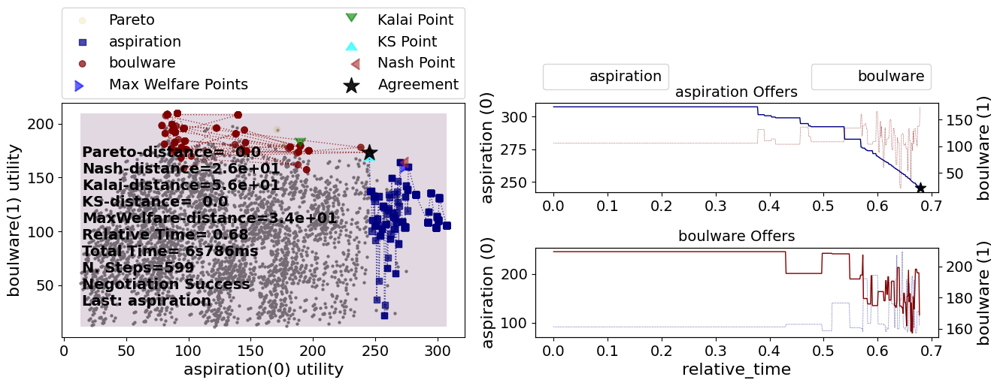
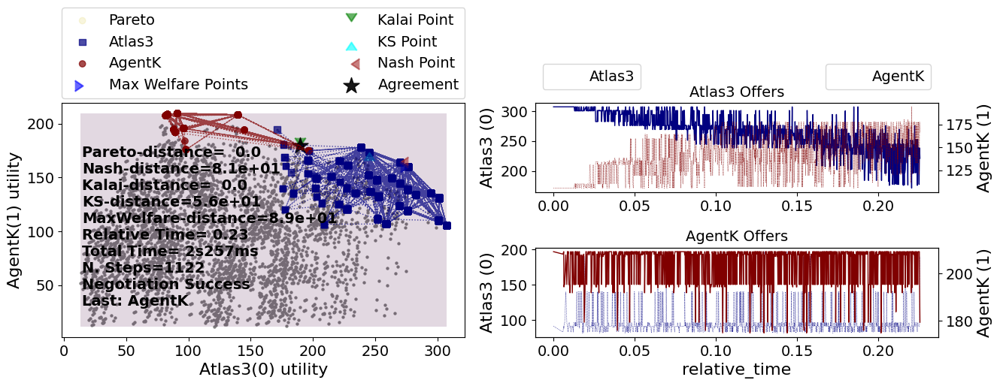
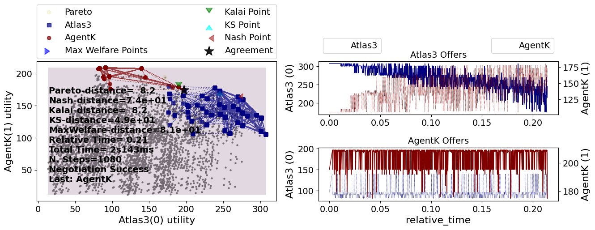

Integrating with Genius
-----------------------

`Genius <http://ii.tudelft.nl/genius/>`__ is a commonly used automated
negotiation research platform implemented in Java. It was used to run
`ANAC <http://web.tuat.ac.jp/~katfuji/ANAC2024/>`__ and has hundreds of
implemented negotiation strategy for the AOP and SAOP negotiation
protocols. It supports other protocols but few existing negotiation
strategies are available for any protocols other than AOP and SAOP.

NegMAS provides a bridge allowing you to run Genius agents and NegMAS
negotiators. This bridge **does not** come bundled with NegMAS.

Installing the bridge
~~~~~~~~~~~~~~~~~~~~~

After installing NegMAS, you can download and prepare the bridge by
running the following command in your terminal:

.. code:: bash

   negmas genius-setup

You can check that everything is OK by running:

.. code:: bash

   java -jar $HOME/negmas/files/geniusbridge.jar --version

Direct Download
^^^^^^^^^^^^^^^

You can also just download the bridge
`here <https://yasserfarouk.github.io/files/geniusbdidge.jar>`__ and
copy it to a folder ``files`` under ``negmas`` in your home directory.
For Linx and macOS, you can just run:

.. code:: bash

   curl https://yasserfarouk.github.io/files/geniusbridge.jar --create-dirs -o $HOME/negmas/files/geniusbridge.jar

For Windows, open a power-shell terminal and run:

.. code:: powershell

   Invoke-WebRequest -Uri https://yasserfarouk.github.io/files/geniusbridge.jar -OutFile $HOME\negmas\files\geniusbridge.jar

Running the bridge [Optional]
~~~~~~~~~~~~~~~~~~~~~~~~~~~~~

Whenever you want to use a Genius agent from negmas, it is recommended
(but not necessary) to explicitly run the bridge using:

.. code:: bash

   negmas genius

If this did not work, make sure that you have a compatible Java version
installed (our tests are run using Open JDK 18 but any modern java
version should work). You can also run the bridge directly using:

.. code:: bash

   java -jar $HOME/negmas/files/geniusbridge.jar

You should get something like:

::

   received options:
   Gateway 0.4.13 to python started at port 25337 listening to port 25337 [forcing timeout: 1800000ms]

Getting an example scenario
~~~~~~~~~~~~~~~~~~~~~~~~~~~

You can create any scenario as described in the previous tutorial. For
this tutorial, we want to showcase the use of ``Scenario.load`` to load
a scenario from the secondry storage.

Firstly, let’s get a negotiation scenario into your machine to use for
this experiment. You can download an example domain
`here <https://yasserfarouk.github.io/files/CameraB.zip>`__, and unzip
it to some place in your hard-disk to use later for the negotiation. Or
just run the following command to download it to
``negmas/scenarios/CameraB`` under your home directory:

-  On Linux and

   .. code:: bash

      curl https://yasserfarouk.github.io/files/CameraB.zip --create-dirs -o $HOME/negmas/scenarios/CameraB.zip
      unzip $HOME/negmas/scenarios/CameraB.zip -d $HOME/negmas/scenarios/
      rm $HOME/negmas/scenarios/CameraB.zip

-  On Windows (You’ll need an unzip utility like
   `7-Zip <https://www.7-zip.org/>`__ installed for this script to
   work.)

   .. code:: powershell

      Invoke-WebRequest -Uri https://yasserfarouk.github.io/files/CameraB.zip -OutFile $HOME/negmas/scenarios/CameraB.zip
      7z x $HOME/negmas/scenarios/CameraB.zip -o$HOME\negmas\scenarios
      Remove-Item $HOME/negmas/scenarios/CameraB.zip

Running a negotiation from the command line
~~~~~~~~~~~~~~~~~~~~~~~~~~~~~~~~~~~~~~~~~~~

Now we are ready to try the bridge from the command line:

.. code:: bash

   negotiate $HOME/negmas/scenarios/CameraB --no-plot -p sao -n AspirationNegotiator -n genius.BoulwareNegotiationParty --steps=100

You should get something like:

.. figure:: negexample.jpg
   :alt: negexample

   negexample

You can also visualize the negotiation using:

.. code:: bash

   negotiate $HOME/negmas/scenarios/CameraB --plot -p sao -n AspirationNegotiator -n genius.BoulwareNegotiationParty --steps=100

.. figure:: negplot.jpg
   :alt: negplot

   negplot

*If you did not explicitly run the bridge, you may get an error the
first time you try running a negotiation with a Genius agent involved
that the system “Cannot start the bridge”. Just try again or run the
bridge explicitly as described in the previous section*

Running a negotiation in python
~~~~~~~~~~~~~~~~~~~~~~~~~~~~~~~

You can run a negotiation between that has some Genius negotiators in
them in python almost as easily as running a negotiation between two
native NegMAS negotiators. Here is an example using the scenario we just
saved:

.. code:: ipython3

    from pathlib import Path
    from negmas.inout import Scenario
    from negmas.sao.negotiators import AspirationNegotiator
    from negmas.genius.gnegotiators import BoulwareNegotiationParty

    scenario = Scenario.load(Path.home() / "negmas" / "scenarios" / "CameraB")
    session = scenario.make_session(time_limit=10)
    session.add(AspirationNegotiator(preferences=scenario.ufuns[0], name="aspiration"))
    session.add(BoulwareNegotiationParty(preferences=scenario.ufuns[1], name="boulware"))
    session.run()
    session.plot()
    plt.show()

As you can see, there is no difference between using a native NegMAS
negotiator and a Genius Negotiator except in where you import it from.
For NegMAS SAO negotiators, you use ``negmas.sao.negotiators`` and for
genius negotiators you use ``negmas.genius.gnegotiators``. Everything
else is the same.

You can even run a negotiation between two Genius negotiators directly:

.. code:: ipython3

    from negmas.genius.gnegotiators import Atlas3, AgentK

    session = scenario.make_session(time_limit=10)
    session.add(Atlas3(preferences=scenario.ufuns[0], name="Atlas3"))
    session.add(AgentK(preferences=scenario.ufuns[1], name="AgentK"))
    session.run()
    session.plot()
    plt.show()

How does it work?
~~~~~~~~~~~~~~~~~

This integration is supported by the
`GeniusNegotiator <https://negmas.readthedocs.io/en/latest/api/negmas.genius.GeniusNegotiator.html>`__.
This class, presents Genius agents as
`SAONegotiator <https://negmas.readthedocs.io/en/latest/api/negmas.sao.SAONegotiator.html>`__
objects to NegMAS. The most important difference between a
``GeniusNegotiator`` and a normal ``SAONegotiator`` from the user’s
point of view is the way they are constructed. A ``GeniusNegotiator``
has the following extra parameters in its ``__init__()`` function:

-  java_class_name (str \| None) – The java class name of the Geinus
   underlying agent
-  domain_file_name (str \| Path \| None) – Optional domain file name
   (containing the negotiation issues or agenda)
-  utility_file_name (str \| Path \| None) – Optional ufun file name
   (xml) from which a ufun will be loaded for the agent-
-  auto_load_java (bool) – Load the genius bridge if needed
-  port (int) – The port to load the genius bridge to (or use if it is
   already loaded)
-  genius_bridge_path (str \| None) – The path to the genius bridge

Inside ``genius.gnegotiators`` we simply create classes for all Genius
agents like this:

.. code:: python

   class Atlas3(GeniusNegotiator):
       def __init__(self, **kwargs):
           kwargs["java_class_name"] = "agents.anac.y2015.Atlas3.Atlas3"
           super().__init__(**kwargs)

If you missed any Genius agent, you can add it by just passing the
``java_class_name`` parameter during construction in the same way.

Let’s try to run the same negotiation above without using
``gnegotiators`` at all:

.. code:: ipython3

    from negmas.genius import GeniusNegotiator

    session = scenario.make_session(time_limit=10)
    session.add(
        GeniusNegotiator(
            java_class_name="agents.anac.y2015.Atlas3.Atlas3",
            preferences=scenario.ufuns[0],
            name="Atlas3",
        )
    )
    session.add(
        GeniusNegotiator(
            java_class_name="agents.anac.y2010.AgentK.Agent_K",
            preferences=scenario.ufuns[1],
            name="AgentK",
        )
    )
    session.run()
    session.plot()
    plt.show()

Download :download:`Notebook<notebooks/02.integrating_with_genius.ipynb>`.

Download :download:`Notebook<notebooks/02.integrating_with_genius.ipynb>`.

Download :download:`Notebook<notebooks/02.integrating_with_genius.ipynb>`.
