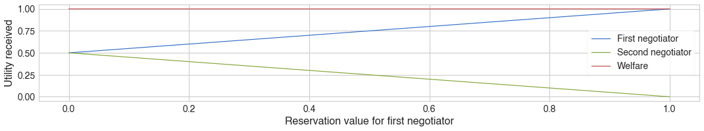
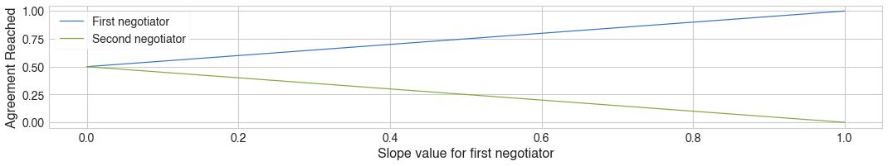
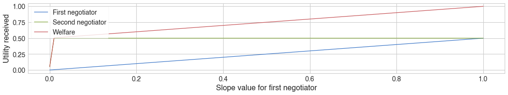
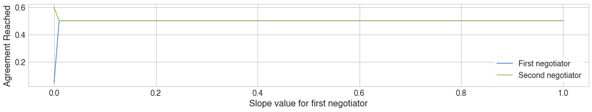
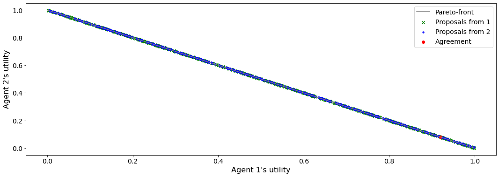
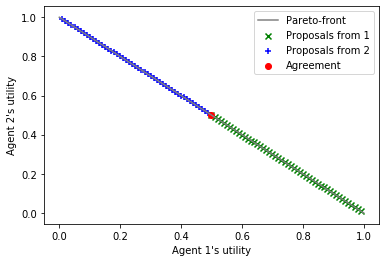
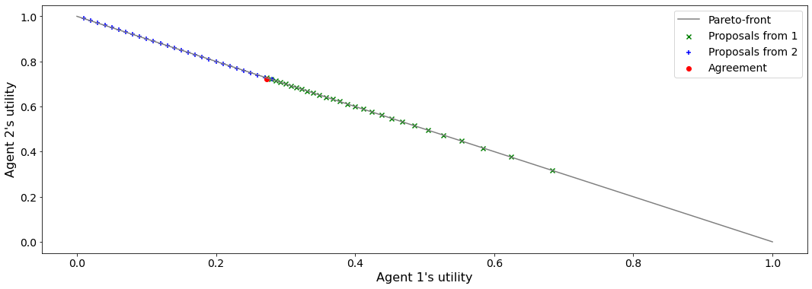

Develop a new mechanism (protocol)
----------------------------------

Developing a new mechanism for negmas is as easy as overriding a single
method. In most cases though, a base class for negotiators compatible
with this protocol needs to be created.

The algorithm for creating a new mechanism in ``NegMAS`` is simple:

1. Create a new ``Mechanism`` class and override the ``round()`` method
   to implement a single round of your protocol. Optionally override the
   ``__init__`` function to provide a constructor to initialize your
   mechanism. Define any ``requirements`` of your mechanism that must be
   satisfied by negotiators using ``add_requirements()`` during
   consturciton (i.e. in the ``__init__`` method).
2. Create a new ``Negotiator`` class that has ``abstractmethod(s)`` for
   any methods called by your custom mechanism class (usually in the
   ``round()`` method). This will be the base class of all negotiators
   compatible with this new mechanism. Set any *capabilities* for this
   new negotiator base class in its ``__init__`` method using
   ``add_capabilities()``
3. Optionally create a new ``MechanismState`` ``dataclass`` with any
   extra state information that the mechanism will pass to negotiators
   and override the ``extra_state()`` method of your mechanism class to
   return a dict representation of this extra state (you will see an
   example later in this tutorial). Moreover, you will need to change
   the ``state_factory`` argument passed to the ``Mechechanism``
   constructor to use this newly created state type. This step is
   optional and is only needed if extra-state needs to be passed to
   negotiators through the ``state`` method. It t is recommended to keep
   all variable publicly accessible information of the mechanism in its
   state variable. This way, the history of the mechanism state will be
   accessible through the ``history`` property after the mechanism run.

Nash Bargaining Game (Stateless Mechanism)
~~~~~~~~~~~~~~~~~~~~~~~~~~~~~~~~~~~~~~~~~~

Let’s start by developing one of the earliest negotiation protocols
every proposed: **Nash Bargaining Game (1950)** .

The Nash bargaining game is a single-step full-information bilateral
negotiation with :math:`\Omega = [0, 1]^2` and two utility functions
(:math:`\tilde u_1, \tilde u_2`) such that: - A (usually convex)
feasible set of agreements :math:`F`. A common example is to define
:math:`F` as all the outcomes for which the total utility received by
negotiators is less than or equal to one:

.. math:: F = \left\{(\omega_1, \omega_2) | \tilde u_2(\omega_2) + \tilde u_1(\omega_1) \le 1\right\}

.

-  A disagreement point
   :math:`d \equiv \tilde u_1(\phi) + \tilde u_2(\phi) \in \Re^2` which
   is the utility value received by the two players in case of
   disagreement ( reserved values) and :math:`\phi` represents the
   disagreement.

.. code:: ipython3

    class NashBargainingGame(Mechanism):
        """A mechanism representing the nash bargaining game"""
        
        def __init__(self, **kwargs):
            kwargs.update(dict(n_steps=1, max_n_agents=2, dynamic_entry=False))
            super().__init__(**kwargs)
            self.add_requirements(dict(propose_for_self = True))   
            self.ufuns: List[UtilityFunction] = []
        
        def add(
            self,
            negotiator: "Negotiator",
            *,
            ufun: Optional["UtilityFunction"] = None,        
            **kwargs,
        ) -> Optional[bool]:
            added = super().add(negotiator, ufun=ufun, role=None, **kwargs)
            if added:
                self.ufuns.append(self.negotiators[-1].utility_function)
                
        def is_feasible(self, outcome: Tuple[float]):
            """Tests feasibility of outcomes.
            
            The default implementation tests that the of all utilities assigned to all negotiators is less than 1.0.
            """        
            return sum(u(outcome) for u in self.ufuns) <= (1.0 + 1e-3)
        
        def round(self)-> MechanismRoundResult:
            """One round of the mechanism"""
            if len(self.negotiators) != 2:
                return MechanismRoundResult(error=True, 
                                            error_details=f"Got {len(self.negotiators)} negotiators!!", 
                                            broken=True)
            outcome = tuple(n.propose_for_self(self.ufuns, i) for i, n in enumerate(self.negotiators))
            if self.is_feasible(outcome):
                return MechanismRoundResult(agreement=outcome)
            return MechanismRoundResult()

The implementation is straight forward. We need to define what a round
of the algorithm does (``round()`` ). In this case we used
``is_feasible()`` to distinguish feasible and infeasible outcomes.

We need now to develop a base class for negotiators compatible with this
mechanism.

.. code:: ipython3

    class NashBargainingNegotiator(Negotiator, ABC):
        """Base class of all negotiators capable of negotiating in the nash bargaining game"""
        
        def __init__(self, *args, **kwargs):
            super().__init__(*args, **kwargs)
            self.add_capabilities(dict(propose_for_self=True))
        
        @abstractmethod
        def propose_for_self(self, ufuns: List[UtilityFunction], my_indx: int) -> float:   
            """Propose some outcome which is just a real number"""
            

Note that any agreement with utilities that sum to the maximum possible
value within the feasible space is a nash equilibrium to this game and
is pareto-efficient.

Based on the axioms used to represent rationality, there are three
widely known equilibria for the Nash bargaining game:

-  Nash Point (1950): The point at which the product of surplus utility
   (above reservation value) of negotiators is maximized

.. math:: \text{argmax}_{\omega_1, \omega_2} \prod_{i=1}^2\left(\tilde u_i(\omega_{i}) - \tilde u_i(\phi)\right)

-  Kalai-Smorodinsky Point (1975): The pareto outcome with equal ratios
   of achieved surplus utility and maximum feasible surplus utility

.. math::

   \text{argmax}_{\omega_1, \omega_2 \in F}\left(\omega_1+\omega_2\right) 
   \text{ s.t. }
   \left(\frac{\tilde u_1(\omega_1)-\tilde u_1(\phi)}{\tilde u_2(\omega_2)-\tilde u_2(\phi)} = 
   \frac{\max_{v \in F} \left(\tilde u_1(v)\right)-\tilde u_1(\phi)}{\max_{v \in F} 
   \left(\tilde u_2(v)\right)-\tilde u_2(\phi)}\right)

-  Kalai Point (1977): The pareto outcome maximizing the utility for the
   unfortunate player. Defining :math:`P` as the pareto front,

.. math:: \text{argmax}_{\omega_1, \omega_2 \in P} \min_{i \in \{1,2\}}\left(\tilde u_i(\omega_{i}) - \tilde u_i(\phi)\right)

We will not implement a negotiator that plays he nash-point strategy
with no prior knowledge of the utility function structure (i.e. it works
for nonlinear nonconvex utility functions).

.. code:: ipython3

    class NashNegotiator(NashBargainingNegotiator):
        """Implements Nash solution to the bargaining game"""
        def propose_for_self(self, ufuns: List[UtilityFunction], my_indx: int)-> float:
            objective = lambda f0: - (ufuns[0]((f0, 1.0-f0)) - ufuns[0].reserved_value) * \
                                     (ufuns[1]((f0, 1.0-f0)) - ufuns[1].reserved_value)
            while True:            
                result = minimize(objective, x0=[random()], bounds=[(0.0, 1.0)])
                if result.success:
                    break
            return float(result.x) if my_indx == 0 else 1.0 - float(result.x)

Now let’s try our brand new mechanism and negotiator

.. code:: ipython3

    m = NashBargainingGame()
    u1 = LinearUtilityFunction([1, 0], reserved_value=0.0)
    u2 = LinearUtilityFunction([0, 1], reserved_value=0.0)
    m.add(NashNegotiator(ufun=u1, name="a1"))
    m.add(NashNegotiator(ufun=u2, name="a2"))
    result = m.run()
    print(f"Agreement: {result.agreement}")

.. parsed-literal::

    Agreement: (0.4999984748241864, 0.5000000039839807)

As expected, the two negotiators agreed on the expected nash point (0.5,
0.5) from the first trial.

It is possible to see what happens at different other conditions. For
example, how does the reservation value affect the outcome:

.. code:: ipython3

    u1values, u2values = np.zeros(101), np.zeros(101)
    a1values, a2values = np.zeros(101), np.zeros(101)
    values = np.linspace(0.0, 1.0, 101, endpoint=True)
    u2 = LinearUtilityFunction([0, 1], reserved_value=0.0)
    for i, r in enumerate(values):
        m = NashBargainingGame()
        u1 = LinearUtilityFunction([1, 0], reserved_value=r)    
        m.add(NashNegotiator(ufun=u1, name="a1"))
        m.add(NashNegotiator(ufun=u2, name="a2"))
        result = m.run()    
        u1values[i] =u1(result.agreement)
        u2values[i] =u2(result.agreement)
        a1values[i], a2values[i] = result.agreement
    plt.subplot(211)
    plt.plot(values, u1values, label="First negotiator")
    plt.plot(values, u2values, label="Second negotiator")
    plt.plot(values, u1values+u2values, label="Welfare")
    plt.ylabel("Utility received")
    plt.legend()
    plt.xlabel("Reservation value for first negotiator")
    plt.show()
    
    plt.subplot(212)
    plt.plot(values, a1values, label="First negotiator")
    plt.plot(values, a2values, label="Second negotiator")
    plt.ylabel("Agreement Reached")
    plt.legend()
    plt.xlabel("Slope value for first negotiator")
    plt.show()

We can see that increasing the reservation value of a negotiator
increases the utility it receives by the end of the negotiation
proportionally.

What happens if the utility value of a negotiator had a different slope:

.. code:: ipython3

    u1values, u2values = np.zeros(101), np.zeros(101) 
    a1values, a2values = np.zeros(101), np.zeros(101)
    slopes = np.linspace(0.0, 1.0, 101, endpoint=True)
    u2 = LinearUtilityFunction([0, 1], reserved_value=0.0)
    for i, s in enumerate(slopes):
        m = NashBargainingGame()
        u1 = LinearUtilityFunction([s, 0.0], reserved_value=0.0)
        m.add(NashNegotiator(ufun=u1, name="a1"))
        m.add(NashNegotiator(ufun=u2, name="a2"))
        result = m.run()
        u1values[i], u2values[i] =u1(result.agreement), u2(result.agreement)
        a1values[i], a2values[i] = result.agreement
        
    plt.subplot(211)
    plt.plot(slopes, u1values, label="First negotiator")
    plt.plot(slopes, u2values, label="Second negotiator")
    plt.plot(slopes, u1values+u2values, label="Welfare")
    plt.ylabel("Utility received")
    plt.legend()
    plt.xlabel("Slope value for first negotiator")
    plt.show()
    
    plt.subplot(212)
    plt.plot(slopes, a1values, label="First negotiator")
    plt.plot(slopes, a2values, label="Second negotiator")
    plt.ylabel("Agreement Reached")
    plt.legend()
    plt.xlabel("Slope value for first negotiator")
    plt.show()

Notice that in this case, the both negotiators always get their maximum
possible utility which leads to a linear increas in welfare with slope.
There is a small exception though at slope zero. Try running the last
simulation several times. Does the peculiar result at slope zero
persist? Does it lead to the same welfare every time? Can you explain
it?

Rubinstein Bargaining Protocol (Stateful Mechanism)
---------------------------------------------------

Rubinstein provided one of the earliest and most widely cited results
for multi-round bilateral negotiation.

In this protocol, two negotiators are again trying to find an agreement
each maximizing its own utility. This is a full information game in
which the utility function of both agents is common knowledge. Moreover,
there is some discount mechanism that reduces the utility of any
potential agreement over time which is different for the two negotiators
but is also known. In this tutorial we will focus on the case with
exponential discounting (with with :math:`t` representing round number
and :math:`\delta_i` is the discount factor for negotiator :math:`i`).
Throughout this section we will use superscripts to indicate round
number. Moreover, we will focus on the case where the initial utility of
an agreement is the value assigned to the agent in that agreement:

.. math:: \tilde u_i^t(\omega) = \delta_i^t \omega_i

We can start by designing the ``MechanismState`` class corresponding to
this information.

.. code:: ipython3

    @dataclass
    class RubinsteinMechanismState(MechanismState):
        discounts: Tuple[float, float] = (1.0, 1.0)

We can then define the mechanism class itself:

.. code:: ipython3

    class RubinsteinMechanism(Mechanism):
        """Simplified Rubinstein's Mechanism with Exponential discounting"""
        def __init__(self, extended=False, **kwargs):
            kwargs.update(dict(issues=[Issue(values=(0.0, 1.0), name="first")
                                       , Issue(values=(0.0, 1.0), name="second")],
                                       max_n_agents=2, dynamic_entry=False, 
                               state_factory=RubinsteinMechanismState,
                              keep_issue_names=False))
            super().__init__(**kwargs)
            self.add_requirements(dict(propose=True, set_index=True))   
            self.discounts: List[UtilityFunction] = []
            self.proposals = []
            self.extended = extended
        
        def extra_state(self) -> Optional[Dict[str, Any]]:
            return dict(discounts=self.discounts)
        
        def add(
            self,
            negotiator: "Negotiator",
            *,
            discount: float =0.95,        
            **kwargs,
        ) -> Optional[bool]:
            weights = [1, 0] if len(self.negotiators) == 0 else [0, 1] 
            ufun = ExpDiscountedUFun(LinearUtilityFunction(weights), discount=discount, ami=self.ami)
            added = super().add(negotiator, ufun=ufun, role=None, **kwargs)
            if added:               
                self.discounts.append(discount)
                    
        def round(self)-> MechanismRoundResult:
            """One round of the mechanism"""
            if self.current_step == 0:
                if len(self.negotiators) != 2:
                    return MechanismRoundResult(error=True, 
                                            error_details=f"Got {len(self.negotiators)} negotiators!!", 
                                            broken=True)
                for i, n in enumerate(self.negotiators):
                    n.set_index(i)
            outcomes = list(n.propose(self.state) for n in self.negotiators)
            self.proposals.append(outcomes)
            if any(o is None for o in outcomes):
                return MechanismRoundResult(broken=True)
            if sum(outcomes[0]) <= 1 + 1e-3:
                if self.extended:
                    if outcomes[0][0] <= outcomes[1][0] + 1e-5 and outcomes[1][1] <= outcomes[0][1] + 1e-5:
                        return MechanismRoundResult(agreement=(min(outcomes[0][0], outcomes[1][0]),
                                                       min(outcomes[0][1], outcomes[1][1])))
                elif max(abs(outcomes[0][i] - outcomes[1][i]) for i in range(2)) < 1e-3:
                    return MechanismRoundResult(agreement=tuple(0.5 *(outcomes[0][i]+outcomes[1][i]) 
                                                                for i in range(2)))
                                                        
            return MechanismRoundResult()
        

The mechanism is very similar to the Nash Bargaining Game with few
modifications:

1. The constructor passes the ``RubnisteinMechanismState`` as the
   ``state_factory``. We also create explicit issues for the
   negotiation. The number of steps is not limited to :math:`1`. Note
   that we define two requirements for any negotiator that wants to
   engage in this protocol.
2. The ``add()`` method now creates the utility function for the
   negotiator following the rules of the game. Each negotiator receives
   an exponentially discounted utility function of the portion it
   receives from the pie.
3. We override ``extra_state`` to provide the ``discounts`` values to
   the state factory.
4. ``propose()`` in the negotiators is expected to receive a state of
   type ``RubinsteinMechanismState`` .
5. Each round all negotiators propose outcomes and the negotiation
   terminates with success only if both proposals are feasible (sum to
   no more than 1.0) and equal (appraximately)

We can now develop the base negotiator type for this mechanism:

.. code:: ipython3

    class RubinsteinNegotiator(Negotiator):
        
        def __init__(self, *args, **kwargs):
            super().__init__(*args, **kwargs)
            self.add_capabilities(dict(propose=True, set_index=True))
            self.my_index = -1
        
        def set_index(self, indx: i) -> None:
            self.my_index = indx
            
        @abstractmethod
        def propose(self, state: RubinsteinMechanismState)  -> Outcome:
            """Proposes an outcome which is a tuple of two numbers between zero and one"""

The base negotiator here implements ``set_index`` so that specific
negotiators need not bother about it. It defines a single abstract
method to be overriden by any compatible negotiator.

We will first define a utility function to plot what happens in a
negotiation

.. code:: ipython3

    def plot_a_run(mechanism: RubinsteinMechanism) -> None:
        result = mechanism.state
        x = np.linspace(0.0, 1.0, 101, endpoint=True)
        first = np.array([_[0] for _ in mechanism.proposals])
        second = np.array([_[1] for _ in mechanism.proposals])
        plt.plot(x, 1-x, color="gray", label="Pareto-front")
        plt.xlabel("Agent 1's utility")
        plt.ylabel("Agent 2's utility")
        plt.scatter(first[:, 0], first[:, 1], marker="x", color="green", label="Proposals from 1")
        plt.scatter(second[:, 0], second[:, 1], marker="+", color="blue", label="Proposals from 2")
        if result.agreement is not None:
            plt.scatter([result.agreement[0]], [result.agreement[1]], marker="o", color="red", label="Agreement")
        plt.legend()
        plt.show()

Let’s implement a random negotiator that ends the negotiation if it
finds that it is impossible to get a positive utility anymore (due to
discounting) and otherwise returns a random apportionment of the pie.

.. code:: ipython3

    class RandomRubinsteinNegotiator(RubinsteinNegotiator):
    
        def propose(self, state: RubinsteinMechanismState)-> Outcome:
            if self.utility_function((1.0, 1.0)) < 0.0:
                return None
            r = random()
            return r, 1 - r

Now we can run negotiations using our new protocol and negotiator:

.. code:: ipython3

    mechanism = RubinsteinMechanism(extended=False)
    mechanism.add(RandomRubinsteinNegotiator(), discount=0.75)
    mechanism.add(RandomRubinsteinNegotiator(), discount=0.75)
    print(f"Agreed to: {mechanism.run().agreement} after {mechanism.current_step} steps")
    plot_a_run(mechanism)

.. parsed-literal::

    Agreed to: (0.2024096797135117, 0.7975903202864882) after 227 steps

Rubinstein showed in 1982 that there is a single perfect game
equilibrium of single round that takes the form:

.. math:: \left(\frac{1-\delta_2}{1-\delta_1\delta_2}, \frac{\delta_2\left(1-\delta_1\right)}{1-\delta_1\delta_2}\right)

We can implement the optimal negotiator for this mechanism as follows:

.. code:: ipython3

    class OptimalRubinsteinNegotiator(RubinsteinNegotiator):
        
        def propose(self, state: RubinsteinMechanismState) -> Outcome:
            first = (1-state.discounts[1]) / (1 - state.discounts[1] * state.discounts[0])        
            return first, 1 - first
    
    mechanism = RubinsteinMechanism()
    mechanism.add(OptimalRubinsteinNegotiator())
    mechanism.add(OptimalRubinsteinNegotiator())
    print(f"Agreed to: {mechanism.run().agreement} in {mechanism.current_step} steps")

.. parsed-literal::

    Agreed to: (0.5128205128205131, 0.4871794871794869) in 1 steps

We can see that even though both negotiators had the same time-pressure
(:math:`\delta_0 = \delta_1`) and have the same utility function, the
negotiator that started, gets a higher utility at the equilibrium.

Let’s try to make an agent that does not use the information about the
other agent’s

.. code:: ipython3

    class AspirationRubinsteinNegotiator(AspirationMixin, RubinsteinNegotiator):
        def __init__(self, *args, aspiration_type="linear", max_aspiration=1.0, **kwargs):
            super().__init__(*args, **kwargs)
            AspirationMixin.aspiration_init(self, aspiration_type=aspiration_type, max_aspiration=max_aspiration)
            
        def propose(self, state: RubinsteinMechanismState)-> Outcome:
            if self.utility_function((1.0, 1.0)) < 0.0:
                return None
            r = self.aspiration(state.relative_time)        
            return  (r, 1.0 - r) if self.my_index == 0 else (1.0 - r, r)        
    
    mechanism = RubinsteinMechanism(n_steps=100, extended=True)
    mechanism.add(AspirationRubinsteinNegotiator())
    mechanism.add(AspirationRubinsteinNegotiator())
    result = mechanism.run()
    print(f"Agreed to: {result.agreement} in {mechanism.current_step} steps")
    plot_a_run(mechanism)

.. parsed-literal::

    Agreed to: (0.5, 0.5) in 50 steps

Now we can see when the first negotiator is a ``conceder`` :

.. code:: ipython3

    mechanism = RubinsteinMechanism(n_steps=100, extended=True)
    mechanism.add(AspirationRubinsteinNegotiator(aspiration_type="conceder"))
    mechanism.add(AspirationRubinsteinNegotiator())
    print(f"Agreed to: {mechanism.run().agreement} in {mechanism.current_step} steps")
    plot_a_run(mechanism)

.. parsed-literal::

    Agreed to: (0.27257284748717403, 0.72) in 28 steps

As expected, the agreement shifted toward the second agent.

Download :download:`Notebook<notebooks/03.develop_new_mechanism.ipynb>`.

