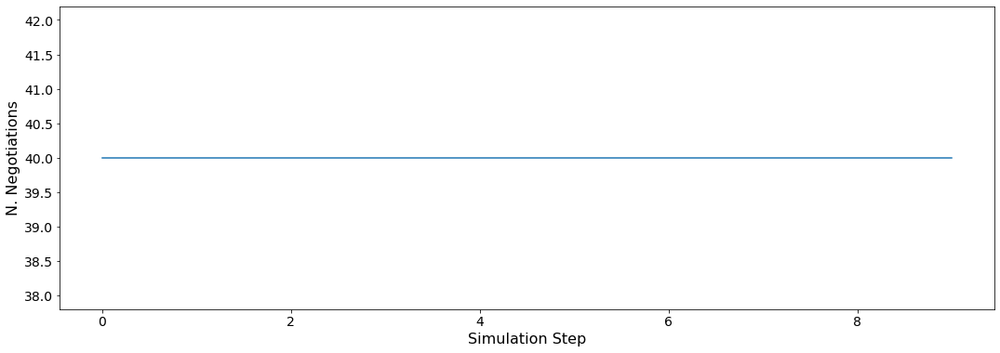
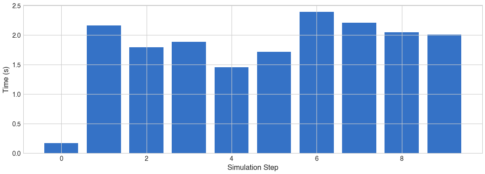
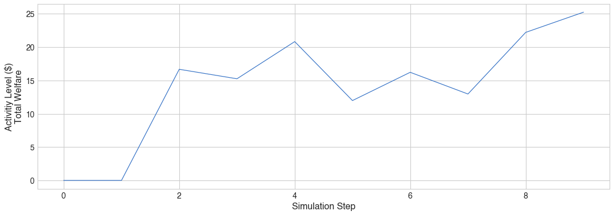
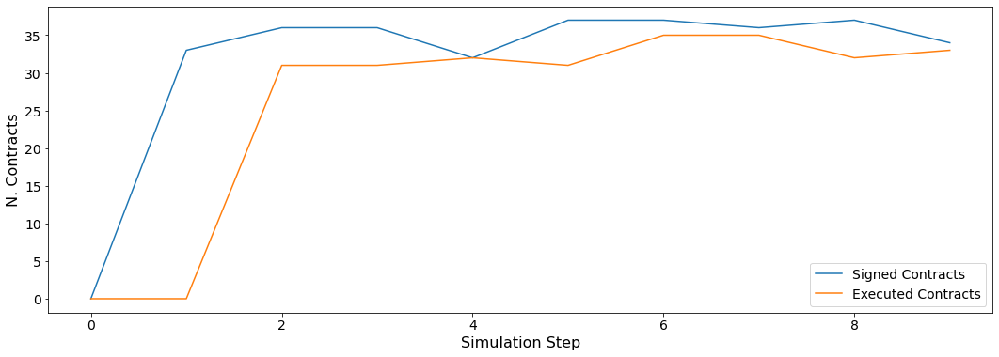
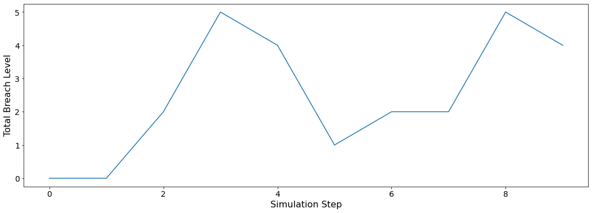
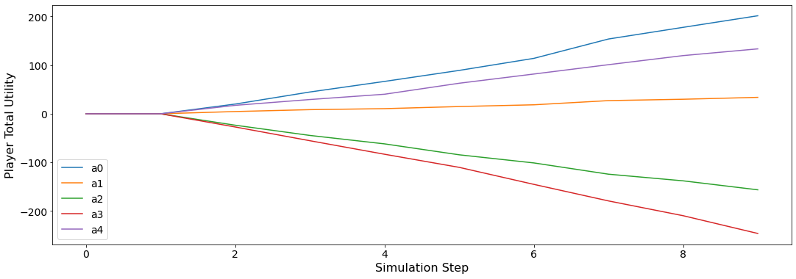
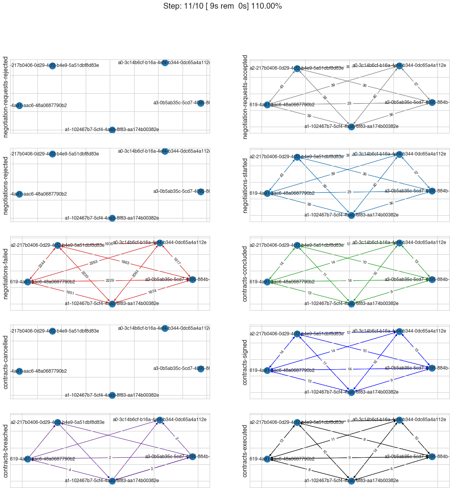
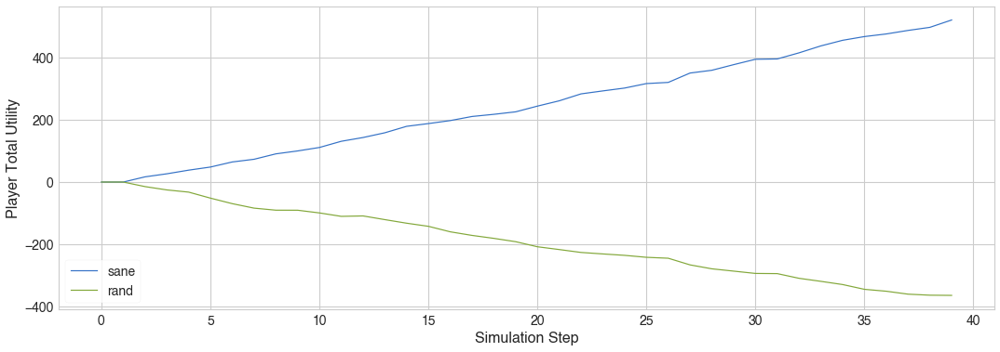

Develop a new agent (for your simulation)
-----------------------------------------

In the previous tutorial, we implemented a world simulation called
``TripsWorld`` in which agents negotiated how to spend their holiday
seasons. In this tutorial we will develop agents for this world and take
it on a test-drive.

Making a Random Agent for the Trips World
~~~~~~~~~~~~~~~~~~~~~~~~~~~~~~~~~~~~~~~~~

Our random agent, will just use a random negotiator for everything and
will not keep track of the history of other agents. That is the complete
code which is self explanatory this time.

.. code:: ipython3

    class RandomPerson(Person):
        def step(self):
            # get IDs of all ogher agents from the AWI
            agents = self.awi.agents
            # request the maximum number of negotiations possible
            for _ in range(self.awi.n_negs):
                # for each negotiation, use a random subset of partners and a random negotiator
                self.awi.request_negotiation(
                    partners=sample(agents, k=randint(1, len(agents) - 1)),
                    negotiator=RandomNegotiator(),
                )
    
        def init(self):
            # we need no initialization
            pass
    
        def respond_to_negotiation_request(
            self, initiator: str, partners: List[str], mechanism: AgentMechanismInterface
        ) -> Optional[Negotiator]:
            # just us a random negotiator for everything
            return RandomNegotiator()

Testing the world
~~~~~~~~~~~~~~~~~

We can now start world simulations using our new world and agent

.. code:: ipython3

    world = TripsWorld(n_steps=10, construct_graphs=True)
    for i in range(5):
        world.join(RandomPerson(name=f"a{i}"))
    world.run_with_progress()

.. parsed-literal::

    100%|██████████| 10/10 [00:06<00:00,  1.50it/s]

Let’s see what happened in this run. Firstly, how many negotiations were
conducted over time. Our agents always conducted the maximum number of
negotiations (:math:`8`) and we had :math:`5` agents which means we
expect :math:`40` negotiations at every step.

.. code:: ipython3

    plt.plot(world.stats['n_negotiations'])
    plt.xlabel('Simulation Step')
    plt.ylabel('N. Negotiations')
    plt.show()

Let’s start by seeing how long did each step take (note that stats
access the stats as a Dict[str, List] but stats_df access the same data
as a pandas dataframe.

.. code:: ipython3

    def stats_df(world):
        return pd.DataFrame(world.stats)
    
    plt.bar(range(world.n_steps), stats_df(world)['step_time'])
    plt.xlabel('Simulation Step')
    plt.ylabel('Time (s)')
    plt.show()

We can for example check the welfare (activity level) of this world
(defined as the total contract sizes executed per step which in our case
correspond to the total welfare)

.. code:: ipython3

    plt.plot(world.stats['activity_level'])
    plt.xlabel('Simulation Step')
    plt.ylabel('Activitiy Level ($)\nTotal Welfare')
    plt.show()

We can see a picture of contracting in this world as follows:

.. code:: ipython3

    plt.plot(world.stats['n_contracts_signed'], label='Signed Contracts') 
    plt.plot(world.stats['n_contracts_executed'], label='Executed Contracts')
    plt.legend()
    plt.xlabel('Simulation Step')
    plt.ylabel('N. Contracts')
    plt.show()

We can also check the breaches that happened

.. code:: ipython3

    plt.plot(world.stats['breach_level'])
    plt.xlabel('Simulation Step')
    plt.ylabel('Total Breach Level')
    plt.show()

We can actually check what happens to ALL agents

.. code:: ipython3

    fig, utility = plt.subplots(1, 1)
    snames = sorted(_.name for _ in world.agents.values())
    for name in snames:    
        utility.plot(np.asarray(world.stats[f'total_utility_{name}']), label=name)
    utility.set(xlabel='Simulation Step', ylabel='Player Total Utility')
    utility.legend(loc='lower left')
    fig.show()

As you can see, the total utility is not monotonically increasing. This
means that agents accepted offers that have a utility less than their
reserved value. That is expected because we use ``RandomNegotiator``\ s
for all negotiations.

We can also get a graphical view of all activities during the
simulation:

.. code:: ipython3

    world.draw(steps=(0, world.n_steps), together=False, ncols=2, figsize=(20, 20))
    plt.show()

Making a Better Agent for the Trips World
~~~~~~~~~~~~~~~~~~~~~~~~~~~~~~~~~~~~~~~~~

As we have seen, the random agent did not behave well in this world. It
is pretty simple to extend it into a better agent. Here is a simple
attempt:

.. code:: ipython3

    class SanePerson(Person):
        """An agent that uses a predefined negotiator instead of a random negotiator"""
        def __init__(self, *args, negotiator_type = AspirationNegotiator, negotiator_params = None, **kwargs):
            super().__init__(*args, **kwargs)
            self.negotiator_type = negotiator_type
            self.negotiator_params = negotiator_params if negotiator_params is not None else dict()
        
        def step(self):
            # get IDs of all ogher agents from the AWI
            agents = self.awi.agents
            # request the maximum number of negotiations possible
            for _ in range(self.awi.n_negs):
                # for each negotiation, use a random subset of partners and a random negotiator
                self.awi.request_negotiation(
                    partners=sample(agents, k=randint(1, len(agents) - 1)),
                    negotiator=self.negotiator_type(ufun=self.ufun, **self.negotiator_params),
                )
    
        def init(self):
            pass
    
        def respond_to_negotiation_request(
            self, initiator: str, partners: List[str], mechanism: AgentMechanismInterface
        ) -> Optional[Negotiator]:
            # just us a random negotiator for everything
            return self.negotiator_type(ufun=self.ufun, **self.negotiator_params)

The only difference between this ``SanePerson`` and the ``RandomPerson``
we developed earlier is that it can be constructed to use any type of
negotiation strategy supported in NegMAS (i.e. any ``SAONegotiator``
class). Whenever it is asked for a negotiator (either in ``step`` or
``respond_to_negotiation_request``) it uses that negotiator setting its
utility function.

Let’s try it

.. code:: ipython3

    world = TripsWorld(n_steps=40, construct_graphs=True)
    for i in range(3):
        world.join(RandomPerson(name=f"rand-{i}"))
    for i in range(3):
        world.join(SanePerson(name=f"sane-{i}"))
    world.run_with_progress()

.. parsed-literal::

    100%|██████████| 40/40 [01:27<00:00,  2.20s/it]

Let’s check how did our agent do

.. code:: ipython3

    fig, utility = plt.subplots(1, 1)
    snames = sorted(_.name for _ in world.agents.values())
    utils = dict(sane=np.zeros(world.n_steps), rand=np.zeros(world.n_steps))
    for agent_name in (_.name for _ in world.agents.values()):
        utils[agent_name.split("-")[0]] += np.asarray(world.stats[f'total_utility_{agent_name}'])
    for name in utils.keys():
        utility.plot(utils[name], label=name)
    utility.set(xlabel='Simulation Step', ylabel='Player Total Utility')
    utility.legend(loc='lower left')
    fig.show()

Better.

Download :download:`Notebook<notebooks/05.develop_new_agent.ipynb>`.

