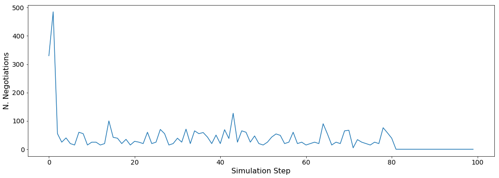
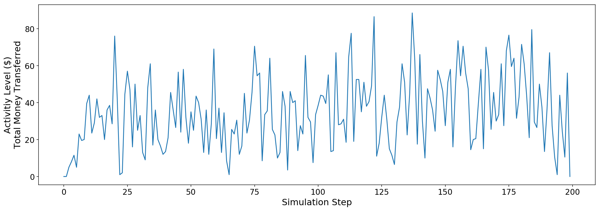
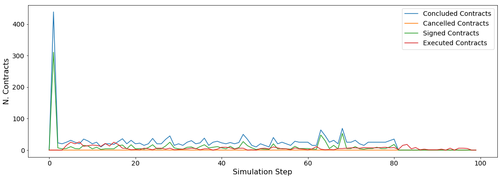
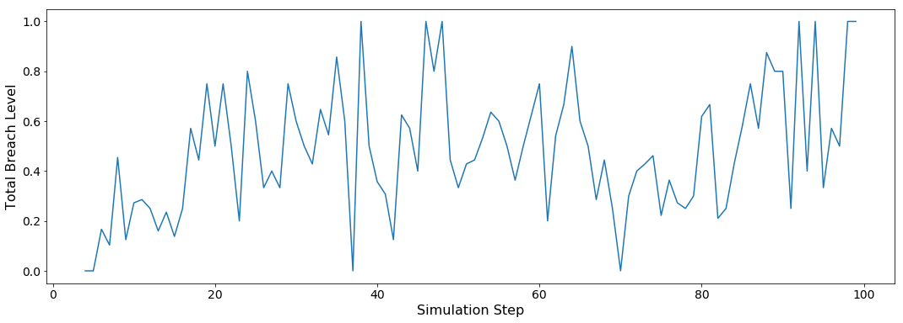
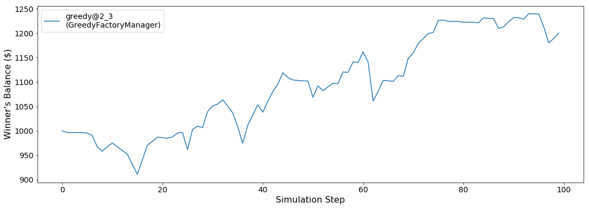
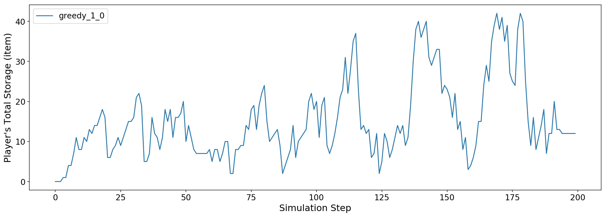
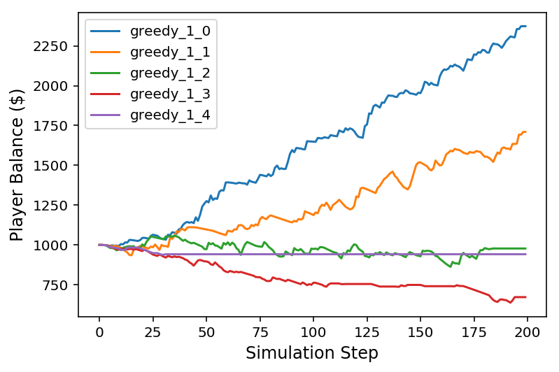

Run a session of the SCML world
-------------------------------

The SCML world (Supply Chain Management League) ships as an example
world with ``NegMAS``. It is used as one of the leagues of ANAC 2019.

In this tutorial, you will test a run of this world.

Firstly, let's import everything from the SCML app

.. code:: ipython3

    from negmas.apps.scml import *

There are several ways to create an SCML world. One of the simplest is
to use one of the class methods of the ``SCMLWorld`` class.

The resulting world will have 100 production steps so simulating it will
take several minutes. **To speed up the simulation, use a small number
of n\_steps (e.g. 10)**

If you want to just test your installation (and do not care whether you
get an accurate indicator of agent performance), you can set the number
of steps to a small value (e.g. n\_steps=10).

.. code:: ipython3

    world = SCMLWorld.chain_world(agent_names_reveal_type=True, n_steps=100, n_intermediate_levels=1, compact=True, log_file_name='')

For debugging purposes, we set ``agent_names_reveal_type`` to true to be
able to know the type of an agent from its name. During the actual ANAC
2019 competition this is passed as ``False`` preventing agents from
knowing the type of other agents by just inspecting their name. Now you
can run this world simulation by just calling ``run``.

.. code:: ipython3

    world.run()

Let's see what happened in this run. Firstly, how many negotiations were
conducted over time

.. code:: ipython3

    plt.plot(world.stats['n_negotiations'])
    plt.xlabel('Simulation Step')
    plt.ylabel('N. Negotiations')
    plt.show()

It is clear that many negotiations happened at the beginning of the
simulation with smaller number later. That is expected as the consumers
publish their calls for proposals early on.

Several other statistics are available:

.. code:: ipython3

    print(list(world.stats.keys()))

.. parsed-literal::

    ['n_cfps_on_board_before', 'n_registered_negotiations_before', 'n_contracts_executed', 'n_contracts_cancelled', 'n_breaches', 'breach_level', 'n_contracts_signed', 'n_contracts_concluded', 'n_negotiations', 'n_negotiation_rounds_successful', 'n_negotiation_rounds_failed', 'n_registered_negotiations_after', 'activity_level', 'n_cfps', 'n_cfps_on_board_after', 'n_contracts_nullified', '_balance_bank', '_balance_society', '_balance_insurance', '_storage_insurance', 'balance_m_0', 'storage_m_0', 'balance_m_1', 'storage_m_1', 'balance_m_2', 'storage_m_2', 'balance_m_3', 'storage_m_3', 'balance_m_4', 'storage_m_4', 'balance_c_0', 'storage_c_0', 'balance_c_1', 'storage_c_1', 'balance_c_2', 'storage_c_2', 'balance_c_3', 'storage_c_3', 'balance_c_4', 'storage_c_4', 'balance_greedy@1_0', 'storage_greedy@1_0', 'balance_greedy@1_1', 'storage_greedy@1_1', 'balance_greedy@1_2', 'storage_greedy@1_2', 'balance_greedy@1_3', 'storage_greedy@1_3', 'balance_greedy@1_4', 'storage_greedy@1_4', 'balance_greedy@2_0', 'storage_greedy@2_0', 'balance_greedy@2_1', 'storage_greedy@2_1', 'balance_greedy@2_2', 'storage_greedy@2_2', 'balance_greedy@2_3', 'storage_greedy@2_3', 'balance_greedy@2_4', 'storage_greedy@2_4', 'market_size', 'production_failures', '_market_size_total']

We can for example check the activity level of this world (defined as
the total amount of money transferred due to trade)

.. code:: ipython3

    plt.plot(world.stats['activity_level'])
    plt.xlabel('Simulation Step')
    plt.ylabel('Activitiy Level ($)\nTotal Money Transferred')
    plt.show()

We can see a picture of contracting in this world as follows:

.. code:: ipython3

    plt.plot(world.stats['n_contracts_concluded'], label='Concluded Contracts')
    plt.plot(world.stats['n_contracts_cancelled'], label='Cancelled Contracts') 
    plt.plot(world.stats['n_contracts_signed'], label='Signed Contracts') 
    plt.plot(world.stats['n_contracts_executed'], label='Executed Contracts')
    plt.legend()
    plt.xlabel('Simulation Step')
    plt.ylabel('N. Contracts')
    plt.show()

We can also check the breaches that happened

.. code:: ipython3

    plt.plot(world.stats['breach_level'])
    plt.xlabel('Simulation Step')
    plt.ylabel('Total Breach Level')
    plt.show()

It is also possible to focus on the behavior of some specific agent.
Let's first find who was the winner (the factory manager that got
maximum wealth). Notice that there can be multiple winners

.. code:: ipython3

    winner_profits = [round(100.0 * world.stats[f'balance_{_}'][-1] / world.stats[f'balance_{_}'][0] - 100.0, 2) for _ in world.winners]
    print(f"{world.winners} won at {winner_profits}%")

.. parsed-literal::

    [greedy@2_3] won at [47.3]%

What was the balance of this winner over time:

.. code:: ipython3

    for winner in world.winners:
        plt.plot(world.stats[f'balance_{winner}'], label=f'{winner}\n({winner.__class__.__name__})')
    plt.legend()
    plt.xlabel('Simulation Step')
    plt.ylabel('Winner\'s Balance ($)')
    plt.show()

Let's check how did its total storage change over time:

.. code:: ipython3

    for winner in world.winners:
        plt.plot(world.stats[f'storage_{winner}'], label=winner)
    plt.xlabel('Simulation Step')
    plt.ylabel('Player\'s Total Storage (item)')
    plt.legend()
    plt.show()

We can actually check what happens to ALL competitors:

.. code:: ipython3

    for name, _ in sorted(((_.name, _) for _ in world.factory_managers), key=lambda x: x[0]):    
        plt.plot(world.stats[f'balance_{name}'], label=name)
    plt.xlabel('Simulation Step')
    plt.ylabel('Player Balance ($)')
    plt.legend()
    plt.show()

Download :download:`Notebook<notebooks/06.run_scml.ipynb>`.

