****************
Value Functions
****************

Value functions map issue values to real numbers, and are the building
blocks of utility functions like
:class:`~negmas.preferences.LinearAdditiveUtilityFunction` (one value
function per issue) and :class:`~negmas.preferences.GLAUtilityFunction`
(one value function per group of issues). This page shows a picture of
every value function type, since a plotted curve or surface makes a shape
recognizable in a way an equation alone does not.

All classes described here live in ``negmas.preferences.value_fun`` and are
also importable directly from ``negmas``. Single-issue functions
(subclasses of `~negmas.preferences.value_fun.BaseFun`) map one issue's
value to a number; multi-issue functions (subclasses of
`~negmas.preferences.value_fun.BaseMultiFun`) map a tuple of several
issues' values to a number and are shown below as a heatmap over two
issues.

.. contents::
    :local:
    :depth: 1

Single-issue functions
=======================

ConstFun
--------

A constant: ``f(x) = bias``, regardless of ``x``.

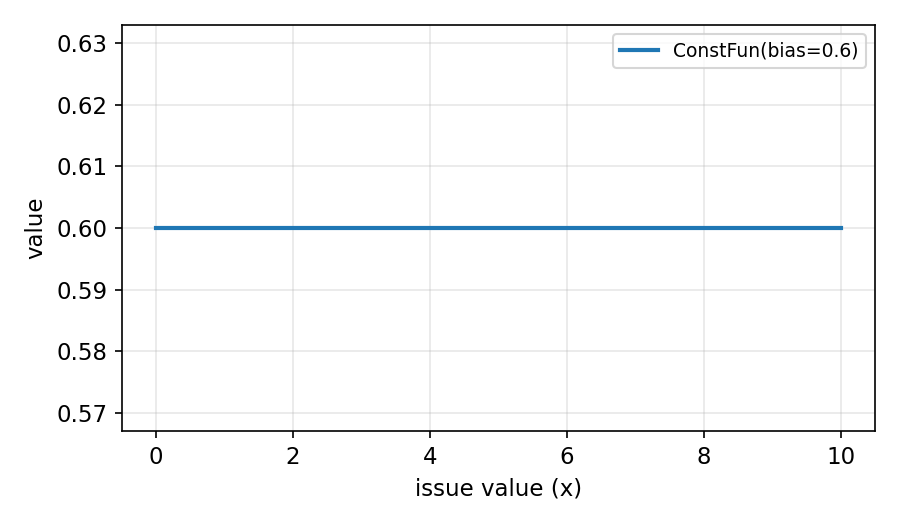

::

    from negmas.preferences.value_fun import ConstFun

    f = ConstFun(bias=0.6)

IdentityFun
-----------

The identity: ``f(x) = x``.

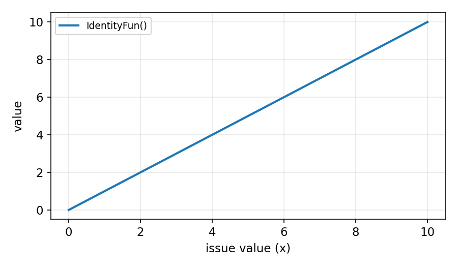

::

    from negmas.preferences.value_fun import IdentityFun

    f = IdentityFun()

AffineFun
---------

An affine map: ``f(x) = slope * x + bias``.

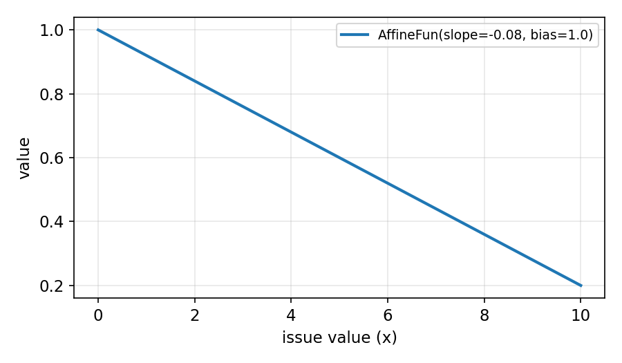

::

    from negmas.preferences.value_fun import AffineFun

    f = AffineFun(slope=-0.08, bias=1.0)

LinearFun
---------

An affine map with no constant term: ``f(x) = slope * x``. Equivalent to
``AffineFun(slope=slope, bias=0)``.

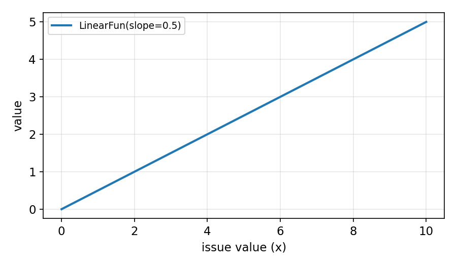

::

    from negmas.preferences.value_fun import LinearFun

    f = LinearFun(slope=0.5)

TriangularFun
-------------

A piecewise-linear tent: rises from ``bias`` at ``start`` to
``bias + scale`` at ``middle``, then falls back to ``bias`` at ``end``.

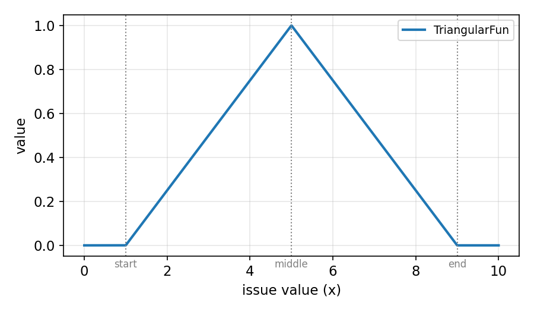

::

    from negmas.preferences.value_fun import TriangularFun

    f = TriangularFun(start=1.0, middle=5.0, end=9.0)

TrapezoidalFun
--------------

A piecewise-linear function that rises from ``bias`` to ``bias + scale``
over ``[start, rise_end]``, stays flat over ``[rise_end, fall_start]``, then
falls back to ``bias`` over ``[fall_start, end]``. It generalizes
`TriangularFun` (a `TrapezoidalFun` with ``rise_end == fall_start`` is a
triangle) to have a plateau instead of a single peak.

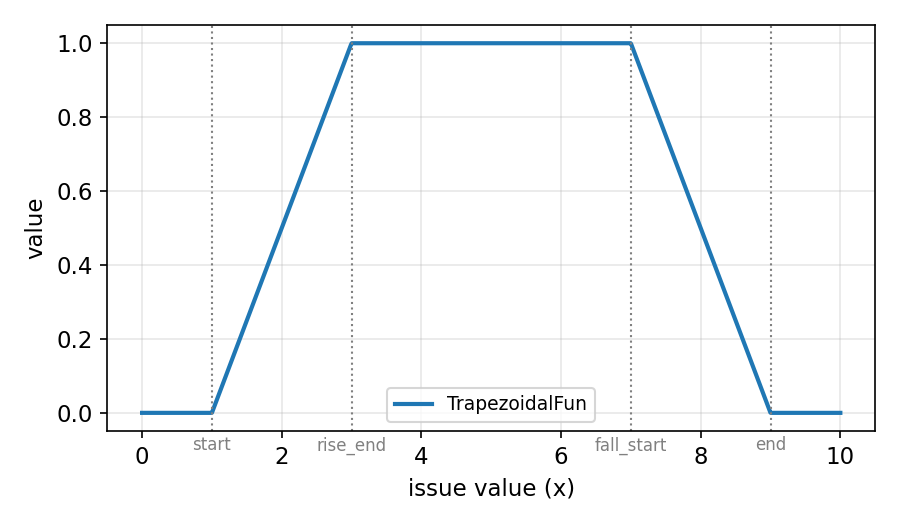

::

    from negmas.preferences.value_fun import TrapezoidalFun

    f = TrapezoidalFun(start=1.0, rise_end=3.0, fall_start=7.0, end=9.0)

GaussianFun
-----------

A Gaussian bump: ``f(x) = bias + scale * exp(-(x - center)^2 / (2 * sigma^2))``.
The ``center`` is a free parameter -- it need not lie inside the issue's
range. If it does, the function peaks there; if it doesn't, the function is
simply monotonically decaying (or increasing, for a negative ``scale``) over
whatever range the issue restricts it to.

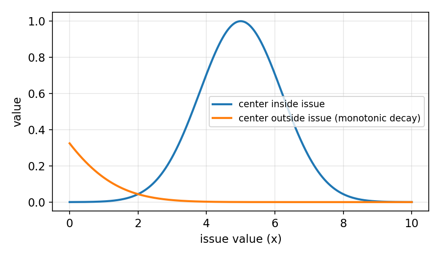

::

    from negmas.preferences.value_fun import GaussianFun

    peak_in_range = GaussianFun(center=5.0, sigma=1.2)
    decaying_from_an_edge = GaussianFun(center=-3.0, sigma=2.0)

LambdaFun
---------

Wraps an arbitrary callable: ``f(x) = g(x) + bias``.

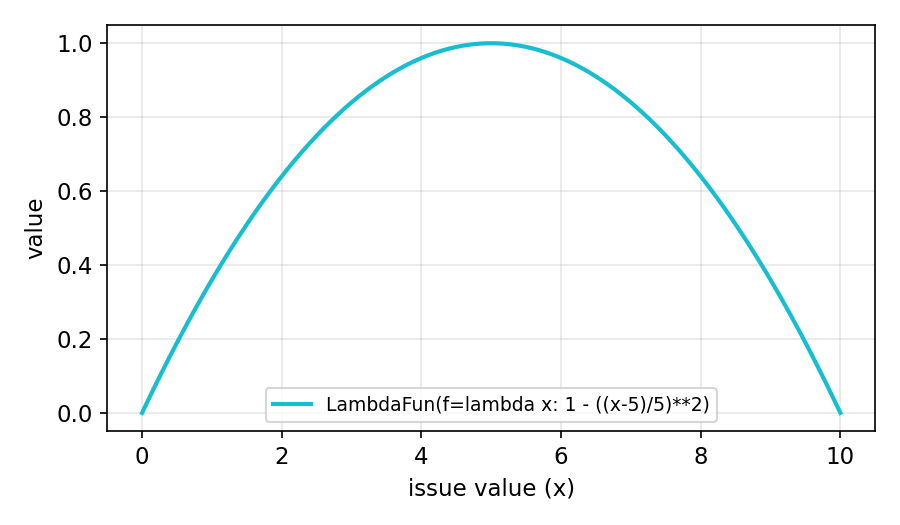

::

    from negmas.preferences.value_fun import LambdaFun

    f = LambdaFun(f=lambda x: 1.0 - ((x - 5.0) / 5.0) ** 2)

PolynomialFun
-------------

A general polynomial: ``f(x) = bias + sum(coefficients[k] * x^(k+1))``.

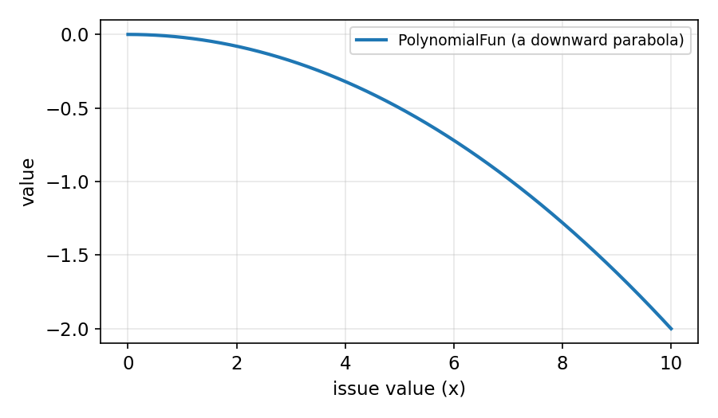

::

    from negmas.preferences.value_fun import PolynomialFun

    f = PolynomialFun(coefficients=(0.0, -0.02))  # -0.02 * x^2

QuadraticFun
------------

A specialized degree-2 polynomial: ``f(x) = a2*x^2 + a1*x + bias``.

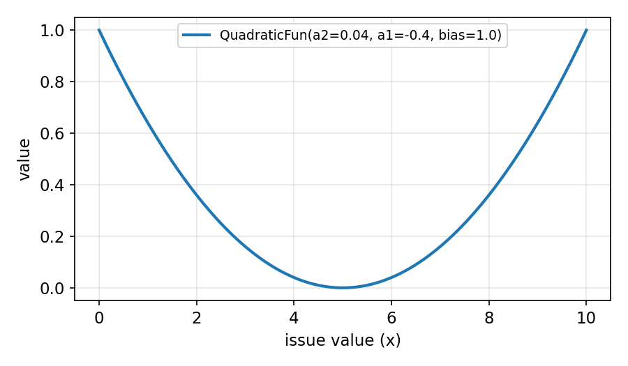

::

    from negmas.preferences.value_fun import QuadraticFun

    f = QuadraticFun(a2=0.04, a1=-0.4, bias=1.0)

ExponentialFun
--------------

``f(x) = base^(tau * x) + bias``.

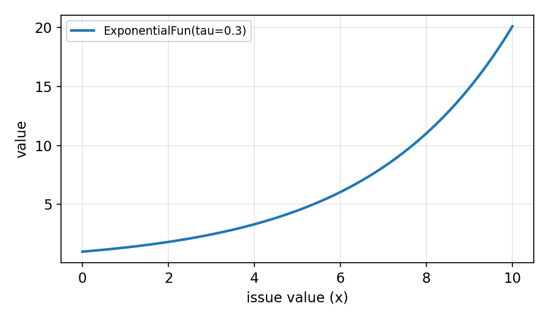

::

    from negmas.preferences.value_fun import ExponentialFun
    from math import e

    f = ExponentialFun(tau=0.3, base=e)

LogFun
------

``f(x) = scale * log_base(tau * x) + bias``. Requires ``tau * x > 0``.

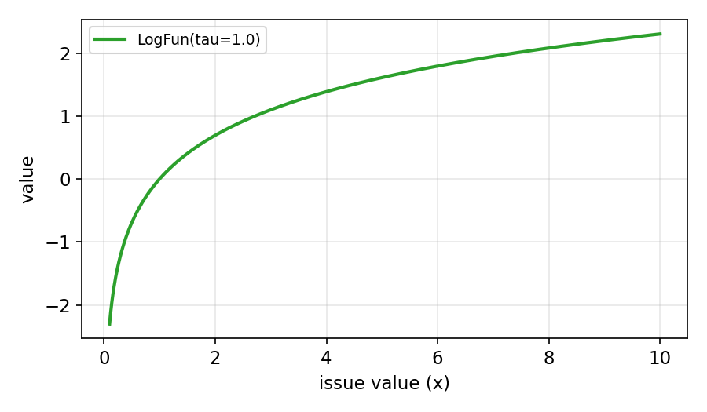

::

    from negmas.preferences.value_fun import LogFun
    from math import e

    f = LogFun(tau=1.0, base=e)

SinFun / CosFun
---------------

Sinusoidal functions: ``f(x) = amplitude * sin(multiplier*x + phase) + bias``
(and the cosine equivalent).

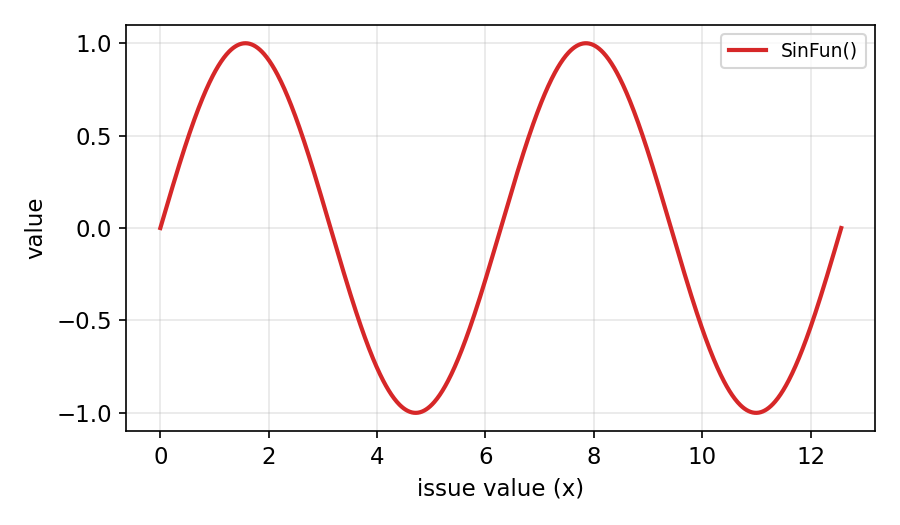

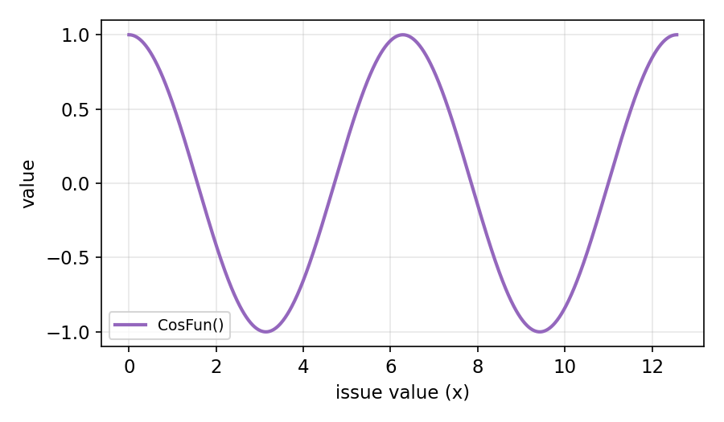

::

    from negmas.preferences.value_fun import SinFun, CosFun

    f_sin = SinFun()
    f_cos = CosFun()

TableFun
--------

A dictionary lookup: maps discrete/categorical issue values to utilities.
Unlike the other functions above, its domain is not continuous, so it is
naturally shown as discrete points rather than a curve.

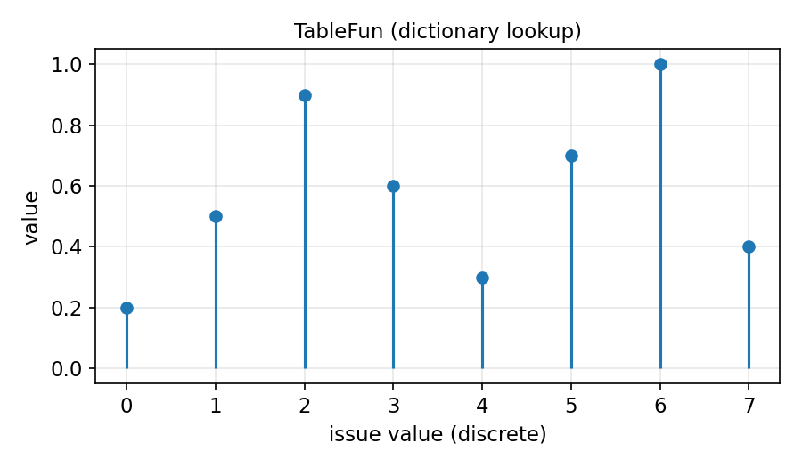

::

    from negmas.preferences.value_fun import TableFun

    f = TableFun(mapping={0: 0.2, 1: 0.5, 2: 0.9, 3: 0.6, ...})

AggregatingFun
--------------

A weighted sum of other `BaseFun` instances over the *same* issue:
``f(x) = bias + sum(weight_i * fun_i(x))``. This is the generic building
block for combining several shapes (including several `GaussianFun` or
`TrapezoidalFun` instances) into one value function, and is what
`MultiModalGaussianFun` and `MultiModalTrapezoidalFun` build on internally.

Passing ``normalize=True`` (and an ``issue``) rescales the combination so
that its range over that issue is exactly ``[0, 1]``.

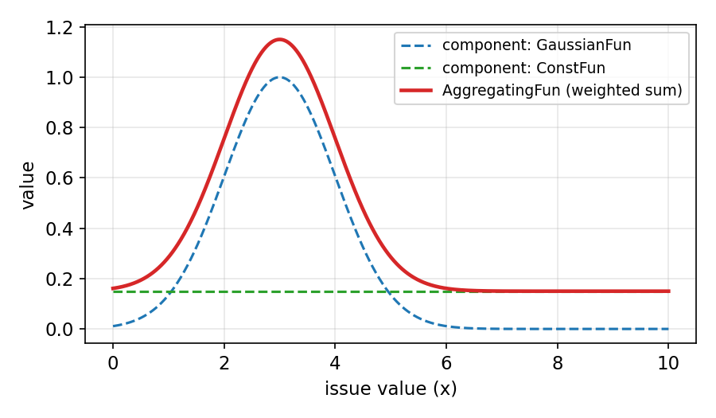

::

    from negmas.preferences.value_fun import AggregatingFun, GaussianFun, ConstFun

    combo = AggregatingFun(
        funs=(GaussianFun(center=3.0, sigma=1.0), ConstFun(bias=0.15)),
        weights=(1.0, 1.0),
    )

BiasedFun
---------

Wraps any `BaseFun`, adding a constant bias: ``f(x) = fun(x) + bias``. Useful
for value function types that don't already expose a ``bias`` parameter of
their own (e.g. `IdentityFun`, `LinearFun`). Like `AggregatingFun`, it
supports ``normalize=True`` (with an ``issue``) to rescale its output to
``[0, 1]``.

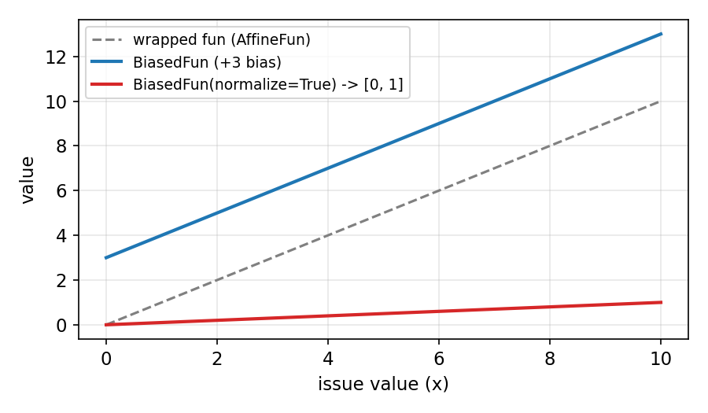

::

    from negmas.preferences.value_fun import BiasedFun, IdentityFun
    from negmas.outcomes import make_issue

    issue = make_issue((0.0, 10.0), "x")
    normalized_identity = BiasedFun(fun=IdentityFun(), normalize=True, issue=issue)

Multi-modal mixtures: MultiModalTrapezoidalFun / MultiModalGaussianFun
-----------------------------------------------------------------------

Build a multi-peak value function out of several trapezoids or Gaussians in
one call, taking each component's parameters as a tuple (one entry per
component) plus a ``weights`` tuple, rather than requiring you to build the
equivalent `AggregatingFun` by hand.

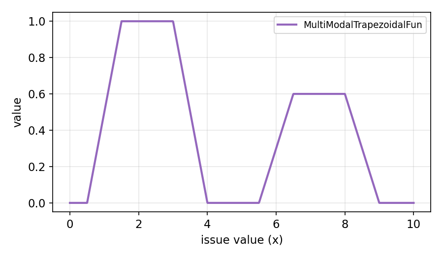

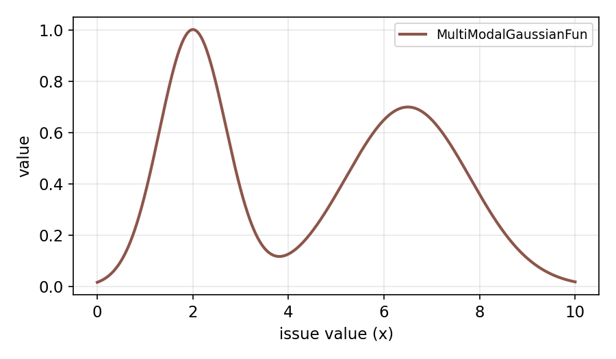

::

    from negmas.preferences.value_fun import MultiModalGaussianFun

    two_peaks = MultiModalGaussianFun(
        centers=(2.0, 6.5), sigmas=(0.7, 1.3), weights=(1.0, 0.7)
    )

.. note::

    `minmax` for these two classes (and for `AggregatingFun` when it holds
    more than one component) is **approximate** over continuous issues: a
    mixture of several bumps need not have a closed-form extremum, so it is
    found by dense grid sampling rather than analytically.

Multi-issue functions
======================

Multi-issue functions map a *tuple* of issue values to a number, so they are
shown below as a heatmap over two issues (``x`` on the horizontal axis,
``y`` on the vertical axis).

LinearMultiFun / AffineMultiFun
-------------------------------

A weighted sum of issue values, with (`AffineMultiFun`) or without
(`LinearMultiFun`) a constant bias: ``f(x) = sum(slope[i] * x[i]) [+ bias]``.

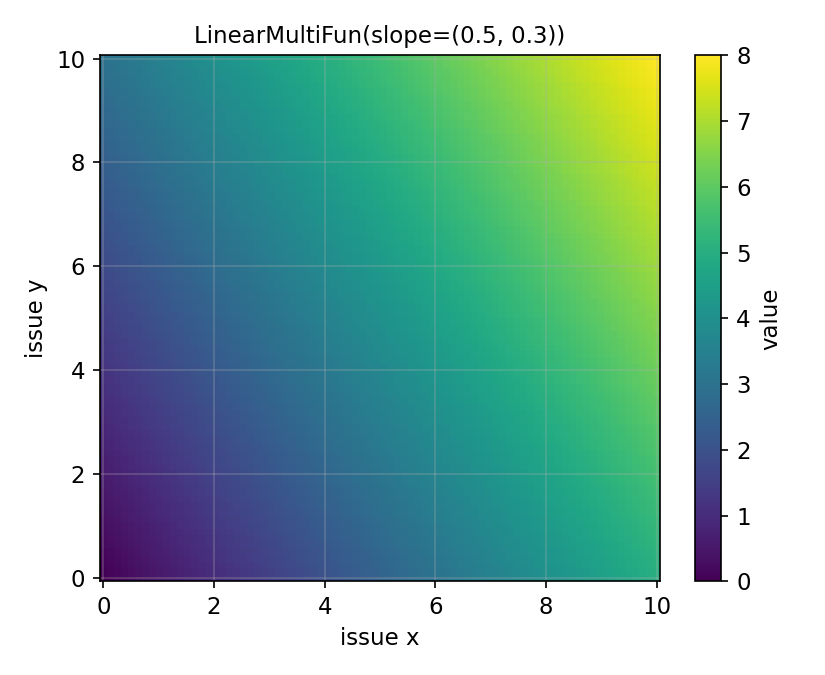

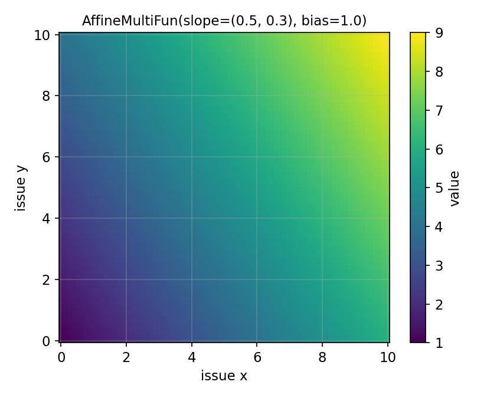

::

    from negmas.preferences.value_fun import LinearMultiFun, AffineMultiFun

    f1 = LinearMultiFun(slope=(0.5, 0.3))
    f2 = AffineMultiFun(slope=(0.5, 0.3), bias=1.0)

BilinearMultiFun
----------------

Two issues with an interaction term: ``f(x, y) = a*x + b*y + c*x*y + bias``.

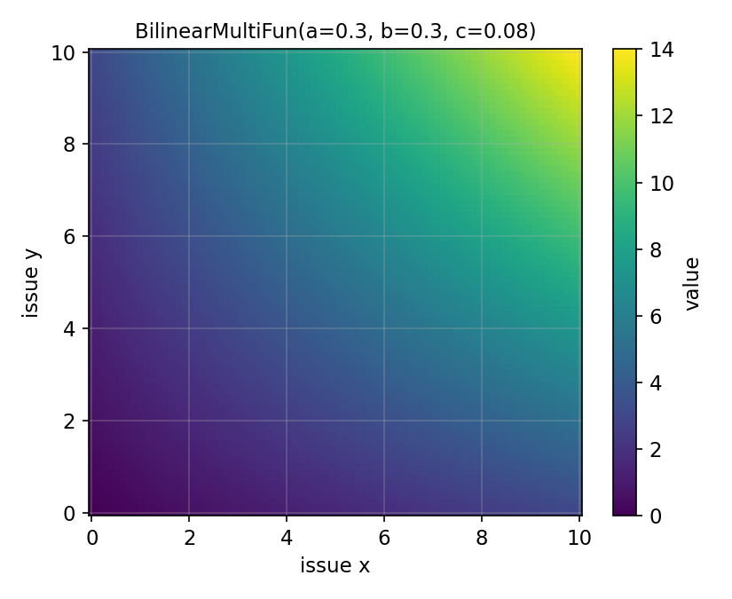

::

    from negmas.preferences.value_fun import BilinearMultiFun

    f = BilinearMultiFun(a=0.3, b=0.3, c=0.08)

QuadraticMultiFun
-----------------

A full quadratic form: linear, squared, and pairwise-interaction terms for
every issue.

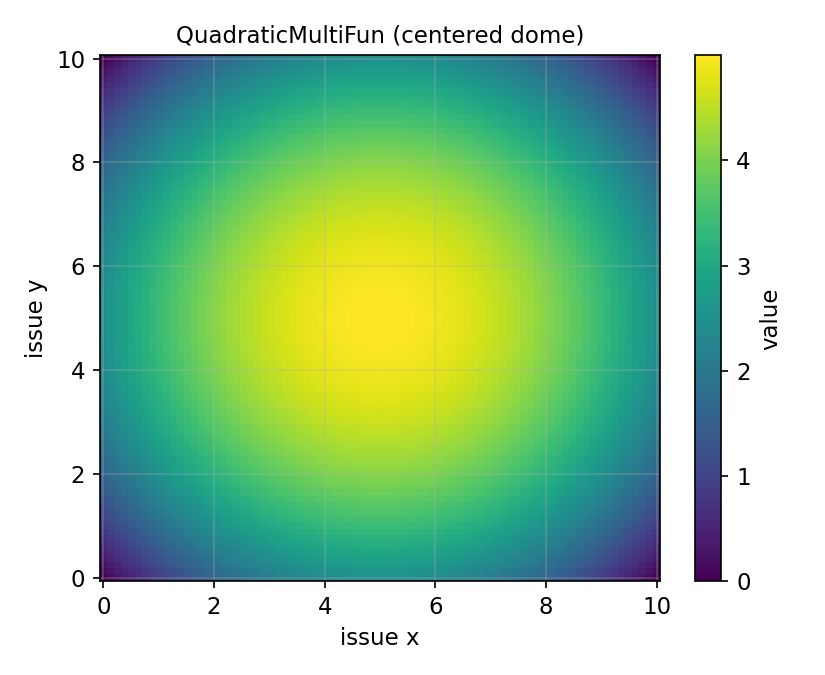

::

    from negmas.preferences.value_fun import QuadraticMultiFun

    f = QuadraticMultiFun(
        linear=(1.0, 1.0), quadratic=(-0.1, -0.1), interactions=(0.0,)
    )

PolynomialMultiFun
------------------

A general multivariate polynomial: a sum of ``coefficient * prod(x[i]^power[i])``
terms.

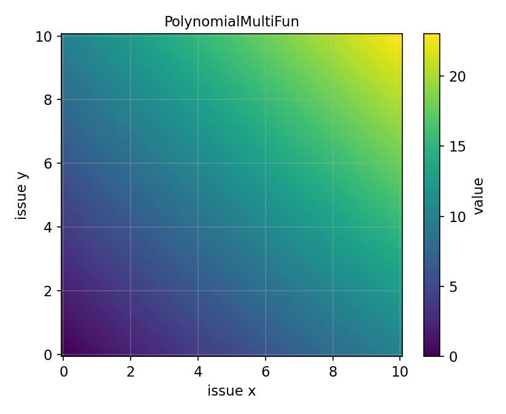

::

    from negmas.preferences.value_fun import PolynomialMultiFun

    f = PolynomialMultiFun(terms=((1.0, (1, 0)), (1.0, (0, 1)), (0.03, (1, 1))))

ProductMultiFun
---------------

A scaled product with per-issue powers: ``f(x) = scale * prod(x[i]^powers[i]) + bias``.
With ``powers`` summing to 1 (as below) this is the Cobb-Douglas form common
in economics.

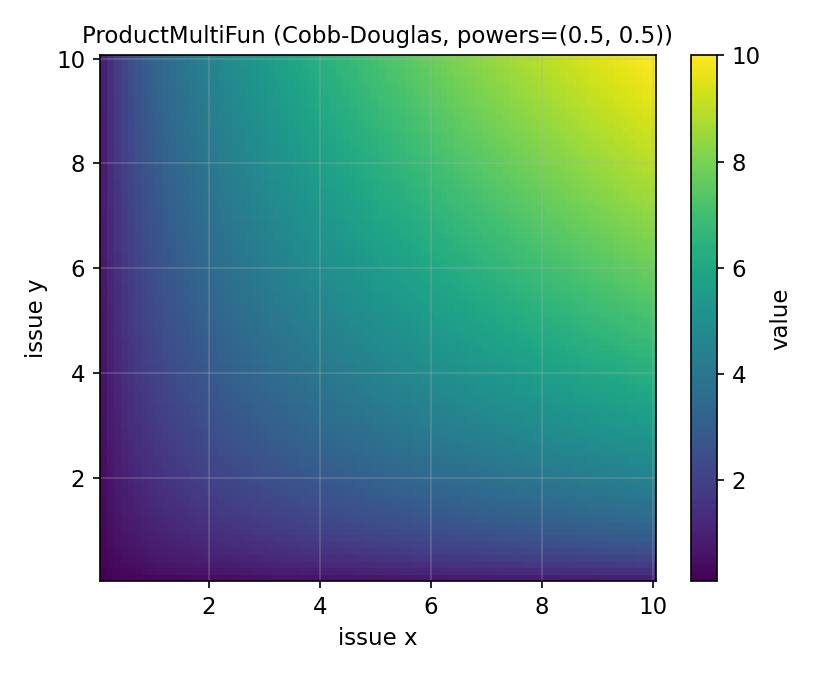

::

    from negmas.preferences.value_fun import ProductMultiFun

    f = ProductMultiFun(powers=(0.5, 0.5))

TableMultiFun
-------------

A dictionary lookup keyed by value tuples -- the multi-issue equivalent of
`TableFun`.

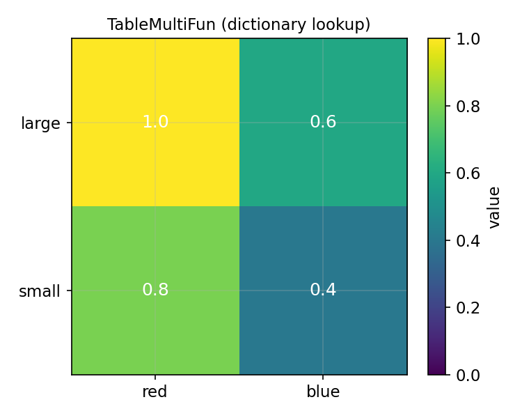

::

    from negmas.preferences.value_fun import TableMultiFun

    f = TableMultiFun(
        mapping={
            ("red", "large"): 1.0,
            ("red", "small"): 0.8,
            ("blue", "large"): 0.6,
            ("blue", "small"): 0.4,
        }
    )

LambdaMultiFun
--------------

Wraps an arbitrary callable taking a value tuple: ``f(x) = g(x) + bias``.

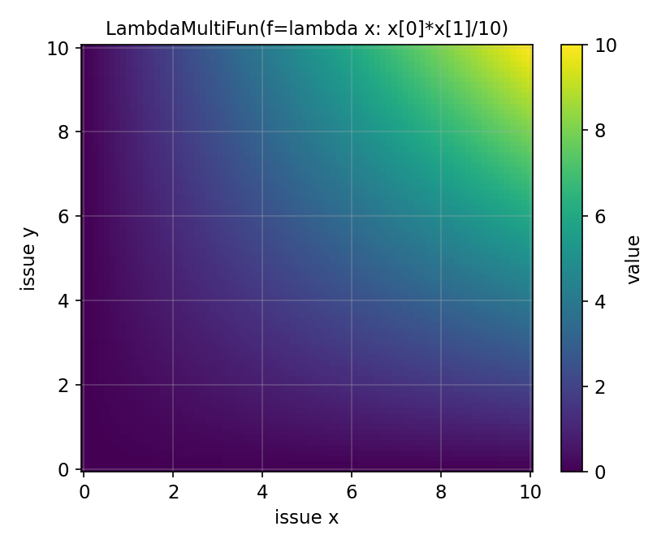

::

    from negmas.preferences.value_fun import LambdaMultiFun

    f = LambdaMultiFun(f=lambda x: x[0] * x[1] / 10.0)

Regenerating the figures
=========================

The images on this page are generated by
``coding_agents/generate_value_fun_figures.py``. Run it (from the repository
root) and re-render the docs whenever the plotted examples change::

    python coding_agents/generate_value_fun_figures.py
